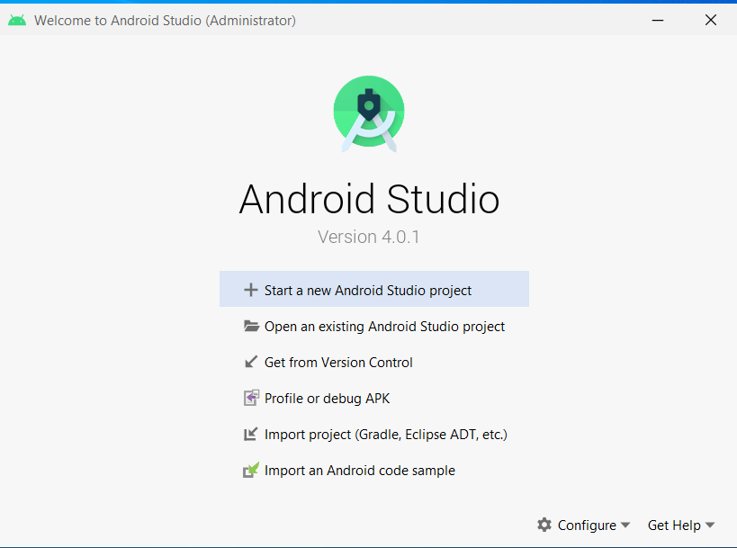
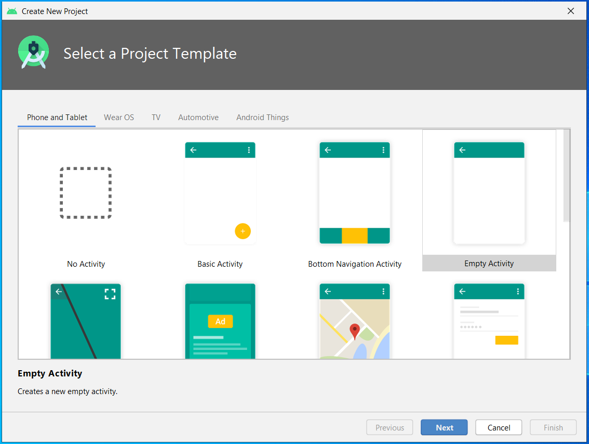
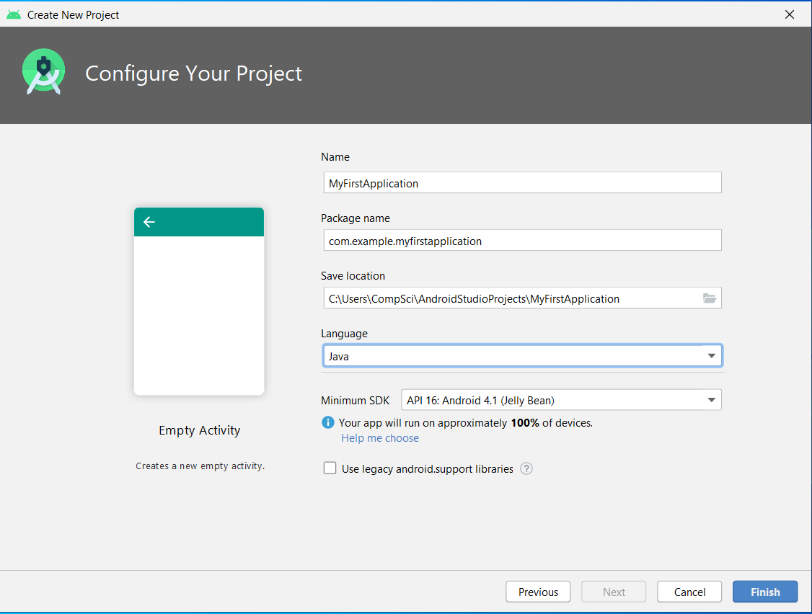
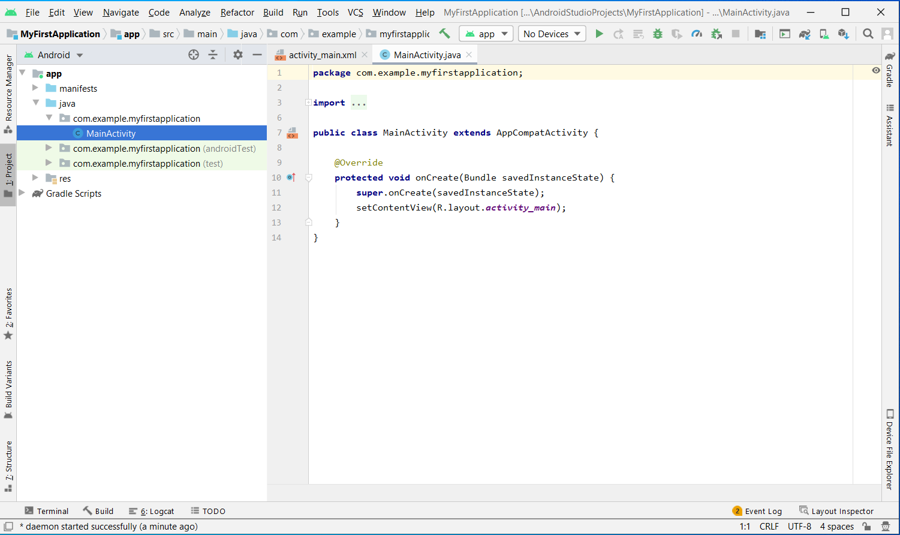
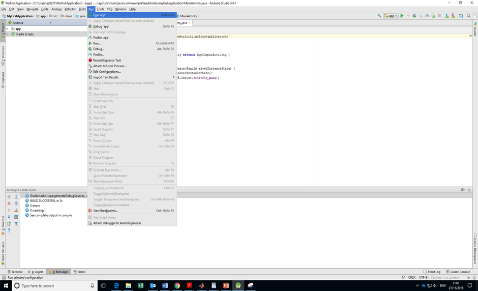
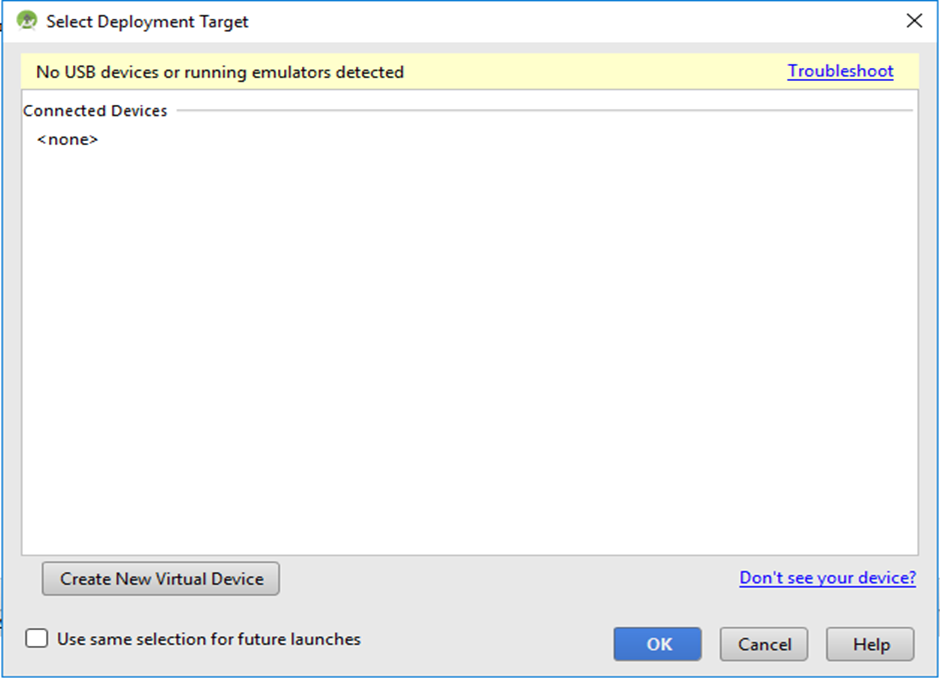
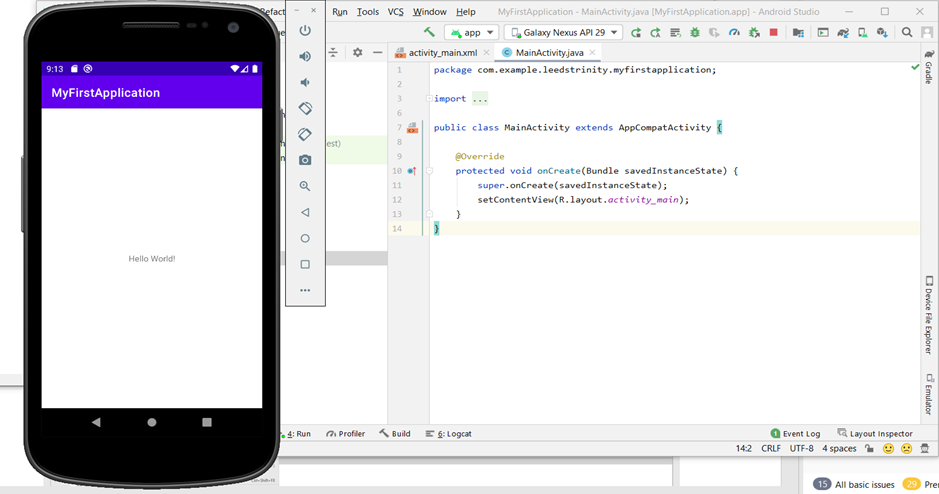
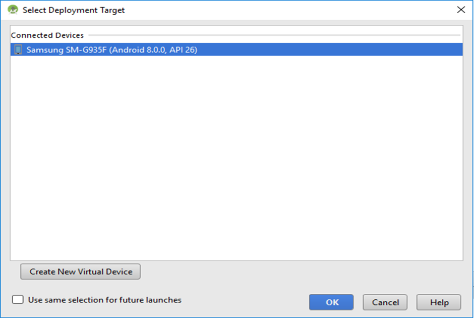
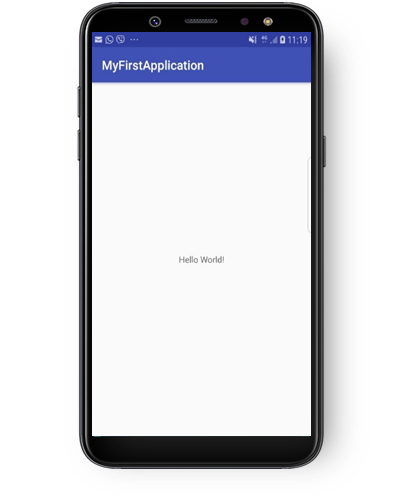

**About this Tutorial**

Android is an open-source mobile operating system based on Java language and Linux kernel. It runs on different handheld mobile devices such as smartphones, tablets, switches, TV, etc. Android was developed by Android Inc. and is now led by Google which purchased it in 2005. This tutorial will illustrate the basics of Android development through “Hello World” and “Change me” examples. To satisfy with this material, please review the introductory lecture notes. 

**Learning objectives**

After completing this tutorial, you will find yourself able to understand some Android terminology and able to create a new project, design basic UI and write a simple code and run your application on a virtual and real device. 

**Requirements**

Enough space on your disk to install Android Studio if you decide to use your own, Android device and USB cable to connect your device with your computer. I recommend you to use a real device as it will be quicker to run your apps on a real device than on a virtual one. If you don’t have one, you could contact the LTU Media centre to borrow a tablet that you can use throughout the semester.

**Hello World Example**

1. Install Android Studio 
Instructions on how to install Android Studio, features and user guide are available through this link: https://developer.android.com/studio/?utm_source=android-studio. This link will provide you with the latest stable version. Android Studio 2020.3.1 is the latest version at the time of preparing this tutorial. You may see little differences between your screens and what is already present in this tutorial as a different version is used to prepare this guide.

2. After installing Android Studio, you will have the following screen: 

3. Press on the ‘Create New Project’ option and the following screen will appear:

 

4. Keep the default selections as we will develop apps for “Phone and Tablet” and we will select an “Empty Activity” to start our project with, press Next when you are ready and the following screen will appear:

 

5. Change the name of the project to “MyFirstApplication” and the language to Java instead of Kotlin. Select the project location and keep the default value for the package and the minimum SDK.

- _It is preferred to keep all the examples in one folder and name it “Android App Development”._ 

6. Click Finish to see your app created with an Activity (java based file) called MainActivity and a Layout (xml based file) called activity_main. If your project is created successfully, you will see the following project screen:

 

_**Now you are ready to run your application**_

7. Click the Run menu and select Run ‘app’ command according to the following screen:

 
8. Select the deployment target (i.e. where do you want to run your app) by creating a virtual device or connecting a real device. The screen below shows no connected devices so far:

  
You may see an error message “**No target device found**” instead of the above screen. In either case, click “**Create New Virtual Device**” or follow the complete steps in the following link to create your own virtual device: [Create and manage virtual devices  |  Android Developers](https://developer.android.com/studio/run/managing-avds). If you successfully created a virtual device, you will see a screen similar to the following: 

 
For this test, I connected my Samsung Galaxy S7 and the screen below shows the detected device. To connect your device, you need to activate the DEVELOPER OPTIONS and USB debugging from the device settings. The following link will provide you with detailed information to connect your real device: Run apps on a hardware device  |  Android Developers.
By allowing access to your device, you will have the following screen:

 
9. Now select the connected device and click the OK button. The run process will start as in the screen below:

 
This process may take a long time to finish and it can take longer if you use a virtual device. 
Well done you have created your first ‘Hello World’ app.
 
**Now time for coding…**
 

Change Me Example 
1) Expand the app files on the left-hand side and then expand the ‘res’ folder and scroll down to the layout folder and expand it and click on ‘activity_main.xml’ and  the UI design will be shown on your screen as follow:
 

Now you can be creative and design your UI.
 
2) Delete the ‘Hello World!’ TextView by clicking it and then pressing ‘delete’ button from your keyboard. 
3) From the pallet (in the above screen) where all Widgets are available, add a TextView and a Button to your project by clicking, dragging and dropping on the activity design in the required location. The design will look like the following screen:
 
4) Click the Button as in the screen above and change the ID on the right-hand side to ‘firstButton’ and create an event on the onClick option named ‘pressMeButton’.

 
 
5) Click on the Text tap down the screen above and the xml code will appear as follow: 
 
6) Move the pointer to the ‘pressMeButton’ event and a small help light bulb will appear. Press on the option ‘Create ‘pressMeButton(View)’ in ‘MainActivity’’ option as in the screen below:
  
7) A public method called ‘pressMeButton’ is created in the ‘MainActivity’ as in the screen below:
 
Now we need to write our code inside this method. 
Change Me idea is very simple for now:

If we press the button we want the text in the TextView to be changed to “Find a great idea for the next app”. 

8) To do so, define two variables to match the two types of views as below:
 
9) The two variables are in red colour which means more classes are required to be imported by the system. To resolve this click Alt + Enter and click Import class.
 
 
Now everything is fine, let continue coding:
 
10) Add the following code inside the method onCreate() to find the views by their IDs. The onCreate() method is one of many methods that are fired when an activity is loaded.  
 
11) Now write the following code in the pressMeButton() method.
 
The code will look like this in the MainActivity.java.
 

12) Add a layout constraint to your UI design by connecting the views to the parent. Change the text of the TextView to “change me” and text of pressMeButton to “Click me” as in the screen below:
 
The xml code in the activity_main.xml will look like the following: 
 
12) Let us run the app again, remember to click on the Run list and press Run app command. You will have the following screens:
 

What’s Next 
To consolidate your understanding and dive further in Android basic concepts and add them to your toolbox, you need to go through chapter 1 from the book “Head First Andriod Development, 3rd Edition” available at 1. Getting Started: Diving In - Head First Android Development, 3rd Edition (oreilly.com).
Note: this book will use Kotlin as the development programming language but Chapter 1 is generic and it will cover everything we need to start with Android. 
