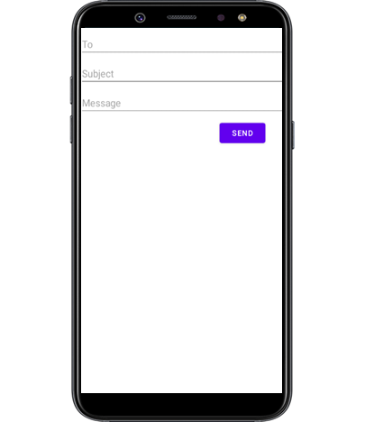
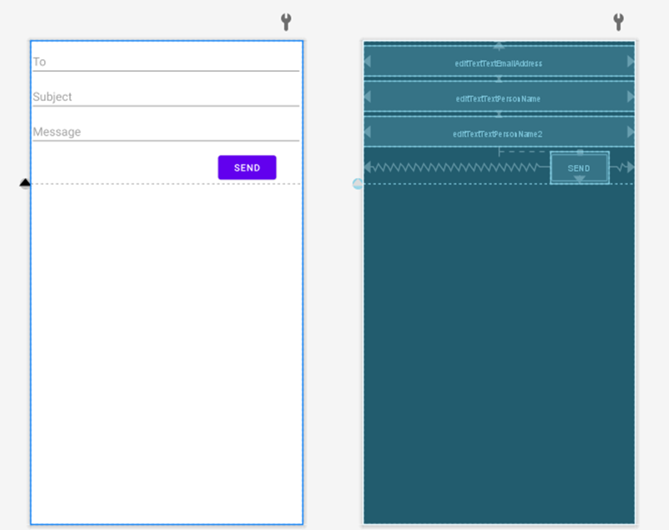
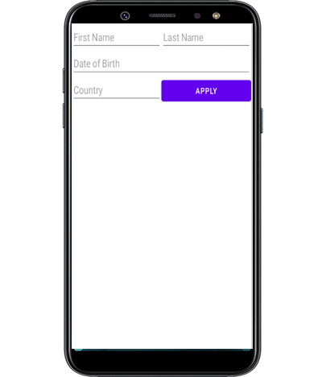

**About the Tutorial**


 
This tutorial will illustrate the basics of Layout – UI elements in Android. This is just an example of how to use one type of layout. You need to read and practice more examples from the Android Developer Website.
 

**Exercise 1: Send Message Design**

Create a new project and design the send message activity as in Figure 1 below. Use the constraintLayout container to hold one EmailText, two PlainText from the Text group and one Button from the Buttons group. Select each view and change properties from the Attributes section in the IDE. Use the XML code below to know what changes you need to make. 
 


Figure 1: Send message design.



Figure 2: Android Studio design layout editor.


**Final XML code**

__**Note: don’t copy and paste the code, use it as a guide to your design.**__

```xml
<?xml version="1.0" encoding="utf-8"?>
<androidx.constraintlayout.widget.ConstraintLayout xmlns:android="http://schemas.android.com/apk/res/android"
    xmlns:app="http://schemas.android.com/apk/res-auto"
    xmlns:tools="http://schemas.android.com/tools"
    android:layout_width="match_parent"
    android:layout_height="match_parent"
    tools:context=".MainActivity">

    <EditText
        android:id="@+id/editTextTextEmailAddress"
        android:layout_width="411dp"
        android:layout_height="wrap_content"
        android:ems="10"
        android:hint="To"
        android:inputType="textEmailAddress"
        app:layout_constraintBottom_toTopOf="@+id/editTextTextPersonName"
        app:layout_constraintEnd_toEndOf="parent"
        app:layout_constraintHorizontal_bias="0.0"
        app:layout_constraintStart_toStartOf="parent"
        app:layout_constraintTop_toTopOf="parent" />

    <EditText
        android:id="@+id/editTextTextPersonName2"
        android:layout_width="411dp"
        android:layout_height="wrap_content"
        android:ems="10"
        android:hint="Message"
        android:inputType="textPersonName"
        app:layout_constraintBottom_toTopOf="@+id/button"
        app:layout_constraintEnd_toEndOf="parent"
        app:layout_constraintHorizontal_bias="0.0"
        app:layout_constraintStart_toStartOf="parent"
        app:layout_constraintTop_toBottomOf="@+id/editTextTextPersonName" />

    <EditText
        android:id="@+id/editTextTextPersonName"
        android:layout_width="411dp"
        android:layout_height="wrap_content"
        android:ems="10"
        android:hint="Subject"
        android:inputType="textPersonName"
        app:layout_constraintBottom_toTopOf="@+id/editTextTextPersonName2"
        app:layout_constraintEnd_toEndOf="parent"
        app:layout_constraintHorizontal_bias="0.0"
        app:layout_constraintStart_toStartOf="parent"
        app:layout_constraintTop_toBottomOf="@+id/editTextTextEmailAddress" />

    <Button
        android:id="@+id/button"
        android:layout_width="wrap_content"
        android:layout_height="wrap_content"
        android:text="Send"
        app:layout_constraintBottom_toTopOf="@+id/guideline"
        app:layout_constraintEnd_toEndOf="parent"
        app:layout_constraintHorizontal_bias="0.879"
        app:layout_constraintStart_toStartOf="parent" />

    <androidx.constraintlayout.widget.Guideline
        android:id="@+id/guideline"
        android:layout_width="wrap_content"
        android:layout_height="wrap_content"
        android:orientation="horizontal"
        app:layout_constraintGuide_begin="215dp" />
</androidx.constraintlayout.widget.ConstraintLayout>
```
Can you now add a Text message to show “Message sent” when the user presses the send button? How to do this?

A toast in Android provides simple feedback about an operation in a small popup. It only fills the amount of space required for the message and the current activity remains visible and interactive. Toasts automatically disappear after a timeout.

Instantiate a Toast object
Use the makeText() method, which takes the following parameters:

1) The activity Context.
2) The text that should appear to the user.
3) The duration that the toast should remain on the screen.
4) The makeText() method returns a properly initialised Toast object.

```java
import androidx.appcompat.app.AppCompatActivity;

import android.os.Bundle;
import android.view.View;
import android.widget.Button;
import android.widget.Toast;

public class MainActivity extends AppCompatActivity {
    Button sendButton;

    @Override
    protected void onCreate(Bundle savedInstanceState) {
        super.onCreate(savedInstanceState);
        setContentView(R.layout.activity_main);
        sendButton = findViewById(R.id.button);
        sendButton.setOnClickListener(new View.OnClickListener() {
            public void onClick(View v) {
                Toast.makeText(MainActivity.this, "Message sent", Toast.LENGTH_SHORT).show();

            }
        });
    }
}
```

Have you spotted a new way to create events in Android? Can you tell the difference between the method and the method we used in the last sessions? Which one is easier? 

Task: 
1) Validate the input inserted by the user and create a toast for each one if the input is wrong.
2) Change the duration of the toast from SHORT to LONG.
3) Make the Message edit text multiline. 

**Exercise 2: Apply for Job Design**

Create a new project and design the 'Apply' activity as shown in Figure 3 below. 




Figure 3: Apply for job design.

**Final XML code** 

**Note: don’t copy and paste the code, just use it as a guide to your design.**  

```xml
?xml version="1.0" encoding="utf-8"?>
<androidx.constraintlayout.widget.ConstraintLayout xmlns:android="http://schemas.android.com/apk/res/android"
    xmlns:app="http://schemas.android.com/apk/res-auto"
    xmlns:tools="http://schemas.android.com/tools"
    android:layout_width="match_parent"
    android:layout_height="match_parent">

    <EditText
        android:id="@+id/editTextTextPersonName3"
        android:layout_width="0dp"
        android:layout_height="wrap_content"
        android:ems="10"
        android:hint="First Name"
        android:inputType="textPersonName"
        app:layout_constraintEnd_toStartOf="@+id/editTextTextPersonName4"
        app:layout_constraintHorizontal_bias="0.5"
        app:layout_constraintStart_toStartOf="parent"
        app:layout_constraintTop_toTopOf="parent" />

    <EditText
        android:id="@+id/editTextTextPersonName4"
        android:layout_width="0dp"
        android:layout_height="wrap_content"
        android:ems="10"
        android:hint="Last Name"
        android:inputType="textPersonName"
        app:layout_constraintEnd_toEndOf="parent"
        app:layout_constraintHorizontal_bias="0.5"
        app:layout_constraintStart_toEndOf="@+id/editTextTextPersonName3"
        app:layout_constraintTop_toTopOf="parent" />

    <EditText
        android:id="@+id/editTextTextPersonName5"
        android:layout_width="0dp"
        android:layout_height="wrap_content"
        android:ems="10"
        android:hint="Date of Birth"
        android:inputType="textPersonName"
        app:layout_constraintEnd_toEndOf="parent"
        app:layout_constraintStart_toStartOf="parent"
        app:layout_constraintTop_toBottomOf="@+id/editTextTextPersonName3" />

    <EditText
        android:id="@+id/editTextTextPersonName6"
        android:layout_width="0dp"
        android:layout_height="wrap_content"
        android:ems="10"
        android:hint="Country"
        android:inputType="textPersonName"
        app:layout_constraintEnd_toStartOf="@+id/button2"
        app:layout_constraintHorizontal_bias="0.5"
        app:layout_constraintStart_toStartOf="parent"
        app:layout_constraintTop_toBottomOf="@+id/editTextTextPersonName5" />

    <Button
        android:id="@+id/button2"
        android:layout_width="0dp"
        android:layout_height="wrap_content"
        android:text="Apply"
        app:layout_constraintEnd_toEndOf="parent"
        app:layout_constraintHorizontal_bias="0.5"
        app:layout_constraintStart_toEndOf="@+id/editTextTextPersonName6"
        app:layout_constraintTop_toBottomOf="@+id/editTextTextPersonName5" />
</androidx.constraintlayout.widget.ConstraintLayout>
```
**Can you make the app interactive? Write code to show a message using Toasts**


**Exercise 3: Design your health app (assignment)**

Start thinking about your UI layout for your app and test the layout using the layout validation.

**Exercise 4: Use Git in Android Studio**

Working with Git in Android is relatively easy and it needs only a few steps, if you use a Mac machine, then the following [Medium article](https://betterprogramming.pub/how-to-use-git-in-android-studio-part-1-a8a554006aad) is for you. If you use a VM or Windows machine, the only difference is the first step to go to File ➤ Settings ➤ Version Control ➤ Git instead of Preferences. The rest will be the same.

**Happy design time**
