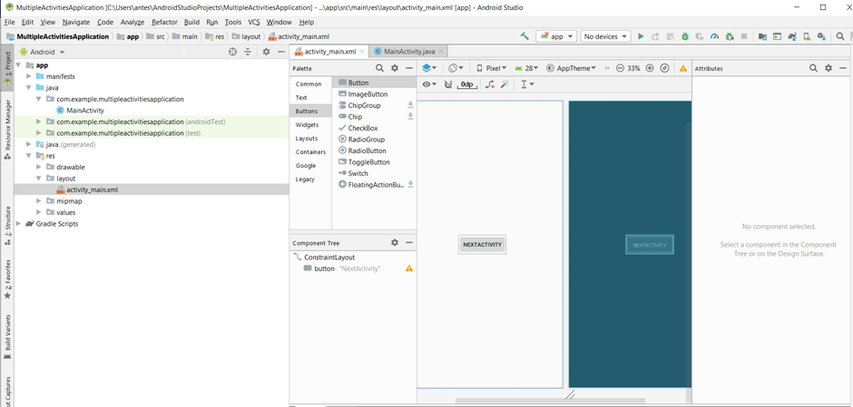
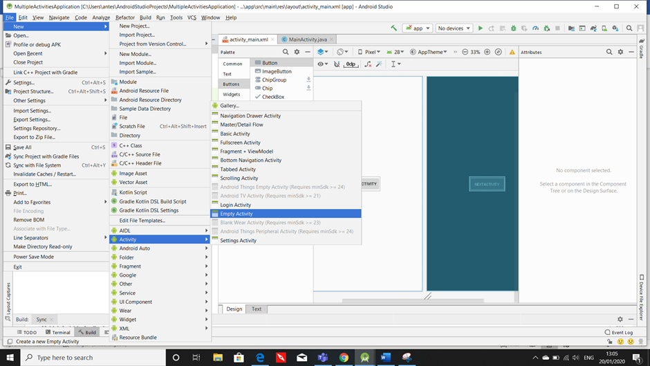
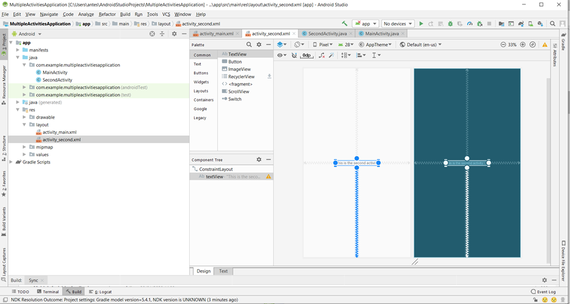
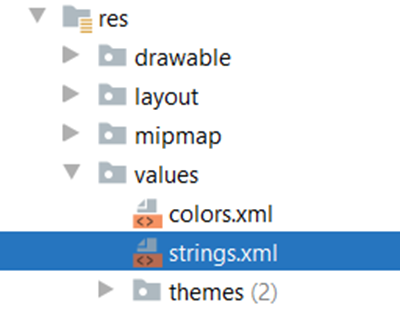
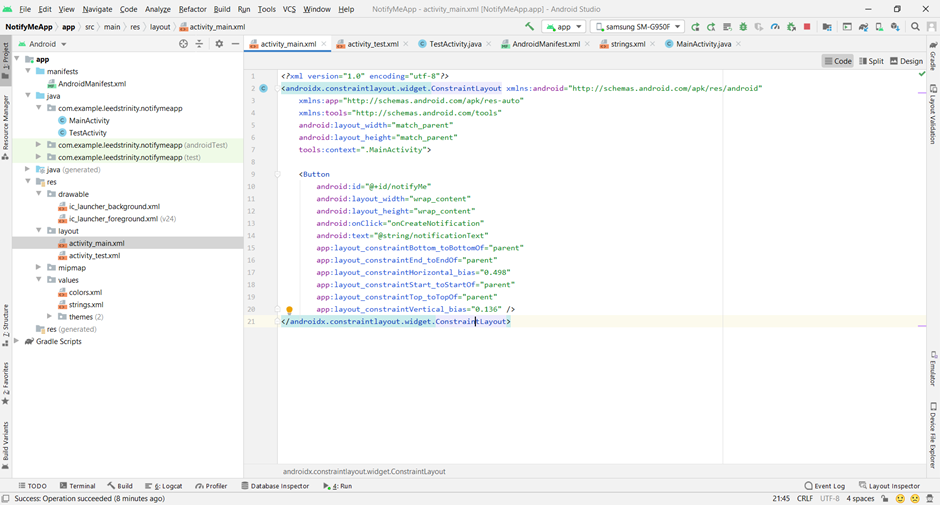
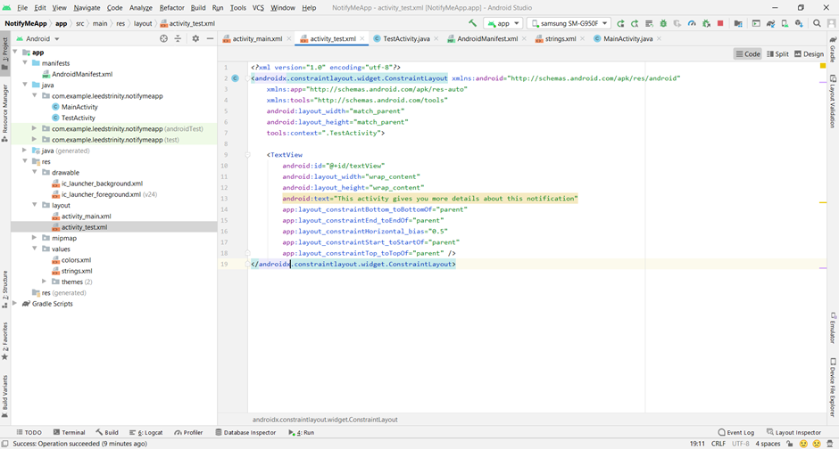

**About the Tutorial**


Android apps can contain one or more activities. Once your app has more than one activity, you will get to navigate from one activity to another using Intent. This tutorial will illustrate the basics of Intent in Android and how to use this messaging object to start communications between different components. 

**Android Intent Example**

The following example shows a way to add another activity to an existing project and so navigate between the two activities in an Android application.

**Explicit Intent - Navigate Between Two Activities Example:**

_(Skip this example if you are done with the MyMessenger project introduced in the lecture and move directly to step 8)._

1. Create a new project and name it “MultipleActivitiesApplication”.
2. Open res ➪ layout ➪ activity_main.xml, add a button and change its id to “linkButton” and text to “NextActivity”.
 


_Important Note!!! You need to constrain each view you add to your XML UI using the design editor._

3. Now you need to add a new activity and name it “SecondActivity”. 
4. Click the app folder from the project window and add a new activity by selecting File -> New -> Activity -> Empty Views Activity.
   Note: Don't select EmptyView


 
5.  Now add a TextView to the XML layout and change its id to “linkView” and text to “This is the second Activity”.  


 
6.  Now add the following code in the MainActivity.java class.
The main points are as follows: 
- Create a variable from the type Button to access the button view you put in the main layout.
- Access the button view in the onCreate method using the R java class and the button id.
- Create an onClick event called 'linkNextActivity' for the button view in the main layout and add the corresponding method in the Java code as we did in previous sessions.
- Add the code as below.


```java
package com.example.multipleactivitiesapplication;

import androidx.appcompat.app.AppCompatActivity;

import android.os.Bundle;
import android.view.View;
import android.content.Intent;

public class MainActivity extends AppCompatActivity {
    Button clickButton;

    @Override
    protected void onCreate(Bundle savedInstanceState) {
        super.onCreate(savedInstanceState);
        setContentView(R.layout.activity_main);

        clickButton = findViewById(R.id.linkButton);
    }

    public void linkNextActivity(View view) {
        Intent intent= new Intent(this, SecondActivity.class);
        startActivity(intent);
    }
}
```

7.  You are done now. Run your Android Intent Application.

8. Now practice sharing data between your activities. Adjust the activity_main.xml UI design and add a PlainText view to your UI, change its id to "editTextMessage", delete the default value of the text attribute and add "Enter your Message" in the hint attribute. 
  
9. Go to the MainActivity.java class and add the following code to the 'linkNextActivity' method:

```java
package com.example.multipleactivitiesapplication;

import androidx.appcompat.app.AppCompatActivity;

import android.os.Bundle;
import android.view.View;
import android.content.Intent;

public class MainActivity extends AppCompatActivity {
    Button clickButton;
    EditText editText;


    @Override
    protected void onCreate(Bundle savedInstanceState) {
        super.onCreate(savedInstanceState);
        setContentView(R.layout.activity_main);

        clickButton = findViewById(R.id.linkButton);
        editText = findViewById(R.id.editTextMessage);
    }

    public void linkNextActivity(View view) {
        Intent intent= new Intent(this, SecondActivity.class);
        String message = editText.getText().toString();
        intent.putExtra("Message", message);
        startActivity(intent);
    }
}

```

10. To receive the data in the SecondActivity, add the following code to the onCreate() method in the SecondActivity.java class:

```java
textMessage = findViewById(R.id.textView);
textMessage.setText(getIntent().getStringExtra("Message"));
```
_Note: don't forget to define the variable textMessage as a class member._

11. You are done now, run your code to see your message shown on the SecondActivity.

 
**Pending Intent - Notification Example**

1. Create a new project called NotifyMeApp and add a button to the activity_main.xml. Change its id to “notifyMe” and the text to “create notification”. Add onClick event to the button, call it 'onCreateNotification' and add the corresponding method associated with it to Java code. 

_Hint: you can now develop some advanced skills and keep all strings in a strings.xml file which is used to replace the Hard-coded strings with a single string. We define all the strings in this XML file and then access them in our app (Activity or in Layout XML files) from this file. This file enhances the reusability of the code. Location in Android Studio:_


 
_For more information about strings.xml file and how to format and style your text visit the following [link](https://developer.android.com/guide/topics/resources/string-resource#java)._

 

2. Add a new activity and name it “TestActivity” as in the previous example and design the activity_test.xml layout to include a TextView. The code should look as follows:
   Note: don't forget to select the right option for the activity: 'Empty Views Activity'.
   

 
3. Add the following code to the MainActivity.java class:

```java
public class MainActivity extends AppCompatActivity {
    String NOTIFICATION_CHANNEL_ID = "my_channel_id_01";

    @Override
    protected void onCreate(Bundle savedInstanceState) {
        super.onCreate(savedInstanceState);
        setContentView(R.layout.activity_main);
        Button btnNotification = findViewById(R.id.notifyMe);
    }

    public void onCreateNotification(View view) {
        // Create a notification channel
        NotificationManager notificationManager = (NotificationManager) getSystemService(Context.NOTIFICATION_SERVICE);
        // Create the NotificationChannel, but only on API 26+ because
        // The NotificationChannel class is new and not in the support library
        if (Build.VERSION.SDK_INT >= Build.VERSION_CODES.O) {
            NotificationChannel notificationChannel = new NotificationChannel(NOTIFICATION_CHANNEL_ID, "My Notifications", NotificationManager.IMPORTANCE_DEFAULT);

            // Configure the notification channel.
            notificationChannel.setDescription("Channel description");
            notificationChannel.enableLights(true);
            notificationChannel.setLightColor(Color.RED);
            notificationChannel.setVibrationPattern(new long[]{0, 1000, 500, 1000});
            notificationChannel.enableVibration(true);
            notificationManager.createNotificationChannel(notificationChannel);
        }


        NotificationCompat.Builder notificationBuilder = new NotificationCompat.Builder(this, NOTIFICATION_CHANNEL_ID);

        notificationBuilder.setAutoCancel(true)
                .setDefaults(Notification.DEFAULT_ALL)
                .setWhen(System.currentTimeMillis())
                .setSmallIcon(R.drawable.ic_launcher_background)
                .setTicker("Hearty365")
                .setPriority(Notification.PRIORITY_MAX)
                .setContentTitle("Default notification")
                .setContentText("This is my first notification app.")
                .setContentInfo("Info");

        notificationManager.notify(/*notification id*/1, notificationBuilder.build());

    }
}
```
Note: Don't forget to import all the classes, go with the 1st suggestions from the Android list or ask for assistance if you're confused. 
You will receive an error at the line:'NotificationCompat.Builder notificationBuilder = new NotificationCompat.Builder(this, NOTIFICATION_CHANNEL_ID);' and Android will suggest adding a 'POST_NOTIFICATIONS' permission, so please go with the suggestion and let Android add it for you.
Check AndroidManidest and make sure that a line is added as follows:

```xml
 <uses-permission android:name="android.permission.POST_NOTIFICATIONS" />
 ```

4. You are done now. Run your application.
5. Set the notification's tap action: every notification should respond to a tap, usually to open an activity in your app that corresponds to the notification. To do so, you must specify a content intent defined with a PendingIntent object and pass it to setContentIntent(). 
The following snippet shows how to create a basic intent to open an activity when the user taps the notification:

```java
// Create an explicit intent for an Activity in your app
Intent intent = new Intent(this, TestActivity.class);
intent.setFlags(Intent.FLAG_ACTIVITY_NEW_TASK | Intent.FLAG_ACTIVITY_CLEAR_TASK);
PendingIntent pendingIntent = PendingIntent.getActivity(this, 0, intent, 0);

// Set the intent that will fire when the user taps the notification
.setContentIntent(pendingIntent);
```

The final code should look like the following:

```java
public class MainActivity extends AppCompatActivity {
    String NOTIFICATION_CHANNEL_ID = "my_channel_id_01";

    @Override
    protected void onCreate(Bundle savedInstanceState) {
        super.onCreate(savedInstanceState);
        setContentView(R.layout.activity_main);
        Button btnNotification = findViewById(R.id.notifyMe);


    }

    public void onCreateNotification(View view) {
        // Create an explicit intent for an Activity in your app
        Intent intent = new Intent(this, TestActivity.class);
        intent.setFlags(Intent.FLAG_ACTIVITY_NEW_TASK | Intent.FLAG_ACTIVITY_CLEAR_TASK);
        PendingIntent pendingIntent = PendingIntent.getActivity(this, 0, intent, 0);
        
        // Create notification channel 
        NotificationManager notificationManager = (NotificationManager) getSystemService(Context.NOTIFICATION_SERVICE);
        // Create the NotificationChannel, but only on API 26+ because
        // the NotificationChannel class is new and not in the support library
        if (Build.VERSION.SDK_INT >= Build.VERSION_CODES.O) {
            NotificationChannel notificationChannel = new NotificationChannel(NOTIFICATION_CHANNEL_ID, "My Notifications", NotificationManager.IMPORTANCE_DEFAULT);

            // Configure the notification channel.
            notificationChannel.setDescription("Channel description");
            notificationChannel.enableLights(true);
            notificationChannel.setLightColor(Color.RED);
            notificationChannel.setVibrationPattern(new long[]{0, 1000, 500, 1000});
            notificationChannel.enableVibration(true);
            notificationManager.createNotificationChannel(notificationChannel);
        }


        NotificationCompat.Builder notificationBuilder = new NotificationCompat.Builder(this, NOTIFICATION_CHANNEL_ID);

        notificationBuilder.setAutoCancel(true)
                .setDefaults(Notification.DEFAULT_ALL)
                .setWhen(System.currentTimeMillis())
                .setSmallIcon(R.drawable.ic_launcher_background)
                .setTicker("Hearty365")
                .setPriority(Notification.PRIORITY_DEFAULT)
                .setContentTitle("Default notification")
                .setContentText("This is my first notification app.")
                .setContentInfo("Info")
                 // Set the intent that will fire when the user taps the notification
                .setContentIntent(pendingIntent);

        notificationManager.notify(/*notification id*/1, notificationBuilder.build());

    }
}
```

6. Rerun your app and check the result.

Check this link to read more about [notifications](https://developer.android.com/training/notify-user/build-notification#java).

**Implicit Intent – Sending Message Example:**

(Note: this example is based on MyMessenger project, please follow the steps in the lecture to complete the first few tasks).

You can build apps that perform powerful tasks by chaining together activities across the device but we don’t know what apps are on the user’s device?

There are three questions we need answers to before we can call activities in other apps:

- How do we know which activities are available on the user’s device?
- How do we know which of these activities are appropriate for what we want to do?
- How do we know how to use these activities?

The great news is that we can solve all of these problems using actions. Actions are a way of telling Android what standard operations activities can perform. As an example, Android knows that all activities registered for a send action are capable of sending messages.

To solve this problem, you’re going to do the following:
- Create an intent that specifies an action: this intent will tell Android you want to use an activity that can send a message. The intent will include the text of the message.
- Allow the user to choose which app to use: chances are, there’ll be more than one app on the user’s device capable of sending messages, so the user will need to pick one. We want the user to be able to choose one every time they click on the Send Message button.

**Let's start the project steps:**
1) Create an intent that specifies an action using the following code:

```java
Intent intent = new Intent(ACTION);
```
where action is the type of activity action you want to perform. Android provides you with a number of standard actions you can use. As an example, you can use Intent.ACTION_DIAL to dial a number, Intent.ACTION_WEB_SEARCH to perform a web search, and Intent.ACTION_SEND to send a message. So, if you want to create an intent that specifies you want to send a message, you use:

```java
Intent intent = new Intent(Intent.ACTION_SEND);
```

2) Add extra information to the intent
Once you’ve specified the action you want to use, you can add extra information to it. We want to pass some text with the intent that will form the body of the message we’re sending. To do this, you use the following lines of code:
   
```java
intent.setType("text/plain");
intent.putExtra(Intent.EXTRA_TEXT,messageText);
```

3) Android sees that the intent can only be passed to activities able to handle ACTION_SEND and text/plain data. Android checks all the activities on the user’s device, looking for ones that are able to receive the intent. If no actions are able to handle the intent, an ActivityNotFoundException is thrown. So, you need to add a filter to your CreateMessageActivity.java in the AndroidManifest.xml file to make this activity able to handle ACTION_SEND and data of any MIME type as follow: 

```xml
<?xml version="1.0" encoding="utf-8"?>
<manifest xmlns:android="http://schemas.android.com/apk/res/android"
    package="com.example.leedstrinity.mymessenger">

    <application
        android:allowBackup="true"
        android:icon="@mipmap/ic_launcher"
        android:label="@string/app_name"
        android:roundIcon="@mipmap/ic_launcher_round"
        android:supportsRtl="true"
        android:theme="@style/Theme.MyMessenger">
        <activity android:name=".ReceiveMessageActivity"></activity>
        <activity android:name=".CreateMessageActivity">
            <intent-filter>
                <action android:name="android.intent.action.MAIN" />

                <category android:name="android.intent.category.LAUNCHER" />
            </intent-filter>

            <intent-filter>
                <action android:name="android.intent.action.SEND"/>
                <category android:name="android.intent.category.DEFAULT"/>
                <data android:mimeType="*/*"/>
            </intent-filter>

        </activity>
    </application>

</manifest>
```

4) Edit the code in the CreateMessageActivity.java activity, the code should look similar to the following:

```java
public class CreateMessageActivity extends AppCompatActivity {

    @Override
    protected void onCreate(Bundle savedInstanceState) {
        super.onCreate(savedInstanceState);
        setContentView(R.layout.activity_create_message);
    }

    public void onSendMessage(View view) {
        EditText messageView = findViewById(R.id.editTextMessage);
        String messageText = messageView.getText().toString();
        //Intent intent = new Intent(this, ReceiveMessageActivity.class);
        Intent intent = new Intent(Intent.ACTION_SEND);
        intent.setType("text/plain");
        intent.putExtra(Intent.EXTRA_TEXT,messageText);
        Intent shareIntent = Intent.createChooser(intent, null);
        startActivity(shareIntent);
    }
}
```

5) Run your application on a real device. 
6) Practice more examples in this [link](https://developer.android.com/training/sharing/send#:~:text=1%20Sending%20text%20content.%20The%20most%20straightforward%20and,content%2C%20use%20the%20ACTION_SEND_MULTIPLE%20action%20together...%20More%20).

**Challenge:** Write a simple activity for typing a phone number and then place the call?
Check this YouTube [video ](https://www.youtube.com/watch?v=eL69kj-_Wvs)to have a clue on how to solve the challenge. Discuss how to design your app and what steps do you need before implementing the solution using Android Studio.

**Happy Android Coding**
