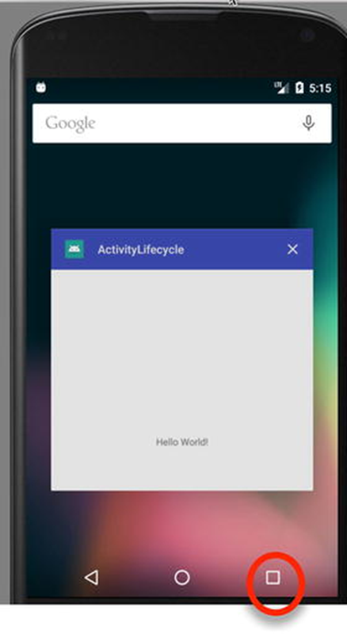
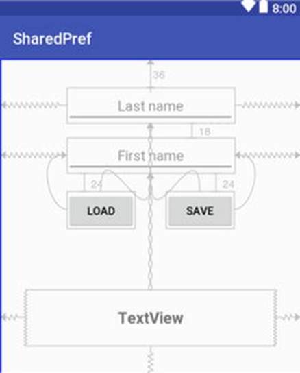

**About the Tutorial**


An activity in Android is a single, focused thing that the user can do. Almost all activities interact with the user, so the Activity class takes care of creating a window for you in which you can place your UI and allow the user to start interacting with your content, however, knowing about the Android Runtime system and activity lifecycle in Android is crucial to design your code. So, this tutorial will give you examples of how to use the Activity class and the lifecycle methods. In addition, you will know how to use runtime permissions in Android.

**Activity Lifecycle Methods Example**
_**Before we start with the example, advance your Android skills and learn about TAGs in Android.**_  

- In Android, you can declare a TAG constant in your MainActivity class to use Log API for sending logs output. You can then view the logs in logcat. Log API is used to test your code, such as printing or saving information about what exactly your code is doing and what is the current data works with. So, it is important to read more about Log API in this [link](https://developer.android.com/reference/android/util/Log).

Now let's start with the example's steps:
1) Create a new android project and name it “ActivityLifecycle”.

2) Edit the MainActivity.java code and define a TAG variable under the class name as follow: 
```java
private static final String TAG = "MainActivity";
```

2) Add the following changes to the MainActivity.java code:

```java
@Override
protected void onCreate(Bundle savedInstanceState) {
    super.onCreate(savedInstanceState);
    setContentView(R.layout.activity_main);
    Log.i(TAG, "onCreate");

}

@Override
protected void onStart() {
    super.onStart();
    Log.i(TAG, "onStart");
}

@Override
protected void onResume() {
    super.onResume();
    Log.i(TAG, "onResume");
}

@Override
protected void onPause() {
    super.onPause();
    Log.i(TAG, "onPause");
}

@Override
protected void onStop() {
    super.onStop();
    Log.i(TAG, "onStop");
}

@Override
protected void onDestroy() {
    super.onDestroy();
    Log.i(TAG, "onDestroy");
}

```
 
**_Note: If you want to see the onDestroy message, you can use the “Recent apps” button of the device to see all the running apps. You can kill the application from there, see figure below:_**


 

**Keeping data across app lifecycle events example.**

When an app creates or captures data from user input, this data will only be available during the lifetime of the app. You only have access to this data as long as the app is not yet killed by Android runtime. When the app is shut down, all the data that has been created while the app was running will be lost. Android offers a variety of ways for us to persist data so that it can outlive the app lifetime and allow us to access the same data across the app lifecycle events. One way is the use of **onSaveInstanceState** method to save data across different lifecycle events which were explored in the Stopwatch app.  

**In this example, you will explore the SharedPreferences storage way which allows you to keep the data safe even after your app is killed.**

**What is SharedPreferences?**

SharedPreferences: this is the simplest form of storage. It’s just a dictionary object that uses the key/value pair idiom. This is useful if your data is simple enough to be structured as a dictionary object (key/value pairs). Android stores these files internally as XML files. SharedPrefs only stores simple data types (e.g., String and primitive data types). It cannot store more complex data such as objects.

**How to use SharedPreferences?**

- To create a SharedPreferences file, we need to use the **getPreferences** method while inside an Activity class and then specify the mode of access for the file as follow:
```java
SharedPreferences sp = getPreferences(CONTEXT.MODE_PRIVATE);
```
- As per Android documentation, Context.MODE_PRIVATE is what we are supposed to use because the public mode has already been deprecated since API level 17. Next, we need an Editor object so we can start modifying data in the newly created file as follow:
```java
SharedPreferences.Editor editor = sp.edit();
```
- Now we can start putting in some data:
```java
edit.putString("name","Gandalf the Grey");
edit.putInt("age", 2019);
```
- The first parameter to the put commands is always the key, and the second parameter is the value. In the preceding example, “name” and “age” are the keys and “Gandalf the Grey” and 2019 are values, respectively. The put commands, by themselves, do not save the data to the file, so we need to use either the apply or the commit method:
```java
editor.apply(); // or
editor.commit();
```
Either the commit or apply method will save the information and persist it in an XML file; there are only slight differences between these two methods. 
| Method| Purpose|
| ------ | ------ |
| commit| this is synchronous and returns a boolean value, it returns true if the write operation succeeded|
| apply | this also saves the data but does not return any value. It is executed asynchronously|

_**NOTE:**_
You don’t need to specify a file name for the shared preferences file; the Android runtime will automatically assign a name for the newly created file. By convention, the newly created file follows the name of the activity class from where getPreferences was called from; for example, if you called getPreferences from MainActivity.java, the name of the shared preferences file will be MainActivity.xml

- Retrieving data from a shared preferences file is just as easy as creating it. To access the created shared preferences file, we use the same syntax when we created the file in the first place as follow:

```java
SharedPreferences sp = getPreferences(CONTEXT.MODE_PRIVATE);
```
- The getPreferences method returns an instance of a SharedPreferences object. The first time this method is called, it will look for an XML file bearing the same name as the activity from which the method was called; if it doesn’t find that file, it will be created, but if the file already exist, it will be used instead. Since we already created the file the first time we called getPreferences, Android won’t be creating a new file, nor will it overwrite what we created before.

- Once we have a shared preferences object, we can extract data from it as follow:
```java
sp.getString("name", "default value");
sp.getInt("age", 0);
```

**Now, let’s experience this in practice.**

1) Create a new project and name it “SharedPreferences”. 
2) Design the UI layout for the main layout file as shown below. 2 Plain Text, 2 Button and 1 Text View
 


The final layout code should look like the following: 

```xml
<?xml version="1.0" encoding="utf-8"?>
<androidx.constraintlayout.widget.ConstraintLayout xmlns:android="http://schemas.android.com/apk/res/android"
    xmlns:app="http://schemas.android.com/apk/res-auto"
    xmlns:tools="http://schemas.android.com/tools"
    android:layout_width="match_parent"
    android:layout_height="match_parent"
    tools:context=".MainActivity">

    <TextView
        android:id="@+id/textView"
        android:layout_width="wrap_content"
        android:layout_height="wrap_content"
        android:layout_marginBottom="56dp"
        android:text="Text View"
        app:layout_constraintBottom_toTopOf="@+id/guideline"
        app:layout_constraintEnd_toEndOf="parent"
        app:layout_constraintHorizontal_bias="0.498"
        app:layout_constraintStart_toStartOf="parent" />

    <EditText
        android:id="@+id/lname_edit"
        android:layout_width="wrap_content"
        android:layout_height="wrap_content"
        android:ems="10"
        android:hint="Last Name"
        android:inputType="textPersonName"
        app:layout_constraintBottom_toTopOf="@+id/fname_edit"
        app:layout_constraintEnd_toEndOf="parent"
        app:layout_constraintHorizontal_bias="0.5"
        app:layout_constraintStart_toStartOf="parent"
        app:layout_constraintTop_toTopOf="parent" />

    <EditText
        android:id="@+id/fname_edit"
        android:layout_width="wrap_content"
        android:layout_height="wrap_content"
        android:layout_marginBottom="68dp"
        android:ems="10"
        android:hint="First Name"
        android:inputType="textPersonName"
        app:layout_constraintBottom_toTopOf="@+id/load_button"
        app:layout_constraintEnd_toEndOf="parent"
        app:layout_constraintHorizontal_bias="0.502"
        app:layout_constraintStart_toStartOf="parent" />

    <Button
        android:id="@+id/load_button"
        android:layout_width="wrap_content"
        android:layout_height="wrap_content"
        android:layout_marginBottom="92dp"
        android:onClick="onClickLoad"
        android:text="Load"
        app:layout_constraintBottom_toTopOf="@+id/textView"
        app:layout_constraintEnd_toStartOf="@+id/save_button"
        app:layout_constraintHorizontal_bias="0.5"
        app:layout_constraintStart_toStartOf="parent" />

    <Button
        android:id="@+id/save_button"
        android:layout_width="wrap_content"
        android:layout_height="wrap_content"
        android:layout_marginBottom="92dp"
        android:onClick="onClickSave"
        android:text="Save"
        app:layout_constraintBottom_toTopOf="@+id/textView"
        app:layout_constraintEnd_toEndOf="parent"
        app:layout_constraintHorizontal_bias="0.5"
        app:layout_constraintStart_toEndOf="@+id/load_button" />

    <androidx.constraintlayout.widget.Guideline
        android:id="@+id/guideline"
        android:layout_width="wrap_content"
        android:layout_height="wrap_content"
        android:orientation="horizontal"
        app:layout_constraintGuide_begin="416dp" />

</androidx.constraintlayout.widget.ConstraintLayout>
```

The basic workflow for this app would be as follows: 
        - Type the last name and first name information in the two text fields.
        - When the “SAVE” button is clicked, extract the string values from the text fields and save them in the shared preferences file. 

We need to create a shared preferences file as explained above and do the following:
o	Push the last name and first name data into the shared preferences file by using one of the put methods of editor object.
o	Save the changes. 

When the “LOAD” button is clicked. Follow the next steps: 
o	Retrieve the shared preferences file using the same syntax as when it was created
o	Retrieve the data on the file using one of the get methods
o	Show the retrieved data by setting the text attribute of a TextView object

**Start coding now!**
4) In the onCreate() method access the UI views and create two onClick() events for the two buttons as shown in the layout code above.

```java
@Override
protected void onCreate(Bundle savedInstanceState) {
    super.onCreate(savedInstanceState);
    setContentView(R.layout.activity_main);
    Button savebtn = findViewById(R.id.save_button);
    Button loadbtn = findViewById(R.id.load_button);

}
```

5) In the save_button onClick() event, write the following code:

```java
public void onClickSave(View view) {
    EditText lname_edit = findViewById(R.id.lname_edit);
    EditText fname_edit = findViewById(R.id.fname_edit);

    SharedPreferences sp = getPreferences(Context.MODE_PRIVATE); ❶
    SharedPreferences.Editor edit = sp.edit(); ❷
    String lname = lname_edit.getText().toString();  ❸
    String fname = fname_edit.getText().toString();
    edit.putString("lname", lname);  ❹
    edit.putString("fname", fname);
    edit.apply();  ❺

    Toast.makeText(MainActivity.this, "Saved it", Toast.LENGTH_SHORT).show();
    Log.i(TAG, "onClickSave: Toast is an Android class which is used to display messages to the user");

}
```
Save Button 
❶ Creates the shared preferences file, if one doesn’t exist yet
❷ We can’t save data to the shared preferences file (yet); we need an interface object for it. The editor objects will do that job
❸ Retrieve whatever the user has typed on the EditText objects and assign them to String variables
❹ Use the editor object to persist data into the shared preferences file
❺ Commit the changes to the file

•	In the load_button onClick() event, write the following code:

public void onClickLoad(View view) {
    TextView name_text = findViewById(R.id.textView);

    SharedPreferences sp = getPreferences(Context.MODE_PRIVATE);  ❶
    String lname = sp.getString("lname", "na");  ❷
 String fname = sp.getString("fname", "na");
 name_text.setText(String.format("%s, %s", lname, fname)); ❸
}

Load Button
❶ Retrieve the shared preferences object by getting a reference to it. The syntax for creating a shared preferences object is the same as that for retrieving it. Android is clever enough to 
Note:
Figure out that if the file doesn’t exist, you want to create, and if it does exist, you want to retrieve it
❷ Get the data out of the shared pref file using one of the get methods; store it in a String variable
❸ Set the text of the TextView object using the retrieved data from the shared pref file

•	The final code should look like the following:
•	package com.example.leedstrinity.sharedpreferences;

import androidx.appcompat.app.AppCompatActivity;

import android.content.Context;
import android.content.SharedPreferences;
import android.os.Bundle;
import android.util.Log;
import android.view.View;
import android.widget.Button;
import android.widget.EditText;
import android.widget.TextView;
import android.widget.Toast;

public class MainActivity extends AppCompatActivity {
    private static final String TAG = "MainActivity";

    @Override
    protected void onCreate(Bundle savedInstanceState) {
        super.onCreate(savedInstanceState);
        setContentView(R.layout.activity_main);
        Button savebtn = findViewById(R.id.save_button);
        Button loadbtn = findViewById(R.id.load_button);

    }

    public void onClickSave(View view) {
        EditText lname_edit = findViewById(R.id.lname_edit);
        EditText fname_edit = findViewById(R.id.fname_edit);
        SharedPreferences sp = getPreferences(Context.MODE_PRIVATE);
        SharedPreferences.Editor edit = sp.edit();
        String lname = lname_edit.getText().toString();
        String fname = fname_edit.getText().toString();
        edit.putString("lname", lname);
        edit.putString("fname", fname);
        edit.apply();
        Toast.makeText(MainActivity.this, "Saved it", Toast.LENGTH_SHORT).show();
        Log.i(TAG, "onClickSave: Toast is an Android class which is used to display messages to the user");

    }

    public void onClickLoad(View view) {
        TextView name_text = findViewById(R.id.textView);
        SharedPreferences sp = getPreferences(Context.MODE_PRIVATE);
        String lname = sp.getString("lname", "na");
        String fname = sp.getString("fname", "na");
        name_text.setText(String.format("%s, %s", lname, fname));
    }
}

•	Check for errors and run your application. 
•	Add age and date of birth fields to your layout and update the shared preferences file to save and retrieve the new fields. 

Runtime permissions example:
The full list of permissions that fall into the dangerous category is as follow:

Permission Group	Permission
Calendar	READ_CALENDAR
WRITE_CALENDAR
Camera	CAMERA
Contacts	READ_CONTACTS
WRITE_CONTACTS
GET_ACCOUNTS
Location	ACCESS_FINE_LOCATION
ACCESS_COARSE_LOCATION
Microphone	RECORD_AUDIO
Phone	READ_PHONE_STATE
CALL_PHONE
READ_CALL_LOG
WRITE_CALL_LOG
ADD_VOICEMAIL
USE_SIP
PROCESS_OUTGOING_CALLS
Sensors	BODY_SENSORS
SMS	SEND_SMS
RECEIVE_SMS
READ_SMS
RECEIVE_WAP_PUSH
RECEIVE_MMS
Storage	READ_EXTERNAL_STORAGE
WRITE_EXTERNAL_STORAGE

Lifecycle of Runtime Permissions
For example let’s assume, we want to request camera permission from user.
	Step 1 -> First of all, we will ask it with pop up dialog. If user grants permissions, then you can implement camera feature.
	Step 2 -> Other than granting the permission, user have other option to deny it. When user denies the permission, we have to repeat the step 1 and this process continues.
	Step 3 -> Last case is that user first checks the “Never Ask Again” checkbox and then denies the permission. Here you cannot repeat the step 1. In this scenario, you need to create custom pop up dialog which will educate user about the importance of the permission. In this dialog, give user a button which will lead him to the app settings, from where he can grant the camera or other permissions.

Creating the Permissions Example Project
Start a new Android project with an Empty Activity template, enter PermissionDemo into the Name field and specify com.example.leedstrinity.permissiondemo as the package name. Before clicking on the Finish button, change the Minimum API level setting to API 26: Android 8.0 (Oreo) and the Language menu to Java.

Checking for a Permission
The Android Support Library contains a number of methods that can be used to seek and manage dangerous permissions within the code of an Android app. These API calls can be made safely regardless of the version of Android on which the app is running, but will only perform meaningful tasks when executed on Android 6.0 or later.

Before an app attempts to make use of a feature that requires approval of a dangerous permission, and regardless of whether or not permission was previously granted, the code must check that the permission has been granted. This can be achieved via a call to the checkSelfPermission() method of the ContextCompat class, passing through as arguments a reference to the current activity and the permission being requested. The method will check whether the permission has been previously granted and return an integer value matching PackageManager.PERMISSION_GRANTED or PackageManager.PERMISSION_DENIED.
Within the MainActivity.java file of the example project, modify the code to check whether permission has been granted for the app to record audio:

package com.example.leedstrinity.permissiondemo;
 
import androidx.appcompat.app.AppCompatActivity;
import androidx.core.content.ContextCompat;
 
import android.os.Bundle;
import android.Manifest;
import android.content.pm.PackageManager;
import android.util.Log;
 
public class MainActivity extends AppCompatActivity {
 
    private static String TAG = "PermissionDemo";
 
    @Override
    protected void onCreate(Bundle savedInstanceState) {
        super.onCreate(savedInstanceState);
        setContentView(R.layout.activity_permission_demo);
 
        setupPermissions();
    }
 
    private void setupPermissions() {
        int permission = ContextCompat.checkSelfPermission(this,
                Manifest.permission.RECORD_AUDIO);
 
        if (permission != PackageManager.PERMISSION_GRANTED) {
            Log.i(TAG, "Permission to record denied");
        }
    }
}

Run the app on a device or emulator running a version of Android that predates Android 6.0 and check the Logcat output within Android Studio. After the app has launched, the Logcat output should include the “Permission to record denied” message.

Edit the AndroidManifest.xml file (located in the Project tool window under app -> manifests) and add a line to request recording permission as follows:
<?xml version="1.0" encoding="utf-8"?>
<manifest xmlns:android="http://schemas.android.com/apk/res/android"
    package="com.example.leedstrinity.permissiondemo" >
 
    <uses-permission android:name="android.permission.RECORD_AUDIO" />
 
    <application
        android:allowBackup="true"
        android:icon="@mipmap/ic_launcher"
        android:label="@sxtring/app_name"
        android:supportsRtl="true"
        android:theme="@style/AppTheme" >
        <activity android:name=".MainActivity" >
            <intent-filter>
                <action android:name="android.intent.action.MAIN" />
 
                <category
                  android:name="android.intent.category.LAUNCHER" />
            </intent-filter>
        </activity>
    </application>
</manifest>

Compile and run the app once again and note that this time the permission denial message does not appear. Clearly, everything that needs to be done to request this permission on older versions of Android has been done. Run the app on a device or emulator running Android 6.0 or later, however, and note that even though permission has been added to the manifest file, the check still reports that permission has been denied. This is because Android version 6 and later require that the app also request dangerous permissions at runtime.

Requesting Permission at Runtime
A permission request is made via a call to the requestPermissions() method of the ActivityCompat class. When this method is called, the permission request is handled asynchronously and a method named onRequestPermissionsResult() is called when the task is completed.
The requestPermissions() method takes as arguments a reference to the current activity, together with the identifier of the permission being requested and a request code. The request code can be any integer value and will be used to identify which request has triggered the call to the onRequestPermissionsResult() method. Modify the MainActivity.java file to declare a request code and request recording permission in the event that the permission check failed:
.
.
import androidx.core.app.ActivityCompat;
.
.
public class MainActivity extends AppCompatActivity {
 
    private static String TAG = "PermissionDemo";
    private static final int RECORD_REQUEST_CODE = 101;
.
.
    @Override
    private void setupPermissions() {
 
        int permission = ContextCompat.checkSelfPermission(this,
                Manifest.permission.RECORD_AUDIO);
 
        if (permission != PackageManager.PERMISSION_GRANTED) {
            Log.i(TAG, "Permission to record denied");
            makeRequest();
        }
    }
 
    protected void makeRequest() {
        ActivityCompat.requestPermissions(this,
                new String[]{Manifest.permission.RECORD_AUDIO},
                RECORD_REQUEST_CODE);
    }
}
Next, implement the onRequestPermissionsResult() method so that it reads as follows:
@Override
public void onRequestPermissionsResult(int requestCode,
           @NonNull String[] permissions, @NonNull int[] grantResults) {
    switch (requestCode) {
        case RECORD_REQUEST_CODE: {
 
            if (grantResults.length == 0
                    || grantResults[0] !=
                     PackageManager.PERMISSION_GRANTED) {
 
                Log.i(TAG, "Permission has been denied by user");
            } else {
                Log.i(TAG, "Permission has been granted by user");
            }
        }
    }
}
Compile and run the app on an Android 6 or later emulator or device and note that a dialog seeking permission to record audio appears as shown below:
 

Tap the Allow button and check that the “Permission has been granted by user” message appears in the Logcat panel.
Once the user has granted the requested permission, the checkSelfPermission() method call will return a PERMISSION_GRANTED result on future app invocations until the user uninstalls and re-installs the app or changes the permissions for the app in Settings.

Providing a Rationale for the Permission Request
The user has the option to deny the requested permission. In this case, the app will continue to request the permission each time that it is launched by the user unless the user selected the “Never ask again” option prior to clicking on the Deny button. Repeated denials by the user may indicate that the user doesn’t understand why the permission is required by the app. The user might, therefore, be more likely to grant permission if the reason for the requirements is explained when the request is made. Unfortunately, it is not possible to change the content of the request dialog to include such an explanation.
An explanation is best included in a separate dialog which can be displayed before the request dialog is presented to the user. This raises the question as to when to display this explanation dialog. The Android documentation recommends that an explanation dialog only be shown in the event that the user has previously denied the permission and provides a method to identify when this is the case.
A call to the shouldShowRequestPermissionRationale() method of the ActivityCompat class will return a true result if the user has previously denied a request for the specified permission, and a false result if the request has not previously been made. In the case of a true result, the app should display a dialog containing a rationale for needing the permission and, once the dialog has been read and dismissed by the user, the permission request should be repeated.
To add this functionality to the example app, modify the onCreate() method so that it reads as follows:
.
.
import android.app.AlertDialog;
import android.content.DialogInterface;
.
.
private void setupPermissions() {
    
    int permission = ContextCompat.checkSelfPermission(this,
            Manifest.permission.RECORD_AUDIO);
 
    if (permission != PackageManager.PERMISSION_GRANTED) {
        Log.i(TAG, "Permission to record denied");
 
        if (ActivityCompat.shouldShowRequestPermissionRationale(this,
                Manifest.permission.RECORD_AUDIO)) {
            AlertDialog.Builder builder =
                     new AlertDialog.Builder(this);
            builder.setMessage("Permission to access the microphone is required for this app to record audio.")
                    .setTitle("Permission required");
 
            builder.setPositiveButton("OK",
                     new DialogInterface.OnClickListener() {
 
                public void onClick(DialogInterface dialog, int id) {
                    Log.i(TAG, "Clicked");
                    makeRequest();
                }
            });
 
            AlertDialog dialog = builder.create();
            dialog.show();
        } else {
            makeRequest();
        }
    }
}
The method still checks whether or not the permission has been granted, but now also identifies whether a rationale needs to be displayed. If the user has previously denied the request, a dialog is displayed containing an explanation and an OK button on which a listener is configured to call the makeRequest() method when the button is tapped. In the event that the permission request has not previously been made, the code moves directly to seeking permission.

Testing the Permissions App
On the Android 6 or later device or emulator session on which testing is being performed, launch the Settings app, select the Apps & notifications option and scroll to and select the PermissionDemo app. On the app settings screen, tap the uninstall button to remove the app from the device.
Run the app once again and, when the permission request dialog appears, click on the Deny button. Stop and restart the app and verify that the rationale dialog appears. Tap the OK button and, when the permission request dialog appears, tap the Allow button.
Return to the Settings app, select the Apps option and select the PermissionDemo app once again from the list. Once the settings for the app are listed, verify that the Permissions section lists the Microphone permission:
 

Summary
Prior to the introduction of Android 6.0 the only step necessary for an app to request permission to access certain functionality was to add an appropriate line to the application’s manifest file. The user would then be prompted to approve the permission at the point that the app was installed. This is still the case for most permissions, with the exception of a set of permissions that are considered dangerous. Permissions that are considered dangerous usually have the potential to allow an app to violate the user’s privacy such as allowing access to the microphone, contacts list or external storage.

Can you now implement a runtime permission for using a camera, write to external storage and read contacts?


