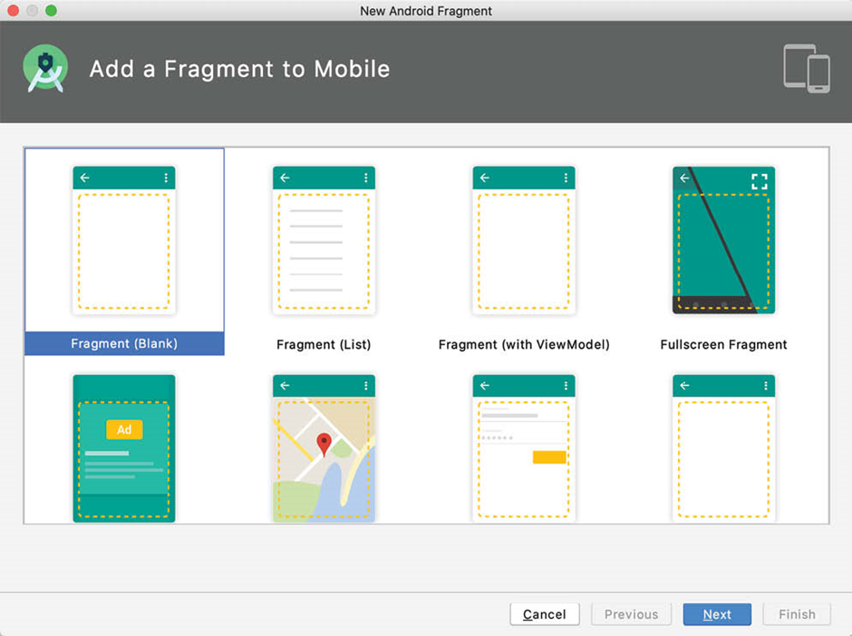
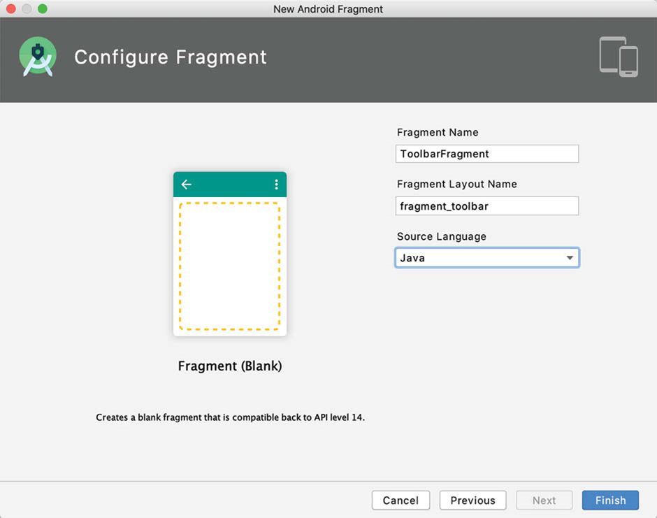
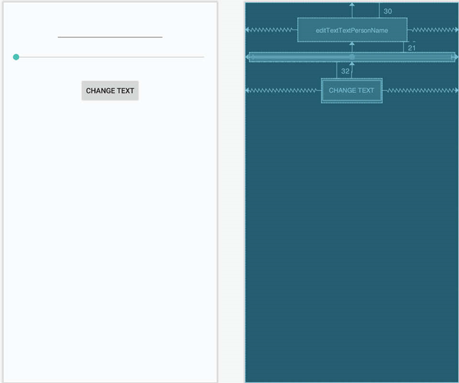
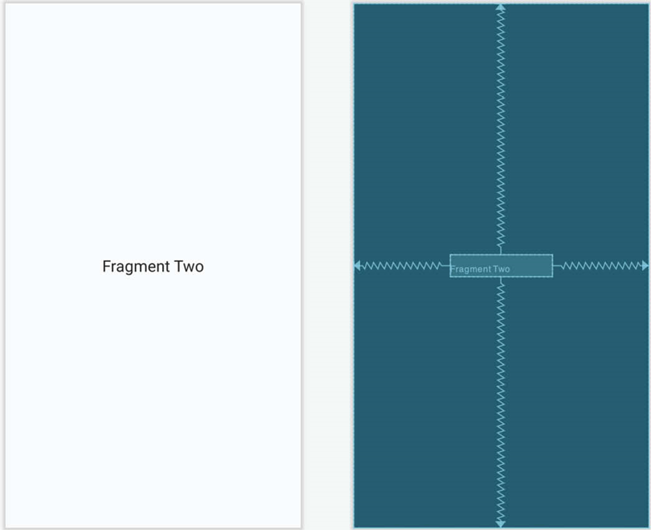
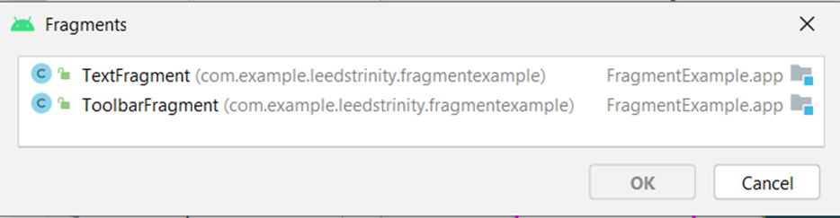
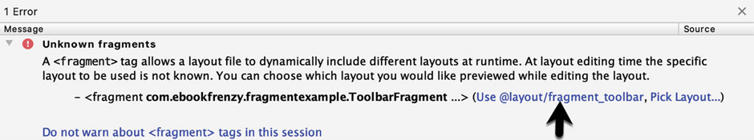
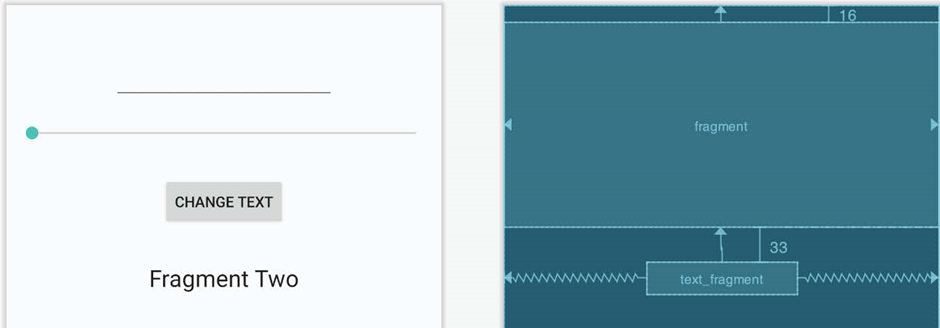

# About the Tutorial


Fragment is an Android programming aspect that represents a portion of the user interface of what a user sees on the application window. The Android documentation describes Fragment as a portion of the user interface in an Activity Object. This tutorial will help learn how to create and work with Android fragments.

## Example 1
The example will consist of a single activity and two fragments. The user interface for the first fragment will contain a toolbar of sorts consisting of an EditText view, a SeekBar and a Button, all contained within a ConstraintLayout view. The second fragment will consist solely of a TextView object, also contained within a ConstraintLayout view.

The two fragments will be embedded within the main activity of the application and communication implemented such that when the button in the first fragment is pressed, the text entered into the EditText view will appear on the TextView of the second fragment using a font size dictated by the position of the SeekBar in the first fragment.

Since this application is intended to work on earlier versions of Android, it will also be necessary to make use of the appropriate Android support library.

## Creating the Fragment Example 

Create a new Android project from File --> New --> New Project. Within the resulting new project dialog, choose the Empty Activity template before clicking on the Next button. Enter "FragmentExample2 into the Name field and specify com.example.leedstrinity.fragmentexample as the package name. Before clicking on the Finish button, change the Minimum API level setting to API 26: Android 8.0 (Oreo) and the Language menu to Java.

## Creating the First Fragment Layout

The next step is to create the user interface for the first fragment that will be used within our activity.

This user interface will consist of an XML layout file and a fragment class. While these could be added manually, it is quicker to ask Android Studio to create them for us. Within the project tool window, locate the app --> java --> com.example.leedtrinity.fragmentexample entry and right click on it. From the resulting menu, select the New --> Fragment --> Gallery... option to display the dialog shown in the figure below:


 

Select the Fragment (Blank) template before clicking the Next button. On the subsequent screen, name the fragment ToolbarFragment with a layout file named fragment_toolbar:


 
Load the fragment_toolbar.xml file into the layout editor using Design mode, right-click on the FrameLayout entry in the Component Tree panel and select the Convert FrameLayout to ConstraintLayout menu option, accepting the default settings in the confirmation dialog. Select and delete the default TextView and add a Plain EditText, Seekbar and Button to the layout and change the view ids to editText1, button1 and seekBar1 respectively.

Change the text on the button to read “Change Text”, extract the text to a string resource named change_text and remove the Name text from the EditText view. Finally, set the layout_width property of the Seekbar to match_constraint with margins set to 8dp on the left and right edges.
Use the Infer constraints toolbar button to add any missing constraints, at which point the layout should match that shown in figure below:


 
## Adding the Second Fragment

Repeating the steps used to create the toolbar fragment, add another empty fragment named TextFragment with a layout file named fragment_text. Once again, convert the FrameLayout container to a ConstraintLayout and remove the default TextView.

Drag and drop a TextView widget from the palette and position it in the centre of the layout, using the Infer constraints button to add any missing constraints. Change the id of the view to textView1, the text to read “Fragment Two” and modify the textAppearance attribute from the theme attribute group to Large.
On completion, the layout should match that shown in the figure below:
 


## Adding the Fragments to the Activity

The main activity for the application has associated with it an XML layout file named activity_main.xml. For the purposes of this example, the fragments will be added to the activity using the <fragment> element within this file. Using the Project tool window, navigate to the app -> res -> layout section of the FragmentExample project and double-click on the activity_main.xml file to load it into the Android Studio Layout Editor tool.
With the Layout Editor tool in Design mode, select and delete the default TextView object from the layout and select the Common category in the palette. Drag the <fragment> component from the list of views and drop it onto the layout so that it is centered horizontally and positioned such that the dashed line appears indicating the top layout margin:


 
On dropping the fragment onto the layout, a dialog will appear displaying a list of Fragments available within the current project as illustrated in the figure below:


 
Select the ToolbarFragment entry from the list and click on the OK button to dismiss the Fragments dialog. Once added, click on the red warning button in the top right-hand corner of the layout editor to display the warnings panel. An unknown fragments message in the figure below will be listed indicating that the Layout Editor tool needs to know which fragment to display during the preview session. Display the ToolbarFragment fragment by clicking on the Use @layout/toolbar_fragment link within the message:


 
With the fragment selected, change the layout_width property to match_constraint so that it occupies the full width of the screen. Click and drag another <fragment> entry from the panel and position it so that it is centered horizontally and located beneath the bottom edge of the first fragment. When prompted, select the TextFragment entry from the fragment dialog before clicking on the OK button. Display the error panel once again and click on the Use @layout/fragment_text option. Use the Infer constraints button to establish any missing layout constraints.

**Note that the fragments are now visible in the layout as demonstrated in the figure below:**


 
Before proceeding to the next step, select the TextFragment instance in the layout and, within the Attributes tool window, change the ID of the fragment to text_fragment.

## Making the Toolbar Fragment Talk to the Activity

When the user touches the button in the toolbar fragment, the fragment class is going to need to get the text from the EditText view and the current value of the SeekBar and send them to the text fragment. As outlined in the lecture, fragments should not communicate with each other directly, instead using the activity in which they are embedded as an intermediary.
The first step in this process is to make sure that the toolbar fragment responds to the button being clicked. We also need to implement some code to keep track of the value of the SeekBar view. For the purposes of this example, we will implement these listeners within the ToolbarFragment class. Select the ToolbarFragment.java file and modify it so that it reads as shown in the following listing:

```java
package com.example.leedstrinity.fragmentexample;
 
import android.os.Bundle;
import androidx.fragment.app.Fragment;
import android.view.LayoutInflater;
import android.view.View;
import android.view.ViewGroup;
import android.content.Context;
import android.widget.Button;
import android.widget.EditText;
import android.widget.SeekBar;
import android.widget.SeekBar.OnSeekBarChangeListener;
 
public class ToolbarFragment extends Fragment implements OnSeekBarChangeListener {
 
    private static int seekvalue = 10;
    private static EditText edittext;
 
    @Override
    public View onCreateView(LayoutInflater inflater, ViewGroup container,
                             Bundle savedInstanceState) {
        // Inflate the layout for this fragment
        View view = inflater.inflate(R.layout.fragment_toolbar,
                container, false);
 
        edittext = view.findViewById(R.id.editText1);
        final SeekBar seekbar = view.findViewById(R.id.seekBar1);
 
        seekbar.setOnSeekBarChangeListener(this);
 
        final Button button = view.findViewById(R.id.button1);
 
        button.setOnClickListener(new View.OnClickListener() {
            public void onClick(View v) {
                buttonClicked(v);
            }
        });
        return view;
    }
 
    public void buttonClicked (View view) {
 
    }
 
    @Override
    public void onProgressChanged(SeekBar seekBar, int progress,
                                  boolean fromUser) {
        seekvalue = progress;
    }
 
    @Override
    public void onStartTrackingTouch(SeekBar arg0) {
 
    }
 
    @Override
    public void onStopTrackingTouch(SeekBar arg0) {
 
    }
}
```

Before moving on, we need to take some time to explain the above code changes. First, the class is declared as implementing the OnSeekBarChangeListener interface. This is because the user interface contains a SeekBar instance and the fragment needs to receive notifications when the user slides the bar to change the font size. Implementation of the OnSeekBarChangeListener interface requires that the onProgressChanged(), onStartTrackingTouch() and onStopTrackingTouch() methods be implemented. These methods have been implemented but only the onProgressChanged() method is actually required to perform a task, in this case storing the new value in a variable named seekvalue which has been declared at the start of the class. Also declared is a variable in which to store a reference to the EditText object.
The onActivityCreated() method has been added to obtain references to the EditText, SeekBar and Button views in the layout. Once a reference to the button has been obtained it is used to set up an onClickListener on the button which is configured to call a method named buttonClicked() when a click event is detected. This method is also then implemented, though at this point it does not do anything.
The next phase of this process is to set up the listener that will allow the fragment to call the activity when the button is clicked:

```java
public class ToolbarFragment extends Fragment
    implements OnSeekBarChangeListener {
       
         private static int seekvalue = 10;
         private static EditText edittext;
              
  ToolbarListener activityCallback;
              
         public interface ToolbarListener {
               public void onButtonClick(int position, String text);
         }
 
         @Override
         public void onAttach(Context context) {
               super.onAttach(context);
               try {
                   activityCallback = (ToolbarListener) context;
               } catch (ClassCastException e) {
                   throw new ClassCastException(context.toString()
                       + " must implement ToolbarListener");
               }
          }

          public void buttonClicked (View view) {
                 activityCallback.onButtonClick(seekvalue,
                      edittext.getText().toString());
          }

}
```

The above implementation will result in a method named onButtonClick() belonging to the activity class being called when the button is clicked by the user. All that remains, therefore, is to declare that the activity class implements the newly created ToolbarListener interface and to implement the onButtonClick() method.
Since the Android Support Library is being used for fragment support in earlier Android versions, the activity also needs to be changed to subclass from FragmentActivity instead of AppCompatActivity. Bringing these requirements together results in the following modified MainActivity.java file:

```java
package com.example.leedstrinity.fragmentexample;
 
import androidx.fragment.app.FragmentActivity;
import android.os.Bundle;
 
public class MainActivity extends FragmentActivity implements ToolbarFragment.ToolbarListener {
 
    @Override
    protected void onCreate(Bundle savedInstanceState) {
        super.onCreate(savedInstanceState);
        setContentView(R.layout.activity_fragment_example);
    }
 
    public void onButtonClick(int fontsize, String text) {
 
    }
}
```

With the code changes as they currently stand, the toolbar fragment will detect when the button is clicked by the user and call a method on the activity passing through the content of the EditText field and the current setting of the SeekBar view. It is now the job of the activity to communicate with the Text Fragment and to pass along these values so that the fragment can update the TextView object accordingly.

## Making the Activity Talk to the Text Fragment
As outlined in the lecture an activity can communicate with a fragment by obtaining a reference to the fragment class instance and then calling public methods on the object. As such, within the TextFragment class we will now implement a public method named changeTextProperties() which takes as arguments an integer for the font size and a string for the new text to be displayed. The method will then use these values to modify the TextView object. Within the Android Studio editing panel, locate and modify the TextFragment.java file to add this new method and to add code to the onCreateView() method to obtain the ID of the TextView object:

```java
package com.example.leedstrinity.fragmentexample;
 
import android.os.Bundle;
import androidx.fragment.app.Fragment;
import android.view.LayoutInflater;
import android.view.View;
import android.view.ViewGroup;
import android.widget.TextView;
 
public class TextFragment extends Fragment {
 
    private static TextView textview;
 
    @Override
    public View onCreateView(LayoutInflater inflater,
                             ViewGroup container,
                             Bundle savedInstanceState) {
        View view = inflater.inflate(R.layout.fragment_text,
                container, false);
 
        textview = view.findViewById(R.id.textView1);
 
        return view;
    }
 
    public void changeTextProperties(int fontsize, String text)
    {
        textview.setTextSize(fontsize);
        textview.setText(text);
    }
}
```

When the TextFragment fragment was placed in the layout of the activity, it was given an ID of text_fragment. Using this ID, it is now possible for the activity to obtain a reference to the fragment instance and call the changeTextProperties() method on the object. Edit the MainActivity.java file and modify the onButtonClick() method as follows:

```java
public void onButtonClick(int fontsize, String text) {
 
   TextFragment textFragment =
    (TextFragment)
      getSupportFragmentManager().findFragmentById(R.id.text_fragment);
 
   textFragment.changeTextProperties(fontsize, text);
}
```

## Testing the Application

With the coding for this project now complete, the last remaining task is to run the application. When the application is launched, the main activity will start and will, in turn, create and display the two fragments. When the user touches the button in the toolbar fragment, the onButtonClick() method of the activity will be called by the toolbar fragment and passed the text from the EditText view and the current value of the SeekBar. The activity will then call the changeTextProperties() method of the second fragment, which will modify the TextView to reflect the new text and font size:
 
## Summary
The goal of this example was to work through the creation of an example project intended specifically to demonstrate the steps involved in using fragments within an Android application. Topics covered include the use of the Android Support Library for compatibility with Android versions predating the introduction of fragments, the inclusion of fragments within an activity layout and the implementation of inter-fragment communication.

