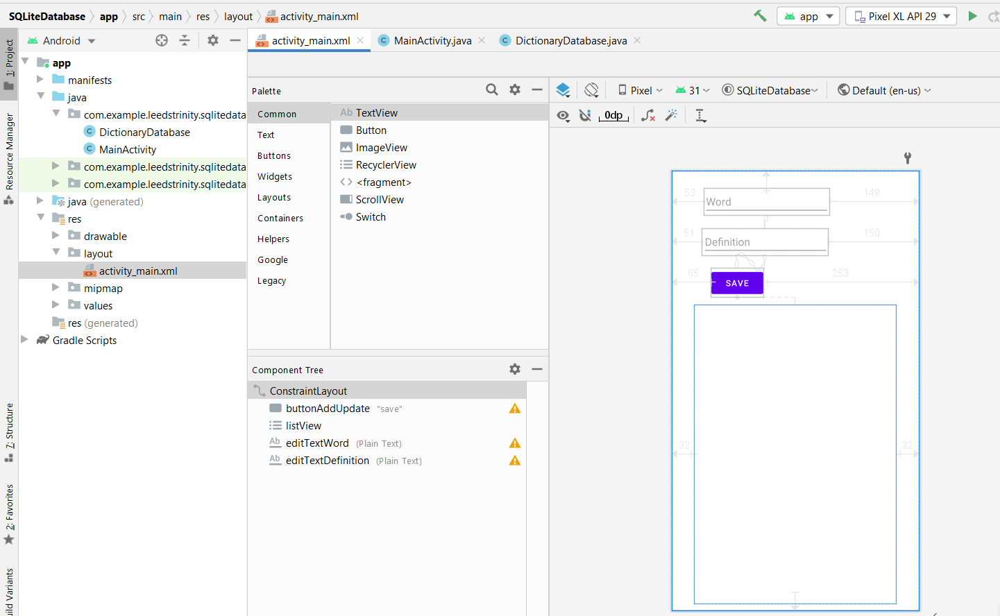
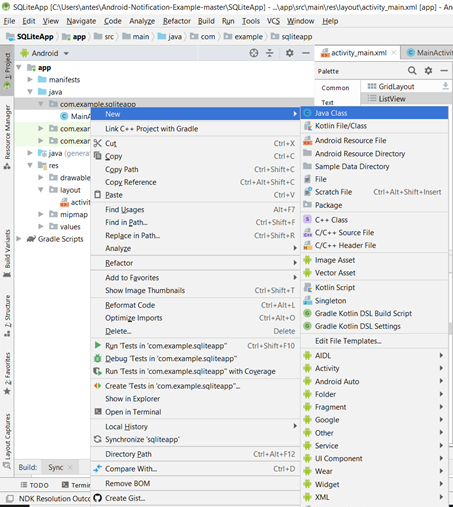

**About the Tutorial**


# Creating and using SQLite database

In this exercise, we're going to demonstrate working with SQLite database. As you're already familiar with SQL databases, then much of what you know will apply. 

To get you up and running with SQLite database quickly, this example implements the basic CRUD operations. Generally, when creating a database in Android, you create a class that extends SQLiteOpenHelper, which is where your database functionality is implemented. Here is a list of the CRUD (create, read, update, and delete) functions:

- Create: insert()
- Read: query() and rawQuery()
- Update: update()
- Delete: delete()

To demonstrate a fully working database, we will create a simple Dictionary database where we'll store words and their definitions. We'll demonstrate the CRUD operations by adding new words (with their definitions) and updating existing word definitions. We'll show words in a ListView using a cursor. Pressing a word in the ListView will read the definition from the database and display it in a Toast message. A long press will delete the word.

# Getting ready
Create a new project in Android Studio and call it SQLiteDatabase. Use the default options and select Empty Views Activity.

# How to do it...
First, we'll create the UI, which will consist of two PlainText fields, a Button, and a ListView from the Legacy options. As we add words to the database, they will populate the ListView. Start by opening activity_main.xml and follow these steps:

1.	Design your screen as follows:

  

Use the attribute “Hint” to hardcode your string for the two PlainText. Change the attribute "Text" to "Save" for the Button and id to what you see in the figure for all views.

2.	Add a new Java class to the project named DictionaryDatabase. This class extends from **SQLiteOpenHelper** and handles all the SQLite functions. Here is the class declaration:
```java
public class DictionaryDatabase extends SQLiteOpenHelper { }
```



Insert the name of the class as in the figure below and extend SQLiteOpenHelper class:


_Don’t worry if you have an error, we will solve it by adding a constructor to the class and onCreate() method in the following steps._

3.	Below the declaration, add the following constants:

```java
private static final String DATABASE_NAME = "dictionary.db";
private static final String TABLE_DICTIONARY = "dictionary";

private static final String FIELD_WORD = "word";
private static final String FIELD_DEFINITION = "definition";
private static final int DATABASE_VERSION = 1;
```

4.	Add the following constructor, OnCreate(), and onUpgrade() methods:
```java
DictionaryDatabase(Context context) {
    super(context, DATABASE_NAME, null, DATABASE_VERSION);
}

@Override
public void onCreate(SQLiteDatabase db) {
    db.execSQL("CREATE TABLE " + TABLE_DICTIONARY +
            "(_id integer PRIMARY KEY," +
            FIELD_WORD + " TEXT, " +
            FIELD_DEFINITION + " TEXT);");
}

@Override
public void onUpgrade(SQLiteDatabase db, int oldVersion, int newVersion) {
    //Handle database upgrade as needed
}
```

5.	The following methods are responsible for creating, updating, and deleting the records:
```java
public void saveRecord(String word, String definition) {
    long id = findWordID(word);
    if (id>0) {
        updateRecord(id, word,definition);
    } else {
        addRecord(word,definition);
    }
}

public long addRecord(String word, String definition) {
    SQLiteDatabase db = getWritableDatabase();

    ContentValues values = new ContentValues();
    values.put(FIELD_WORD, word);
    values.put(FIELD_DEFINITION, definition);
    return db.insert(TABLE_DICTIONARY, null, values);
}

public int updateRecord(long id, String word, String definition) {
    SQLiteDatabase db = getWritableDatabase();
    ContentValues values = new ContentValues();
    values.put("_id", id);
    values.put(FIELD_WORD, word);
    values.put(FIELD_DEFINITION, definition);
    return db.update(TABLE_DICTIONARY, values, "_id = ?", new String[]{String.valueOf(id)});
}
public int deleteRecord(long id) {
    SQLiteDatabase db = getWritableDatabase();
    return db.delete(TABLE_DICTIONARY, "_id = ?", new String[]{String.valueOf(id)});
}
```

6.	And these methods to handle reading the information from the database:
```java
public long findWordID(String word) {
    long returnVal = -1;
    SQLiteDatabase db = getReadableDatabase();
    Cursor cursor = db.rawQuery(
            "SELECT _id FROM " + TABLE_DICTIONARY + " WHERE " + FIELD_WORD + " = ?", 
            new String[]{word});
    if (cursor.getCount() == 1) {
        cursor.moveToFirst();
        returnVal = cursor.getInt(0);
    }
    return returnVal;
}

public String getDefinition(long id) {
    String returnVal = "";
    SQLiteDatabase db = getReadableDatabase();
    Cursor cursor = db.rawQuery(
            "SELECT definition FROM " + TABLE_DICTIONARY + " WHERE _id = ?", 
            new String[]{String.valueOf(id)});
    if (cursor.getCount() == 1) {
        cursor.moveToFirst();
        returnVal = cursor.getString(0);
    }
    return returnVal;
}

public Cursor getWordList() {
    SQLiteDatabase db = getReadableDatabase();
    String query = "SELECT _id, " + FIELD_WORD +
            " FROM " + TABLE_DICTIONARY + " ORDER BY " + FIELD_WORD +
            " ASC";
    return db.rawQuery(query, null);
}
```
7.	We finished with class DictionaryDatabase, now open MainActivity.java and add the following global variables below the class declaration:
```java
EditText mEditTextWord; 
EditText mEditTextDefinition; 
DictionaryDatabase mDB; 
ListView mListView; 
```

8.	Add the following method to save the fields when the button is clicked:
```java
private void saveRecord() {
    mDB.saveRecord(mEditTextWord.getText().toString(), mEditTextDefinition.getText().toString());
    mEditTextWord.setText("");
    mEditTextDefinition.setText("");
    updateWordList();
}
```
9.	Add this method to populate the ListView:
```java
private void updateWordList() {
    SimpleCursorAdapter simpleCursorAdapter = new SimpleCursorAdapter(
            this,
            android.R.layout.simple_list_item_1,
            mDB.getWordList(),
            new String[]{"word"},
            new int[]{android.R.id.text1},
            0);
    mListView.setAdapter(simpleCursorAdapter);
}
```
10.	Finally, add the following code to onCreate():
```java
mDB = new DictionaryDatabase(this);
mEditTextWord = findViewById(R.id.editTextWord);
mEditTextDefinition = findViewById(R.id.editTextDefinition);
Button buttonAddUpdate = findViewById(R.id.buttonAddUpdate);
buttonAddUpdate.setOnClickListener(new View.OnClickListener() {
    @Override
    public void onClick(View v) {
        saveRecord();
    }
});

mListView = findViewById(R.id.listView);
mListView.setOnItemClickListener(new AdapterView.OnItemClickListener() {
    @Override
    public void onItemClick(AdapterView<?> parent, View view, int position, long id) {
        Toast.makeText(MainActivity.this, mDB.getDefinition(id), Toast.LENGTH_SHORT).show();
    }
});
mListView.setOnItemLongClickListener(new AdapterView.OnItemLongClickListener() {
    @Override
    public boolean onItemLongClick(AdapterView<?> parent, View view, int position, long id) {
        Toast.makeText(MainActivity.this, 
                "Records deleted = " + mDB.deleteRecord(id), Toast.LENGTH_SHORT).show();
        updateWordList();
        return true;
    }
});
updateWordList();
```
11.	Run the program on a device or emulator and try it out.

# How it works...
We'll start by explaining the DictionaryDatabase class as that's the heart of an SQLite database. The first item to note is the constructor:
```java
DictionaryDatabase(Context context) { 
    super(context, DATABASE_NAME, null, DATABASE_VERSION); 
} 
```
Note: Increment the value of your DATABASE_VERSION only when you make changes to your database schema.

Next is onCreate(), where the database is created. This is only called the first time the database is created, not each time the class is created. It's also worth noting the _id field. Android does not require tables to have a primary field, but some classes, such as the SimpleCursorAdapter, may require an _id.

We're required to implement the onUpgrade() callback, but as this is a new database, there's nothing to do. This method will only be called when the database version is incremented.

The saveRecord() method handles calling addRecord() or updateRecord(), as appropriate. Since we will modify the database, both methods use getWritableDatabase() to get an updatable database reference. A writable database requires more resources so if you don't need to make changes, get a read-only database instead.

The last method to note is getWordList(), which returns all the words in the database using a cursor object. We use this cursor to populate the ListView, which brings us to ActivityMain.java. The onCreate() method does the standard initialization we've seen before and also creates an instance of the database with the following line of code:
```java
mDB = new DictionaryDatabase(this); 
```
The onCreate() method is also where we set up the events to show the word definition (with a Toast) when an item is pressed and to delete the word on a long press. Probably the most complicated code is in updateWordList().

We use the SimpleCursorAdapter to create a mapping between our field in the cursor and the ListView item. We use the layout.simple_list_item_1 layout, which only includes a single text field with the ID android.R.id.text1. In a real application, we could create a custom layout and include the definition in the ListView item, but we wanted to demonstrate a method to read the definition from the database.

We call updateWordList() in three places: during onCreate() to create the initial list, then again after we add/update an item, and lastly when deleting an item.

# There's more...
Although this is a fully functioning example of SQLite, it is still just the basics. There are many books dedicated to SQLite for Android and they are worth checking out.

# Upgrading a database
As we mentioned previously when we increment the database version, the onUpgrade() method will be called. What you do here is dependent on the changes made to the database. If you changed an existing table, ideally you'll want to migrate the user data to the new format by querying the existing data and inserting it into the new format. Keep in mind that there is no guarantee the user will upgrade in consecutive order, so they could jump from version 1 to version 4, for example.
See also
- SQLite homepage: https://www.sqlite.org/
- SQLite database Android reference: http://developer.android.com/reference/android/database/sqlite/SQLiteDatabase.html

# Sign in and sign up activities
In this example, we will cover SQLite in more detail. We will do input validation and test some functionalities. It is the time to work on your assignment project.  

1) Create a new project using Android and call it BookClubApp. 
2) Create a new Java Class and call it User
 
In the User class, create public variables and constructors for the user sign in and sign up activities as follows:
 
```java
public class User {

    public String fullName, email, mobile, password;
    public int age;

    public String getEmail() {
        return email;
    }

    public void setEmail(String email) {
        this.email = email;
    }

    public String getFullName() {
        return fullName;
    }

    public void setFullName(String fullName) {
        this.fullName = fullName;
    }

    public int getAge() {
        return age;
    }

    public void setAge(int age) {
        this.age = age;
    }

    public String getPassword() {
        return password;
    }

    public void setPassword(String password) {
        this.password = password;
    }

    public String getMobile() {
        return mobile;
    }

    public void setMobile(String mobile) {
        this.mobile = mobile;
    }

}
```
For me, I designed the user table to include full name, email, age, password and mobile. Please feel free to change as per your design.

3) Create another class called DBHelper.java to include all the important methods for connecting to the SQLite. Don’t forget to extend the SQLiteOpenHelper class (remember the DictionaryDatabase class in the example above).
```java
package com.example.bookclubapp;

import android.content.ContentValues;
import android.content.Context;
import android.database.Cursor;
import android.database.sqlite.SQLiteDatabase;
import android.database.sqlite.SQLiteOpenHelper;
import android.service.autofill.UserData;
import android.util.Log;
import android.widget.Toast;

public class DBHelper extends SQLiteOpenHelper {
    static SQLiteDatabase db;

    private static final int DATABASE_VERSION = 1;
    private static final String DATABASE_NAME = "bookclubdata.db";
    private static final String TABLE_NAME = "user";
    private static final String COLUMN_ID = "id";
    private static final String COLUMN_FULLNAME = "fullname";
    private static final String COLUMN_EMAIL= "email";
    private static final String COLUMN_MOBILE = "mobile";
    private static final String COLUMN_AGE = "age";
    private static final String COLUMN_PASSWORD = "password";

    private static final String CREATE_TABLE = "create table IF NOT EXISTS user (id integer primary key not null , " +
            "fullname text not null , email text not null, age integer not null, password text not null, mobile text not null);" ;


    public DBHelper(Context context){
        super(context,DATABASE_NAME, null , DATABASE_VERSION);
    }

    @Override
    public void onCreate(SQLiteDatabase db) {

        db.execSQL(CREATE_TABLE);
        this.db = db;
        Log.d("Table created","created");
    }

    public boolean insertData(User user){
        ContentValues values = new ContentValues();
        values.put(COLUMN_FULLNAME,user.getFullName());
        values.put(COLUMN_EMAIL,user.getEmail());
        values.put(COLUMN_MOBILE,user.getMobile());
        values.put(COLUMN_AGE,user.getAge());
        values.put(COLUMN_PASSWORD,user.getPassword());

        try{
            db.insert(TABLE_NAME, null ,values);
            Log.d("Insert SUCCESS", values.toString());
            return true;
        } catch (Exception e){
            Log.d("Insert FAILURE", e.toString());
            return false;
        }
        //db.close();
    }

    public boolean userExists(String email,String password){
        //db = this.getReadableDatabase();
        String fetchuser = "Select email,password from " +TABLE_NAME;
        Cursor cursor = db.rawQuery(fetchuser, null);
        String a,b = "not found";
        Log.d("received email", email);
        Log.d("Cursor count", String.valueOf(cursor.getCount()));
        if(cursor.moveToFirst()){
            Log.d("Select " , " clause");
            do{
                a= cursor.getString(0);
                Log.d("a " , a);
                if (a.equals(email)){
                    Log.d("email  If loop" , a);
                    b = cursor.getString(1);
                    Log.d("b " , b);
                    break;
                }
            }
            while(cursor.moveToNext());
        }
        if (b.equals(password)) {
            Log.d("Returning "," true");
            return true;
        }
        else return false;
    }

    public String getUserName(String email){
        //db = this.getReadableDatabase();
        String fetchuser = "Select "+COLUMN_EMAIL+", "+COLUMN_FULLNAME+" from " +TABLE_NAME;
        Cursor cursor = db.rawQuery(fetchuser, null);
        String a,b = "not found";
        Log.d("received email", email);
        Log.d("Cursor count", String.valueOf(cursor.getCount()));
        if(cursor.moveToFirst()){
            Log.d("Select " , " clause");
            do{
                a= cursor.getString(0);
                Log.d("a " , a);
                if (a.equals(email)){
                    Log.d("email  If loop" , a);
                    b = cursor.getString(1);
                    Log.d("b " , b);
                    break;
                }
            }
            while(cursor.moveToNext());
        }
        return b;

    }

    @Override
    public void onUpgrade(SQLiteDatabase db, int oldVersion, int newVersion) {

        String dropquery= "DROP TABLE IF EXISTS "+TABLE_NAME;
        db.execSQL(dropquery);
        this.onCreate(db);
    }

}
```
4) Design the activity_main.xml as the following screenshot:
You can skip the design and copy the code below for speedy development of the main learning activities:

 ```xml
<?xml version="1.0" encoding="utf-8"?>
<androidx.constraintlayout.widget.ConstraintLayout xmlns:android="http://schemas.android.com/apk/res/android"
    xmlns:app="http://schemas.android.com/apk/res-auto"
    xmlns:tools="http://schemas.android.com/tools"
    android:layout_width="match_parent"
    android:layout_height="match_parent"
    tools:context=".MainActivity">

    <ImageView
        android:id="@+id/imageView"
        android:layout_width="wrap_content"
        android:layout_height="wrap_content"
        android:layout_marginStart="79dp"
        android:layout_marginTop="16dp"
        android:layout_marginEnd="79dp"
        app:layout_constraintEnd_toEndOf="parent"
        app:layout_constraintStart_toStartOf="parent"
        app:layout_constraintTop_toBottomOf="@+id/textView"
        app:srcCompat="@drawable/ic_launcher_foreground" />

    <TextView
        android:id="@+id/textView"
        android:layout_width="wrap_content"
        android:layout_height="wrap_content"
        android:layout_marginStart="176dp"
        android:layout_marginTop="32dp"
        android:layout_marginEnd="176dp"
        android:text="@string/app_name"
        app:layout_constraintEnd_toEndOf="parent"
        app:layout_constraintStart_toStartOf="parent"
        app:layout_constraintTop_toTopOf="parent" />

    <TextView
        android:id="@+id/account"
        android:layout_width="wrap_content"
        android:layout_height="wrap_content"
        android:layout_marginStart="130dp"
        android:layout_marginTop="28dp"
        android:layout_marginEnd="130dp"
        android:text="Don't have an account?"
        app:layout_constraintEnd_toEndOf="parent"
        app:layout_constraintStart_toStartOf="parent"
        app:layout_constraintTop_toBottomOf="@+id/forgotPassword" />

    <Button
        android:id="@+id/signIn"
        android:layout_width="243dp"
        android:layout_height="48dp"
        android:layout_marginStart="130dp"
        android:layout_marginTop="44dp"
        android:layout_marginEnd="130dp"
        android:onClick="onSignIn"
        android:text="Login"
        app:layout_constraintEnd_toEndOf="parent"
        app:layout_constraintHorizontal_bias="0.5"
        app:layout_constraintStart_toStartOf="parent"
        app:layout_constraintTop_toBottomOf="@+id/password" />

    <EditText
        android:id="@+id/email"
        android:layout_width="wrap_content"
        android:layout_height="48dp"
        android:layout_marginStart="113dp"
        android:layout_marginTop="46dp"
        android:layout_marginEnd="88dp"
        android:ems="10"
        android:hint="Email"
        android:inputType="textEmailAddress"
        app:layout_constraintEnd_toEndOf="parent"
        app:layout_constraintHorizontal_bias="0.5"
        app:layout_constraintStart_toStartOf="parent"
        app:layout_constraintTop_toBottomOf="@+id/imageView" />

    <EditText
        android:id="@+id/password"
        android:layout_width="wrap_content"
        android:layout_height="48dp"
        android:layout_marginStart="113dp"
        android:layout_marginTop="13dp"
        android:layout_marginEnd="88dp"
        android:ems="10"
        android:hint="Password"
        android:inputType="textPassword"
        app:layout_constraintEnd_toEndOf="parent"
        app:layout_constraintHorizontal_bias="0.5"
        app:layout_constraintStart_toStartOf="parent"
        app:layout_constraintTop_toBottomOf="@+id/email" />

    <TextView
        android:id="@+id/forgotPassword"
        android:layout_width="wrap_content"
        android:layout_height="48dp"
        android:layout_marginStart="130dp"
        android:layout_marginTop="24dp"
        android:layout_marginEnd="130dp"
        android:onClick="onForgotPassword"
        android:text="Forgot Password?"
        app:layout_constraintEnd_toEndOf="parent"
        app:layout_constraintHorizontal_bias="0.5"
        app:layout_constraintStart_toStartOf="parent"
        app:layout_constraintTop_toBottomOf="@+id/signIn" />

    <TextView
        android:id="@+id/signUp"
        android:layout_width="wrap_content"
        android:layout_height="48dp"
        android:layout_marginStart="130dp"
        android:layout_marginTop="8dp"
        android:layout_marginEnd="130dp"
        android:layout_marginBottom="58dp"
        android:onClick="onSignUp"
        android:text="Create Account"
        app:layout_constraintBottom_toBottomOf="parent"
        app:layout_constraintEnd_toEndOf="parent"
        app:layout_constraintHorizontal_bias="0.49"
        app:layout_constraintStart_toStartOf="parent"
        app:layout_constraintTop_toBottomOf="@+id/account"
        app:layout_constraintVertical_bias="0.0" />

</androidx.constraintlayout.widget.ConstraintLayout>
```
5) Add three extra activities as follows SignUpActivity, UserActivity and ForgotPasswordActivity.
 
Continue the design stage or skip this step by copying the following code:
a)	Activity_sign_up.xml

```xml
<?xml version="1.0" encoding="utf-8"?>
<androidx.constraintlayout.widget.ConstraintLayout xmlns:android="http://schemas.android.com/apk/res/android"
    xmlns:app="http://schemas.android.com/apk/res-auto"
    xmlns:tools="http://schemas.android.com/tools"
    android:layout_width="match_parent"
    android:layout_height="match_parent"
    tools:context=".SignUpActivity">

    <ImageView
        android:id="@+id/imageView"
        android:layout_width="117dp"
        android:layout_height="75dp"
        android:layout_marginStart="79dp"
        android:layout_marginTop="12dp"
        android:layout_marginEnd="79dp"
        app:layout_constraintEnd_toEndOf="parent"
        app:layout_constraintStart_toStartOf="parent"
        app:layout_constraintTop_toBottomOf="@+id/textView"
        app:srcCompat="@drawable/ic_launcher_foreground" />

    <TextView
        android:id="@+id/textView"
        android:layout_width="wrap_content"
        android:layout_height="wrap_content"
        android:layout_marginTop="32dp"
        android:text="@string/app_name"
        app:layout_constraintEnd_toEndOf="parent"
        app:layout_constraintStart_toStartOf="parent"
        app:layout_constraintTop_toTopOf="parent" />

    <Button
        android:id="@+id/signUp"
        android:layout_width="232dp"
        android:layout_height="40dp"
        android:layout_marginStart="100dp"
        android:layout_marginTop="32dp"
        android:layout_marginEnd="100dp"
        android:onClick="onSignUp"
        android:text="Sign Up"
        app:layout_constraintEnd_toEndOf="parent"
        app:layout_constraintStart_toStartOf="parent"
        app:layout_constraintTop_toBottomOf="@+id/mobile" />

    <EditText
        android:id="@+id/fullName"
        android:layout_width="wrap_content"
        android:layout_height="wrap_content"
        android:layout_marginStart="113dp"
        android:layout_marginTop="16dp"
        android:layout_marginEnd="88dp"
        android:ems="10"
        android:hint="Full Name"
        android:inputType="textPersonName"
        app:layout_constraintEnd_toEndOf="parent"
        app:layout_constraintHorizontal_bias="0.501"
        app:layout_constraintStart_toStartOf="parent"
        app:layout_constraintTop_toBottomOf="@+id/imageView" />

    <EditText
        android:id="@+id/age"
        android:layout_width="wrap_content"
        android:layout_height="wrap_content"
        android:layout_marginStart="114dp"
        android:layout_marginTop="8dp"
        android:layout_marginEnd="87dp"
        android:ems="10"
        android:hint="Age"
        android:inputType="textPersonName"
        app:layout_constraintEnd_toEndOf="parent"
        app:layout_constraintStart_toStartOf="parent"
        app:layout_constraintTop_toBottomOf="@+id/password" />

    <EditText
        android:id="@+id/password"
        android:layout_width="wrap_content"
        android:layout_height="wrap_content"
        android:layout_marginStart="113dp"
        android:layout_marginTop="8dp"
        android:layout_marginEnd="88dp"
        android:ems="10"
        android:hint="Password"
        android:inputType="textPassword"
        app:layout_constraintEnd_toEndOf="parent"
        app:layout_constraintHorizontal_bias="0.501"
        app:layout_constraintStart_toStartOf="parent"
        app:layout_constraintTop_toBottomOf="@+id/email" />

    <TextView
        android:id="@+id/loginButton"
        android:layout_width="wrap_content"
        android:layout_height="wrap_content"
        android:layout_marginStart="184dp"
        android:layout_marginTop="8dp"
        android:layout_marginEnd="169dp"
        android:onClick="onLogIn"
        android:text="Login"
        app:layout_constraintEnd_toEndOf="parent"
        app:layout_constraintStart_toStartOf="parent"
        app:layout_constraintTop_toBottomOf="@+id/accountExist" />

    <TextView
        android:id="@+id/accountExist"
        android:layout_width="wrap_content"
        android:layout_height="wrap_content"
        android:layout_marginStart="129dp"
        android:layout_marginTop="32dp"
        android:layout_marginEnd="129dp"
        android:text="Already have an account"
        app:layout_constraintEnd_toEndOf="parent"
        app:layout_constraintStart_toStartOf="parent"
        app:layout_constraintTop_toBottomOf="@+id/signUp" />

    <EditText
        android:id="@+id/mobile"
        android:layout_width="wrap_content"
        android:layout_height="wrap_content"
        android:layout_marginStart="114dp"
        android:layout_marginTop="8dp"
        android:layout_marginEnd="87dp"
        android:ems="10"
        android:hint="Mobile"
        android:inputType="textPersonName"
        app:layout_constraintEnd_toEndOf="parent"
        app:layout_constraintStart_toStartOf="parent"
        app:layout_constraintTop_toBottomOf="@+id/age" />

    <EditText
        android:id="@+id/email"
        android:layout_width="wrap_content"
        android:layout_height="wrap_content"
        android:layout_marginStart="113dp"
        android:layout_marginTop="8dp"
        android:layout_marginEnd="88dp"
        android:ems="10"
        android:hint="Email"
        android:inputType="textEmailAddress"
        app:layout_constraintEnd_toEndOf="parent"
        app:layout_constraintHorizontal_bias="0.501"
        app:layout_constraintStart_toStartOf="parent"
        app:layout_constraintTop_toBottomOf="@+id/fullName" />

</androidx.constraintlayout.widget.ConstraintLayout>
```

b)	Activity_user.xml

```xml
<?xml version="1.0" encoding="utf-8"?>
<androidx.constraintlayout.widget.ConstraintLayout xmlns:android="http://schemas.android.com/apk/res/android"
    xmlns:app="http://schemas.android.com/apk/res-auto"
    xmlns:tools="http://schemas.android.com/tools"
    android:layout_width="match_parent"
    android:layout_height="match_parent"
    android:onClick="onSignout"
    tools:context=".UserActivity">

    <TextView
        android:id="@+id/textView2"
        android:layout_width="wrap_content"
        android:layout_height="wrap_content"
        android:layout_marginStart="146dp"
        android:layout_marginTop="368dp"
        android:layout_marginEnd="146dp"
        android:text="You are here, welcome to user activity"
        app:layout_constraintEnd_toEndOf="parent"
        app:layout_constraintStart_toStartOf="parent"
        app:layout_constraintTop_toTopOf="parent" />

    <Button
        android:id="@+id/signout"
        android:layout_width="wrap_content"
        android:layout_height="wrap_content"
        android:layout_marginStart="146dp"
        android:layout_marginTop="48dp"
        android:layout_marginEnd="146dp"
        android:onClick="onSignOut"
        android:text="Signout"
        app:layout_constraintEnd_toEndOf="parent"
        app:layout_constraintStart_toStartOf="parent"
        app:layout_constraintTop_toBottomOf="@+id/textView2" />
</androidx.constraintlayout.widget.ConstraintLayout>
```

6) Now start the Java coding in MainActivity.java
Start with defining the UI widgets as class variables:
```java
private TextView signUp, forgotPassword;
private EditText editTextEmail, editTextPassword;
private Button signIn;

DBHelper helper = new DBHelper(this);

Now, create your table/s
@Override
protected void onCreate(Bundle savedInstanceState) {
    super.onCreate(savedInstanceState);
    setContentView(R.layout.activity_main);

    signUp = (TextView) findViewById(R.id.signUp);

    signIn = (Button) findViewById(R.id.signIn);

    editTextEmail = (EditText) findViewById(R.id.email);
    editTextPassword = (EditText) findViewById(R.id.password);

    forgotPassword = (TextView) findViewById(R.id.forgotPassword);

    helper = new DBHelper(this);
    SQLiteDatabase sb = helper.getWritableDatabase();
    helper.onCreate(sb);


}
```

The whole class should look like the following:

```java
package com.example.bookclubapp;

import androidx.appcompat.app.AppCompatActivity;

import android.content.Intent;
import android.database.sqlite.SQLiteDatabase;
import android.os.Bundle;
import android.util.Log;
import android.util.Patterns;
import android.view.View;
import android.widget.Button;
import android.widget.EditText;
import android.widget.TextView;
import android.widget.Toast;

public class MainActivity extends AppCompatActivity {

    private TextView signUp, forgotPassword;
    private EditText editTextEmail, editTextPassword;
    private Button signIn;

    DBHelper helper = new DBHelper(this);

    @Override
    protected void onCreate(Bundle savedInstanceState) {
        super.onCreate(savedInstanceState);
        setContentView(R.layout.activity_main);

        signUp = (TextView) findViewById(R.id.signUp);

        signIn = (Button) findViewById(R.id.signIn);

        editTextEmail = (EditText) findViewById(R.id.email);
        editTextPassword = (EditText) findViewById(R.id.password);

        forgotPassword = (TextView) findViewById(R.id.forgotPassword);

        helper = new DBHelper(this);
        SQLiteDatabase sb = helper.getWritableDatabase();
        helper.onCreate(sb);


    }

    public void onSignIn(View view) {
        userLogin();
    }

    public void onForgotPassword(View view) {
        startActivity(new Intent(this, ForgotPasswordActivity.class));

    }


    private void userLogin() {
        String email = editTextEmail.getText().toString().trim();
        String password = editTextPassword.getText().toString().trim();

        // do all the validation
        if (email.isEmpty()) {
            editTextEmail.setError("Email is required");
            editTextEmail.requestFocus();
            return;
        }

        if (!Patterns.EMAIL_ADDRESS.matcher(email).matches()) {
            editTextEmail.setError("Please provide a valid email!");
            editTextEmail.requestFocus();
            return;
        }
        if (password.isEmpty()) {
            editTextPassword.setError("Password is required");
            editTextPassword.requestFocus();
            return;
        }

        if (password.length() < 6) {
            editTextPassword.setError("Min password length should be 6 characters!");
            editTextPassword.requestFocus();
            return;
        }

        if(helper.userExists(email,password)){

            String userFullName = helper.getUserName(email);
            Log.d("Retrieved userfullname", userFullName);
            Intent i = new Intent(MainActivity.this,UserActivity.class);
            i.putExtra("username", userFullName);
            startActivity(i);

        } else{
            Toast.makeText(this, "Email and/or password don't match.",
                    Toast.LENGTH_LONG).show();
        }
    }

    public void onSignUp(View view) {
           startActivity(new Intent(this, SignUpActivity.class));

        }

}
```

6) Now let’s look at the SignUpActivity. Java class:

```java
package com.example.bookclubapp;

import androidx.appcompat.app.AppCompatActivity;

import android.content.Intent;
import android.os.Bundle;
import android.util.Log;
import android.util.Patterns;
import android.view.View;
import android.widget.Button;
import android.widget.EditText;
import android.widget.TextView;
import android.widget.Toast;

public class SignUpActivity extends AppCompatActivity {
    //private TextView banner;
    private Button signUpUser;
    private EditText editTextFullName, editTextEmail, editTextPassword, editTextAge, editTextMobile;
    DBHelper helper = new DBHelper(this);


    @Override
    protected void onCreate(Bundle savedInstanceState) {
        super.onCreate(savedInstanceState);
        setContentView(R.layout.activity_sign_up);

        signUpUser = (Button) findViewById(R.id.signUp);
        editTextFullName = (EditText) findViewById(R.id.fullName);
        editTextEmail = (EditText) findViewById(R.id.email);
        editTextPassword = (EditText) findViewById(R.id.password);
        editTextAge = (EditText) findViewById(R.id.age);
        editTextMobile = (EditText) findViewById(R.id.mobile);

    }

    public void onSignUp(View view) {
        SignUpUser();
    }
    public void onSignIn(View view) {
        startActivity(new Intent(this, MainActivity.class));

    }

    private void SignUpUser() {
        String email = editTextEmail.getText().toString().trim();
        String password = editTextPassword.getText().toString().trim();
        String fullName = editTextFullName.getText().toString().trim();
        int age = Integer.parseInt(editTextAge.getText().toString());
        String mobile = editTextMobile.getText().toString().trim();

        if (fullName.isEmpty()){
            editTextFullName.setError("Full name is required");
            editTextFullName.requestFocus();
            return;
        }
        if (email.isEmpty()){
            editTextEmail.setError("Email is required");
            editTextEmail.requestFocus();
            return;
        }

        if (!Patterns.EMAIL_ADDRESS.matcher(email).matches()){
            editTextEmail.setError("Please provide valid email!");
            editTextEmail.requestFocus();
            return;
        }

        if (password.isEmpty()){
            editTextPassword.setError("Password is required");
            editTextPassword.requestFocus();
            return;
        }

        if (password.length() < 6){
            editTextPassword.setError("Min password length should be 6 characters!");
            editTextPassword.requestFocus();
            return;
        }


        User user = new User();
        user.setFullName(fullName);
        user.setEmail(email);
        user.setAge(age);
        user.setMobile(mobile);
        user.setPassword(password);

        Log.d("user.getFullName", user.getFullName());
        Log.d("user.getEmail", user.getEmail());
        Log.d("user.getAge", String.valueOf(user.getAge()));
        Log.d("user.getMobile", user.getMobile());
        Log.d("user.getPassword", user.getPassword());

        //helper.insertData(user);

        if(helper.insertData(user)){

            String userFullName = helper.getUserName(email);
            Log.d("Successful Signup", userFullName);
            Intent i = new Intent(SignUpActivity.this,UserActivity.class);
            i.putExtra("username", userFullName);
            startActivity(i);

        } else{
            Toast.makeText(this, "Sign up could not be completed, please try again",
                    Toast.LENGTH_LONG).show();
        }


}

}
```

Finally, let’s look at the UserActivity class:
```java
package com.example.bookclubapp;

import androidx.appcompat.app.AppCompatActivity;

import android.content.Intent;
import android.os.Bundle;
import android.view.View;

public class UserActivity extends AppCompatActivity {

    @Override
    protected void onCreate(Bundle savedInstanceState) {
        super.onCreate(savedInstanceState);
        setContentView(R.layout.activity_user);
    }

    public void onSignOut(View view) {
        startActivity(new Intent(this, MainActivity.class));
    }
}
```
Run the code and discuss it with your peers and tutor. 

Task: Identify and improve upon the poor software development practices present in the code and improve them in your version.


