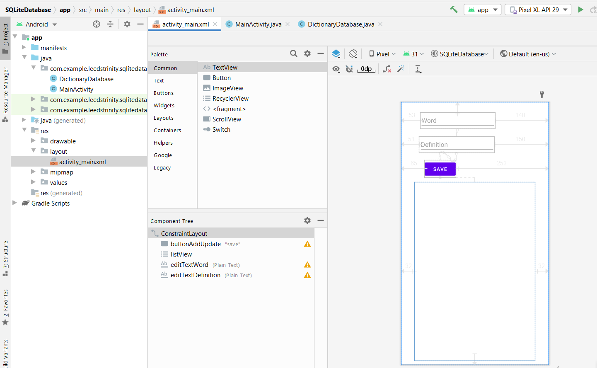
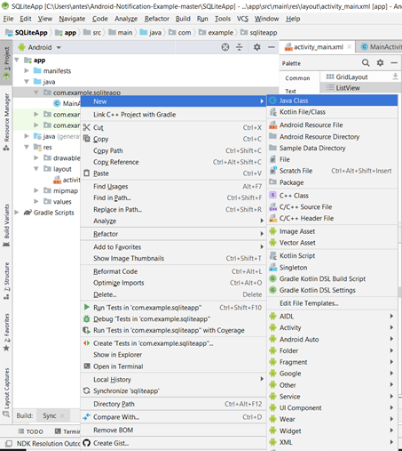
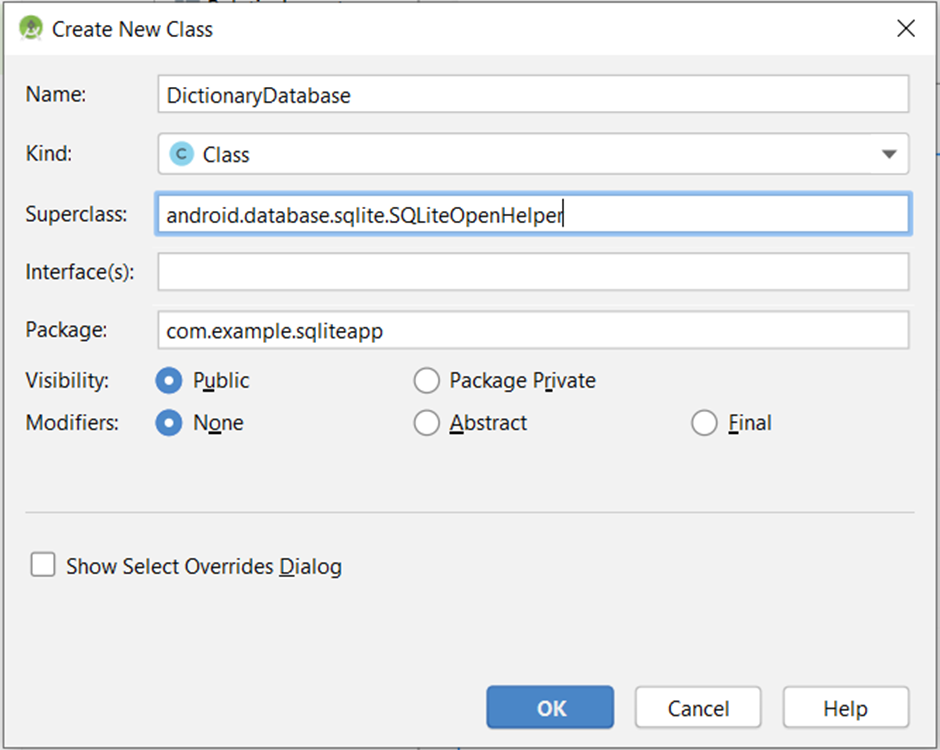
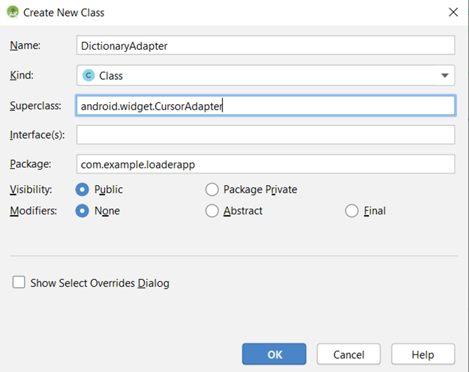

# Creating and using an SQLite database

In this exercise, we're going to demonstrate working with an SQLite database. As you're already familiar with SQL databases, then much of what you know will apply. 

To get you up and running with an SQLite database quickly, this example implements the basic CRUD operations. Generally, when creating a database in Android, you create a class that extends SQLiteOpenHelper, which is where your database functionality is implemented. Here is a list of the CRUD (create, read, update, and delete) functions:

- Create: insert()
- Read: query() and rawQuery()
- Update: update()
- Delete: delete()

To demonstrate a fully working database, we will create a simple Dictionary database where we'll store words and their definitions. We'll demonstrate the CRUD operations by adding new words (with their definitions) and updating existing word definitions. We'll show words in a ListView using a cursor. Pressing a word in the ListView will read the definition from the database and display it in a Toast message. A long press will delete the word.

# Getting ready
Create a new project in Android Studio and call it SQLiteDatabase. Use the default options and select Empty Activity.

# How to do it...
First, we'll create the UI, which will consist of two PlainText fields, a Button, and a ListView. As we add words to the database, they will populate the ListView. Start by opening activity_main.xml and follow these steps:

1.	Design your screen as follow:

  

Use the attribute “Hint” to hardcode your string for the two PlainText. Change the attribute "Text" to "Save" for the Button and id to what you see in the figure for all views.

2.	Add a new Java class to the project named DictionaryDatabase. This class extends from **SQLiteOpenHelper** and handles all the SQLite functions. Here is the class declaration:
```java
public class DictionaryDatabase extends SQLiteOpenHelper { 
```



Insert the following information in the popup window as in the figure below:


 

3.	Below the declaration, add the following constants:

```java
private static final String DATABASE_NAME = "dictionary.db";
private static final String TABLE_DICTIONARY = "dictionary";

private static final String FIELD_WORD = "word";
private static final String FIELD_DEFINITION = "definition";
private static final int DATABASE_VERSION = 1;
```

4.	Add the following constructor, OnCreate(), and onUpgrade() methods:
```java
DictionaryDatabase(Context context) {
    super(context, DATABASE_NAME, null, DATABASE_VERSION);
}

@Override
public void onCreate(SQLiteDatabase db) {
    db.execSQL("CREATE TABLE " + TABLE_DICTIONARY +
            "(_id integer PRIMARY KEY," +
            FIELD_WORD + " TEXT, " +
            FIELD_DEFINITION + " TEXT);");
}

@Override
public void onUpgrade(SQLiteDatabase db, int oldVersion, int newVersion) {
    //Handle database upgrade as needed
}
```

5.	The following methods are responsible for creating, updating, and deleting the records:
```java
public void saveRecord(String word, String definition) {
    long id = findWordID(word);
    if (id>0) {
        updateRecord(id, word,definition);
    } else {
        addRecord(word,definition);
    }
}

public long addRecord(String word, String definition) {
    SQLiteDatabase db = getWritableDatabase();

    ContentValues values = new ContentValues();
    values.put(FIELD_WORD, word);
    values.put(FIELD_DEFINITION, definition);
    return db.insert(TABLE_DICTIONARY, null, values);
}

public int updateRecord(long id, String word, String definition) {
    SQLiteDatabase db = getWritableDatabase();
    ContentValues values = new ContentValues();
    values.put("_id", id);
    values.put(FIELD_WORD, word);
    values.put(FIELD_DEFINITION, definition);
    return db.update(TABLE_DICTIONARY, values, "_id = ?", new String[]{String.valueOf(id)});
}
public int deleteRecord(long id) {
    SQLiteDatabase db = getWritableDatabase();
    return db.delete(TABLE_DICTIONARY, "_id = ?", new String[]{String.valueOf(id)});
}
```

6.	And these methods handle reading the information from the database:
```java
public long findWordID(String word) {
    long returnVal = -1;
    SQLiteDatabase db = getReadableDatabase();
    Cursor cursor = db.rawQuery(
            "SELECT _id FROM " + TABLE_DICTIONARY + " WHERE " + FIELD_WORD + " = ?", 
            new String[]{word});
    if (cursor.getCount() == 1) {
        cursor.moveToFirst();
        returnVal = cursor.getInt(0);
    }
    return returnVal;
}

public String getDefinition(long id) {
    String returnVal = "";
    SQLiteDatabase db = getReadableDatabase();
    Cursor cursor = db.rawQuery(
            "SELECT definition FROM " + TABLE_DICTIONARY + " WHERE _id = ?", 
            new String[]{String.valueOf(id)});
    if (cursor.getCount() == 1) {
        cursor.moveToFirst();
        returnVal = cursor.getString(0);
    }
    return returnVal;
}

public Cursor getWordList() {
    SQLiteDatabase db = getReadableDatabase();
    String query = "SELECT _id, " + FIELD_WORD +
            " FROM " + TABLE_DICTIONARY + " ORDER BY " + FIELD_WORD +
            " ASC";
    return db.rawQuery(query, null);
}
```
7.	We finished with class DictionaryDatabase, now open MainActivity.java and add the following global variables below the class declaration:
```java
EditText mEditTextWord; 
EditText mEditTextDefinition; 
DictionaryDatabase mDB; 
ListView mListView; 
```

8.	Add the following method to save the fields when the button is clicked:
```java
private void saveRecord() {
    mDB.saveRecord(mEditTextWord.getText().toString(), mEditTextDefinition.getText().toString());
    mEditTextWord.setText("");
    mEditTextDefinition.setText("");
    updateWordList();
}
```
9.	Add this method to populate the ListView:
```java
private void updateWordList() {
    SimpleCursorAdapter simpleCursorAdapter = new SimpleCursorAdapter(
            this,
            android.R.layout.simple_list_item_1,
            mDB.getWordList(),
            new String[]{"word"},
            new int[]{android.R.id.text1},
            0);
    mListView.setAdapter(simpleCursorAdapter);
}
```
10.	Finally, add the following code to onCreate():
```java
mDB = new DictionaryDatabase(this);
mEditTextWord = findViewById(R.id.editTextWord);
mEditTextDefinition = findViewById(R.id.editTextDefinition);
Button buttonAddUpdate = findViewById(R.id.buttonAddUpdate);
buttonAddUpdate.setOnClickListener(new View.OnClickListener() {
    @Override
    public void onClick(View v) {
        saveRecord();
    }
});

mListView = findViewById(R.id.listView);
mListView.setOnItemClickListener(new AdapterView.OnItemClickListener() {
    @Override
    public void onItemClick(AdapterView<?> parent, View view, int position, long id) {
        Toast.makeText(MainActivity.this, mDB.getDefinition(id), Toast.LENGTH_SHORT).show();
    }
});
mListView.setOnItemLongClickListener(new AdapterView.OnItemLongClickListener() {
    @Override
    public boolean onItemLongClick(AdapterView<?> parent, View view, int position, long id) {
        Toast.makeText(MainActivity.this, 
                "Records deleted = " + mDB.deleteRecord(id), Toast.LENGTH_SHORT).show();
        updateWordList();
        return true;
    }
});
updateWordList();
```
11.	Run the program on a device or emulator and try it out.

# How it works...
We'll start by explaining the DictionaryDatabase class as that's the heart of an SQLite database. The first item to note is the constructor:
```java
DictionaryDatabase(Context context) { 
    super(context, DATABASE_NAME, null, DATABASE_VERSION); 
} 
```
Notice DATABASE_VERSION? Only when you make changes to your database schema do you need to increment this value.

Next is onCreate(), where the database is actually created. This is only called the first time the database is created, not each time the class is created. It's also worth noting the _id field. Android does not require tables to have a primary field, but some classes, such as the SimpleCursorAdapter, may require an _id.

We're required to implement the onUpgrade() callback, but as this is a new database, there's nothing to do. This method will only be called when the database version is incremented.

The saveRecord() method handles calling addRecord() or updateRecord(), as appropriate. Since we are going to modify the database, both methods use getWritableDatabase() to get an updatable database reference. A writable database requires more resources so if you don't need to make changes, get a read-only database instead.

The last method to note is getWordList(), which returns all the words in the database using a cursor object. We use this cursor to populate the ListView, which brings us to ActivityMain.java. The onCreate() method does the standard initialization we've seen before and also creates an instance of the database with the following line of code:
```java
mDB = new DictionaryDatabase(this); 
```
The onCreate() method is also where we set up the events to show the word definition (with a Toast) when an item is pressed and to delete the word on a long press. Probably the most complicated code is in updateWordList().

We use the SimpleCursorAdapter to create a mapping between our field in the cursor and the ListView item. We use the layout.simple_list_item_1 layout, which only includes a single text field with the ID android.R.id.text1. In a real application, we'd probably create a custom layout and include the definition in the ListView item, but we wanted to demonstrate a method to read the definition from the database.

We call updateWordList() in three places: during onCreate() to create the initial list, then again after we add/update an item, and lastly when deleting an item.

# There's more...
Although this is a fully functioning example of SQLite, it is still just the basics. There are many books dedicated to SQLite for Android and they are worth checking out.

# Upgrading a database
As we mentioned previously, when we increment the database version, the onUpgrade() method will be called. What you do here is dependent on the changes made to the database. If you changed an existing table, ideally you'll want to migrate the user data to the new format by querying the existing data and inserting it into the new format. Keep in mind that there is no guarantee the user will upgrade in consecutive order, so they could jump from version 1 to version 4, for example.
See also
- SQLite homepage: https://www.sqlite.org/
- SQLite database Android reference: http://developer.android.com/reference/android/database/sqlite/SQLiteDatabase.html

# Accessing data in the background using a Loader
Any potentially long-running operations should not be done on the UI thread, as this can cause your application to be slow or become unresponsive. The Android OS will bring up the Application Not Responding (ANR) dialog when apps become unresponsive.

Since querying databases can be time-consuming, Android introduced the Loader API in Android 3.0. A Loader processes the query on a background thread and notifies the UI thread when it finishes.

The two primary benefits to Loaders are the following:
- Querying the database is (automatically) handled on a background thread
- The query auto-updates (when using a Content Provider data source)

To demonstrate a Loader, we will modify the previous SQLite database example to use a CursorLoader to populate ListView.

# Getting ready
We will use the project from the previous example, Creating and using an SQLite database, as the base for this recipe. Create a new project in Android Studio and call it Loader. Use the default options and select Empty Activity on the Add an Activity to Mobile dialog. Copy the DictionaryDatabase class and the layout from the previous recipe. Although we will use parts of the previous ActivityMain.java code, we will start at the beginning in this recipe to make it easier to follow.

# How to do it...
With the project set up as described in Getting ready, we'll continue by creating two new Java classes, and then tie it all together in ActivityMain.java. Here are the steps:
1.	Create a new Java class called DictionaryAdapter that extends CursorAdapter. 

 

This class replaces the SimpleCursorAdapater used in the previous recipe. Here is the full code:
```java
public class DictionaryAdapter extends CursorAdapter {
    public DictionaryAdapter(Context context, Cursor c, int flags) {
        super(context, c, flags);
    }

    @Override
    public View newView(Context context, Cursor cursor, ViewGroup parent) {
        return LayoutInflater.from(context)
                .inflate(android.R.layout.simple_list_item_1,parent, false);
    }

    @Override
    public void bindView(View view, Context context, Cursor cursor) {
        TextView textView = view.findViewById(android.R.id.text1);
        textView.setText(cursor.getString(getCursor().getColumnIndex("word")));
    }
}
```
2.	Next, create another new Java class and call this one DictionaryLoader that extends the CursorLoader. Although this is the class that handles the data loading on the background thread, it's actually very simple:
```java
public class DictionaryLoader extends CursorLoader { 
    Context mContext;
    public DictionaryLoader(Context context) {
        super(context);
        mContext = context;
    }

    @Override
    public Cursor loadInBackground() {
        DictionaryDatabase db = new DictionaryDatabase(mContext);
        return db.getWordList();
    }
} 
```
3.	Next, open ActivityMain.java. We need to change the declaration to implement the LoaderManager.LoaderCallbacks<Cursor> interface as follows:
```java
public class MainActivity extends AppCompatActivity 
    implements LoaderManager.LoaderCallbacks<Cursor> {
```
4.	Add the adapter to the global declarations. The complete list is as follows:
```java
EditText mEditTextWord; 
EditText mEditTextDefinition; 
DictionaryDatabase mDB; 
ListView mListView; 
DictionaryAdapter mAdapter; 
```
5.	Change onCreate() to use the new adapter and add a call to update the Loader after deleting a record. The final onCreate() method should look as follows:
```java
@Override
protected void onCreate(Bundle savedInstanceState) {
    super.onCreate(savedInstanceState);
    setContentView(R.layout.activity_main);

    mDB = new DictionaryDatabase(this);

    mEditTextWord = findViewById(R.id.editTextWord);
    mEditTextDefinition = findViewById(R.id.editTextDefinition);    
    Button buttonAddUpdate = findViewById(R.id.buttonAddUpdate);
    buttonAddUpdate.setOnClickListener(new View.OnClickListener() {
        @Override
        public void onClick(View v) {
            saveRecord();
        }
    });

    mListView = findViewById(R.id.listView);
    mListView.setOnItemClickListener(new AdapterView.OnItemClickListener() {
        @Override
        public void onItemClick(AdapterView<?> parent, View view, int position, long id) {
            Toast.makeText(MainActivity.this,
                    mDB.getDefinition(id),
                    Toast.LENGTH_SHORT).show();
        }
    });
    mListView.setOnItemLongClickListener(new AdapterView.OnItemLongClickListener() {
        @Override
        public boolean onItemLongClick(AdapterView<?> parent, View view, int position, long id) {
            Toast.makeText(MainActivity.this, "Records deleted = " + mDB.deleteRecord(id),
                    Toast.LENGTH_SHORT).show();
            getSupportLoaderManager().restartLoader(0, null, MainActivity.this);
            return true;
        }
    });
    getSupportLoaderManager().initLoader(0, null, this);
    mAdapter = new DictionaryAdapter(this,mDB.getWordList(),0);
    mListView.setAdapter(mAdapter);
}
```
6.	We no longer have the updateWordList() method, so change saveRecord()
as follows:
```java
private void saveRecord() {
    mDB.saveRecord(mEditTextWord.getText().toString(), mEditTextDefinition.getText().toString());
    mEditTextWord.setText("");
    mEditTextDefinition.setText("");
    getSupportLoaderManager().restartLoader(0, null, MainActivity.this);
}
```
7.	Finally, implement these three methods for the Loader interface:
```java
@Override
public Loader<Cursor> onCreateLoader(int id, Bundle args) {
    return new DictionaryLoader(this);
}

@Override
public void onLoadFinished(Loader<Cursor> loader, Cursor data) {
    mAdapter.swapCursor(data);
}

@Override
public void onLoaderReset(Loader<Cursor> loader) {
    mAdapter.swapCursor(null);
}
```
8.	Run the program on a device or emulator.

# How it works...
The default CursorAdapter requires a Content Provider URI. Since we are accessing the SQLite database directly (and not through a Content Provider), we don't have a URI to pass, so instead, we created a custom adapter by extending the CursorAdapter class. DictionaryAdapter still performs the same functionality as SimpleCursorAdapter from the previous recipe, namely mapping the data from the cursor to the item layout.

The next class we added was DictionaryLoader, which handles populating the adapter. As you can see, it's actually very simple. All it does is return the cursor from getWordList(). The key here is that this query is being handled in a background thread and will call the onLoadFinished() callback (in MainActivity.java) when it finishes. Fortunately, most of the heavy lifting is handled in the base class.

This takes us to ActivityMain.java, where we implemented the following three callbacks from the LoaderManager.LoaderCallbacks interface:

- onCreateLoader(): It's initially called in onCreate() with the initLoader() call. It's called again with the restartLoader() call after we make changes to the database.
- onLoadFinished(): It's called when the Loader loadInBackground() finishes.
- onLoaderReset(): It's called when the Loader is being recreated (such as with the restart() method). We set the old cursor to null because it will be invalidated and we don't want a reference kept around.

