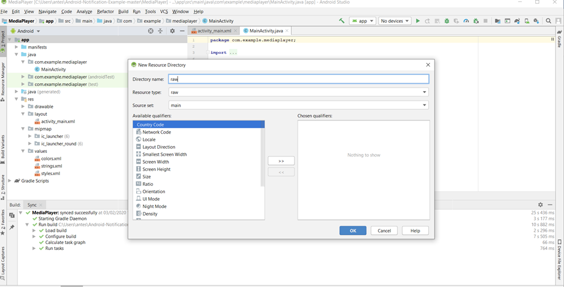
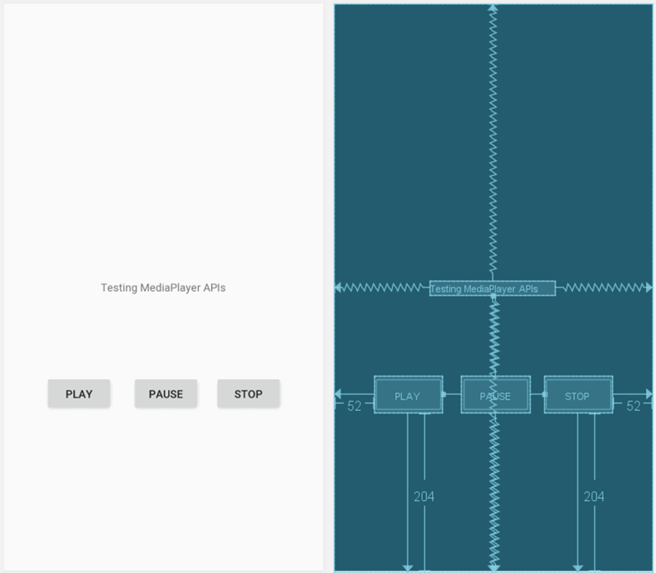
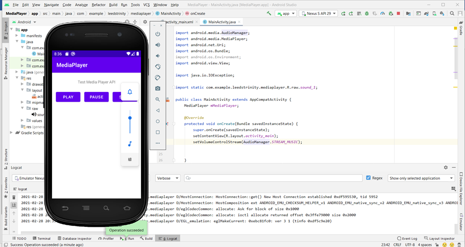
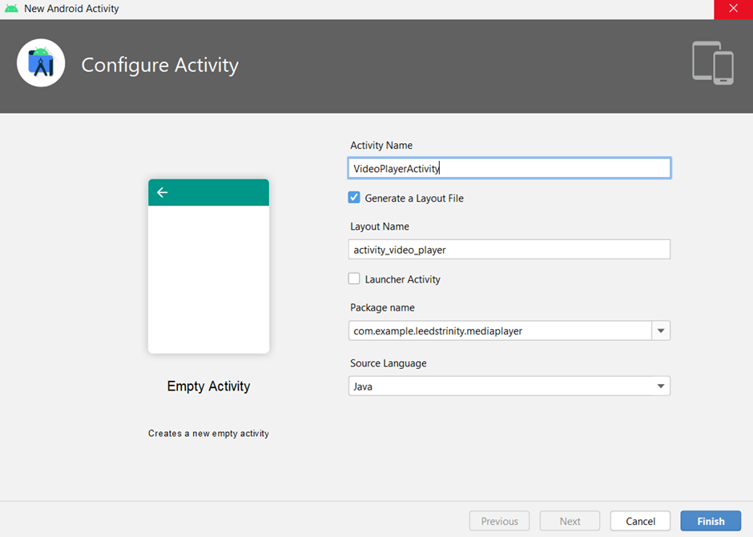
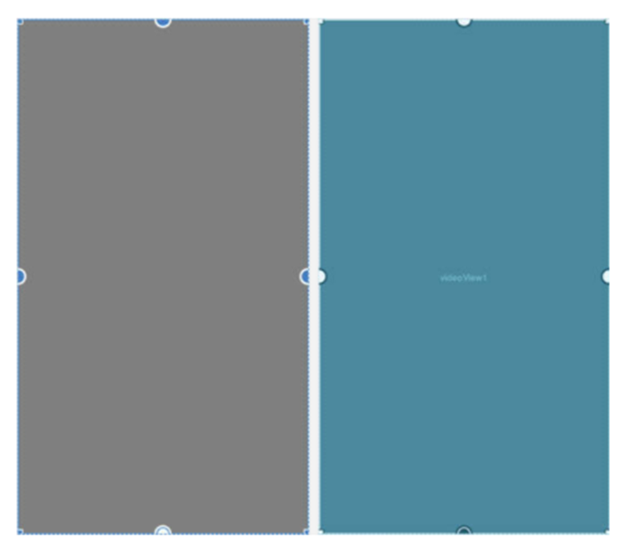
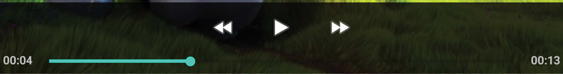
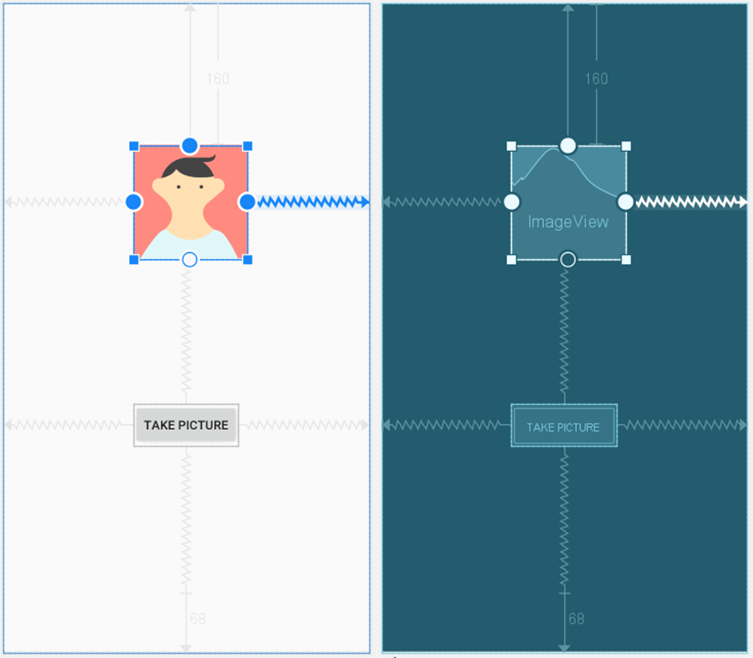

# Android Multimedia Framework

This Tutorial shows you how to write a media-playing application that interacts with the user and the system in order to get good performance and a pleasant user experience. It also looks at how to use Camera APIs using the default camera app and camera2 app.


# Exercise 1: MediaPlayer APIs to play a sound file.
Create a new project in Android Studio and call it MediaPlayer. Use the default options and select Empty Activity when prompted for Activity Type. We will also need a sound for this exercise and will use the same longer playing "water" sound from:http://soundbible.com/2032-Water.html

# How to do it ...
As explained previously, we'll need a sound file to include in the project. Once you have your sound file ready, follow these steps:

1.	Create a new raw folder (File | New | Android resource directory) and chose raw in the Resource type dropdown.



 
2.	Copy your sound file to res/raw as sound_1, (keep the original extension).
3.	Open activity_main.xml and replace the existing TextView with the following buttons:

  

4.	Add android:onClick="buttonPlay" /> for button PLAY and android:onClick="buttonPause" for button PAUSE and android:onClick="buttonStop" for button STOP.

5.	Now, open ActivityMain.java and add the following class variable:
```java
MediaPlayer mMediaPlayer;
```
6.	Add the buttonPlay() method:
```java
public void buttonPlay(View view){
    if (mMediaPlayer==null) {
        mMediaPlayer = MediaPlayer.create(this, R.raw.sound_1);
        mMediaPlayer.setLooping(true);
        mMediaPlayer.start();
    } else  {
        mMediaPlayer.start();
    }
}
```
7.	Add the buttonPause() method:
```java
public void buttonPause(View view){
    if (mMediaPlayer!=null && mMediaPlayer.isPlaying()) {
        mMediaPlayer.pause();
    }
}
```
8.	Add the buttonStop() method:
```java
public void buttonStop(View view){
    if (mMediaPlayer!=null) {
        mMediaPlayer.stop();
        mMediaPlayer.release();
        mMediaPlayer = null;
    }
}
```
9.	Finally, override the onStop() callback with the following code:
```java
@Override
protected void onStop() {
    super.onStop();
    if (mMediaPlayer!=null) {
        mMediaPlayer.release();
        mMediaPlayer = null;
    }
}
```
10.	You're ready to run the application on a device or emulator.

# There's more...
Using a short audio file included with the project, we aren't likely to experience any UI delays. In general, it's a good idea to use a background thread when preparing MediaPlayer. To make this common task easier, MediaPlayer already includes an asynchronous preparation method called prepareAsync(). The following code will create an OnPreparedListener() listener and use the prepareAsync() method:
```java
mMediaPlayer = new MediaPlayer();
mMediaPlayer.setOnPreparedListener(new MediaPlayer.OnPreparedListener() {
    @Override
    public void onPrepared(MediaPlayer mp) {
        mMediaPlayer.start();
    }
});
try {
    mMediaPlayer.setDataSource(/*URI, URL or path here*/));
} catch (IOException e) {
    e.printStackTrace();
}
mMediaPlayer.prepareAsync();
```
Replace the code in buttonPlay with the following code:
```java
public void buttonPlay(View view) {
    Uri mediaPath = Uri.parse("android.resource://" + getPackageName() + "/" + R.raw.sound_1);
    mMediaPlayer = new MediaPlayer();
    mMediaPlayer.setOnPreparedListener(new MediaPlayer.OnPreparedListener() {
        @Override
        public void onPrepared(MediaPlayer mp) {
            mMediaPlayer.start();
        }
    });
    try {
        mMediaPlayer.setDataSource(getApplicationContext(), mediaPath);
    } catch (IOException e) {
        e.printStackTrace();
    }
    mMediaPlayer.prepareAsync();
}
```
## Using hardware volume keys to control your app's audio volume

If you want the volume controls to control the volume in your app, add the setVolumeControlStream() method to your onCreate() method to specify your application's audio stream, as follows:
```java
setVolumeControlStream(AudioManager.STREAM_MUSIC);
``` 


See the AudioManager [link](https://developer.android.com/reference/android/media/AudioManager) for other streaming options.

# Exercise 2: Video Playback on Android using the VideoView and MediaController Classes

1.	Create a new empty activity and call it VideoPlayerActivity as follow:


 
2.	Open the activity_video_player.xml Layout and from the Widgets category of the Palette panel, drag and drop a VideoView instance onto the layout so that it fills the available canvas area as follows: 


 
Using the Attributes panel, change the layout_width and layout_height attributes to match_constraint and wrap_content respectively. Also, remove the constraint connecting the bottom of the VideoView to the bottom of the parent ConstraintLayout. 

3.	Download the Video File from [Moodle](https://moodle.leedstrinity.net/mod/resource/view.php?id=252509) and add it to the raw directory created in the previous example.

4.	The next step is to configure the VideoView with the path of the video to be played and then start the playback. This will be performed when the VideoPlayerActivity has initialised, so load the VideoPlayerActivity.java file into the editor and modify it as outlined in the following listing:
```java
public class VideoPlayerActivity extends AppCompatActivity {
    private VideoView videoView;
    
    @Override
    protected void onCreate(Bundle savedInstanceState) {
        super.onCreate(savedInstanceState);
        setContentView(R.layout.activity_video_player);
        configureVideoView();
    }
    private void configureVideoView() {
        videoView = findViewById(R.id.videoView);
        videoView.setVideoURI(Uri.parse("android.resource://"
                + getPackageName() + "/" + R.raw.movie));
        videoView.start();
    }
}
```
5.	Now Add a button to the axtivity_main.xml and start VideoPlayerActivity from the main activity using intent and run your app.

6.	As the VideoPlayer application currently stands, there is no way for the user to control playback. As previously outlined, this can be achieved using the MediaController class. To add a controller to the VideoView, modify the configureVideoView() method once again. The final code should look like the following:
```java
public class VideoPlayerActivity extends AppCompatActivity {
    private VideoView videoView;
    private MediaController mediaController;

    @Override
    protected void onCreate(Bundle savedInstanceState) {
        super.onCreate(savedInstanceState);
        setContentView(R.layout.activity_video_player);
        configureVideoView();
    }
    private void configureVideoView() {
        final VideoView videoView = findViewById(R.id.videoView);
        videoView.setVideoURI(Uri.parse("android.resource://"
                + getPackageName() + "/" + R.raw.movie));
        mediaController = new MediaController(this);
        mediaController.setAnchorView(videoView);
        videoView.setMediaController(mediaController);
        videoView.start();
    }
}
```
When the application is launched with these changes implemented, tapping the VideoView canvas will cause the media controls to appear over the video playback. These controls should include a seekbar together with fast forward, rewind and play/pause buttons. After the controls recede from view, they can be restored at any time by tapping on the VideoView canvas once again. With just three more lines of code, our video player application now has media controls as shown in the following figure:


 
7.	Now set up the onPreparedListener as in the previous example by changing the existing code with the following one:
```java
public class VideoPlayerActivity extends AppCompatActivity {
    private VideoView videoView;
    private MediaController mediaController;
    String TAG = "VideoPlayer";

    @Override
    protected void onCreate(Bundle savedInstanceState) {
        super.onCreate(savedInstanceState);
        setContentView(R.layout.activity_video_player);
        configureVideoView();
    }
    private void configureVideoView() {
        final VideoView videoView = findViewById(R.id.videoView);
        videoView.setVideoURI(Uri.parse("android.resource://"
                + getPackageName() + "/" + R.raw.movie));
        mediaController = new MediaController(this);
        mediaController.setAnchorView(videoView);
        videoView.setMediaController(mediaController);
        videoView.setOnPreparedListener(new MediaPlayer.OnPreparedListener() {
            @Override
            public void onPrepared(MediaPlayer mp) {
                mp.setLooping(true);
                Log.i(TAG, "Duration = " + videoView.getDuration());
            }
        });
        videoView.start();
    }
}
```
8.	Now rerun your application.

# Exercise 3: Taking a photo with the default camera app

If your application needs an image from the camera but is not a camera replacement app, it may be better to allow the default camera app to take the picture. This also respects your user's preferred camera application.

When you take a photo, unless it is specific to your application, it's considered good practice to make the photo publicly available (this allows it to be included in the user's photo gallery). So, this exercise will demonstrate using the default photo application to click a picture, save it to the public folder, and display the image.

# Getting ready ...

Create a new project in Android Studio and call it UsingTheDefaultCameraApp. Use the default options and select Empty Activity on the Add an Activity to Mobile dialog.

# How to do it ...

We're going to create a layout with an ImageView and button. The button will create an Intent to launch the default Camera app. When the camera app is done, our app will get a callback. We'll check the result and display the picture if available. Start by opening the Android Manifest and follow these steps:

1.	Add the following permission:
```java
<uses-permission android:name="android.permission.READ_EXTERNAL_STORAGE" />
```
2.	Open activity_main.xml and replace the existing TextView with ImageView and Button as the following screen:
 


Note: Add android:onClick="takePicture" as a part of setting the button’s attributes.

3.	Open MainActivity.java and add the following global variables to the MainActivity class:
```java
final int PHOTO_RESULT=1;
private Uri mLastPhotoURI=null;
```
4.	Add the following method to create the URI for the photo:
```java
private Uri createFileURI() {
    String timeStamp = new SimpleDateFormat("yyyyMMdd_HHmmss")
            .format(System.currentTimeMillis());
    String fileName = "PHOTO_" + timeStamp + ".jpg";
    return Uri.fromFile(new File(Environment
            .getExternalStoragePublicDirectory(Environment.DIRECTORY_PICTURES),fileName));
}
```
Note: add this method after onCreate()method in the MainActivity.java. 

5.	Add the following method to handle the button click:
```java
public void takePicture(View view) {
    Intent takePictureIntent = new Intent(MediaStore.ACTION_IMAGE_CAPTURE);
    if (takePictureIntent.resolveActivity(getPackageManager()) != null) {
        mLastPhotoURI = createFileURI();
        takePictureIntent.putExtra(MediaStore.EXTRA_OUTPUT, mLastPhotoURI);
        startActivityForResult(takePictureIntent, PHOTO_RESULT);
    }
}
```
6.	Add a new method to override onActivityResult() as follows:
```java
@Override
protected void onActivityResult(int requestCode, int resultCode, Intent data) {
    if (requestCode == PHOTO_RESULT && resultCode == RESULT_OK ) {
        ImageView imageView = findViewById(R.id.imageView);
        imageView.setImageBitmap(BitmapFactory.decodeFile(mLastPhotoURI.getPath()));
    }
}
```
7. Add the following code to the end of the existing onCreate() method: 
```java
StrictMode.VmPolicy.Builder builder = new StrictMode.VmPolicy.Builder();
StrictMode.setVmPolicy(builder.build());

if (ContextCompat.checkSelfPermission(this, Manifest.permission.READ_EXTERNAL_STORAGE) 
        != PackageManager.PERMISSION_GRANTED ) {
    ActivityCompat.requestPermissions(this, 
            new String[] {Manifest.permission.READ_EXTERNAL_STORAGE},0);
}
```
8. You're ready to run the application on a device or emulator.

# How it works ...
There are two parts to working with the default camera app. The first is to set up the Intent to launch the app. We create the Intent using MediaStore.ACTION_IMAGE_CAPTURE to indicate we want a photo app. We verify a default app exists by checking the results from resolveActivity(). As long as it's not null, we know an application is available to handle the Intent. (Otherwise, our app will crash.) We create a filename and add it to the Intent with putExtra(MediaStore.EXTRA_OUTPUT, mLastPhotoURI).

When we get the callback in onActivityResult(), we first make sure it's PHOTO_RESULT and RESULT_OK (the user could have cancelled), then we load the photo in ImageView.

You might be wondering what the StrictMode calls are for in onCreate(). Basically, those lines of code disable an additional security check made by the OS. If we don't disable StrictMode, the app will crash when creating the file URI with a FileUriExposedException exception.  For a production app, one solution would be to create a FileProvider as we did in the Accessing External Storage with Scoped Directories.

# There's more ...

If you don't care where the picture is stored, you can call the Intent without using the MediaStore.EXTRA_OUTPUT extra. If you don't specify the output file, onActivityResult() will include a thumbnail of the image in the data Intent. The following is how you can display the thumbnail:
```java
if (data != null) {
    imageView.setImageBitmap((Bitmap) data.getExtras().get(“data”));
}
```
Here's the code to load the full resolution image, using the URI returned in the data Intent:
```java
if (data != null) {
    try {
        imageView.setImageBitmap(
            MediaStore.Images.Media. getBitmap(getContentResolver(),
            Uri.parse(data.toUri(Intent.URI_ALLOW_UNSAFE))));
    } catch (IOException e) {
        e.printStackTrace();
    }
}
```
## Calling the default video app 
It's the same process if you want to call the default video capture application (add another button to the previous app “Record Video” to test the video capture app). Just change the Intent in step 5, as follows:
```java
Intent takeVideoIntent = new Intent(MediaStore.ACTION_VIDEO_CAPTURE);
```
You can get the URI to the video in onActivityResult(), as follows:
```java
Uri videoUri = intent.getData();
```
 
# Exercise 4: Taking a picture using the Camera2 API

The previous exercise demonstrated how to use an Intent to call the default photo application. If you only need a quick photo, the Intent is probably the ideal solution. If not, and you need more control over the camera, this exercise will show you how to use the camera directly with the Camera2 API.

Now that 85% of devices are using Android 5.0 or later, this exercise focuses only on the Camera2 API.  (Google has already deprecated the original Camera API.)

# Getting ready

Create a new project in Android Studio and call it Camera2API. In the Target Android Devices dialog, select the Phone & Tablet option and choose API 21: Android 5.0 (Lollipop), or later, for the minimum SDK. Select Empty Activity on the Add an Activity to Mobile dialog.

# How to do it...

As you'll see, there's a lot of code for this exercise. Start by opening the Android Manifest and following these steps:

1.	Add the following two permissions:
```java
<uses-permission android:name="android.permission.CAMERA" />
<uses-permission android:name="android.permission.WRITE_EXTERNAL_STORAGE" />
```
2.	Now, open activity_main.xml and replace the existing TextView with the following views:
```xml
<TextureView
    android:id="@+id/textureView"
    android:layout_width="match_parent"
    android:layout_height="match_parent"
    app:layout_constraintTop_toTopOf="parent"
    app:layout_constraintBottom_toTopOf="@+id/button"
    app:layout_constraintLeft_toLeftOf="parent"
    app:layout_constraintRight_toRightOf="parent" />
<android.support.v7.widget.AppCompatButton
    android:id="@+id/button"
    android:layout_width="wrap_content"
    android:layout_height="wrap_content"
    android:text="Take Picture"
    android:onClick="takePictureClick"
    app:layout_constraintBottom_toBottomOf="parent"
    app:layout_constraintLeft_toLeftOf="parent"
    app:layout_constraintRight_toRightOf="parent"/>
```
3.	Now, open MainActivity.java and add the following global variables to the MainActivity class:
```java
private CameraDevice mCameraDevice = null;
private CaptureRequest.Builder mCaptureRequestBuilder = null;
private CameraCaptureSession mCameraCaptureSession  = null;
private TextureView mTextureView = null;
private Size mPreviewSize = null;
```
4.	Add the following Comparator class to the MainActivity class:
```java
static class CompareSizesByArea implements Comparator<Size> {
    @Override
    public int compare(Size lhs, Size rhs) {
        return Long.signum((long) lhs.getWidth() * lhs.getHeight() 
                - (long) rhs.getWidth() * rhs.getHeight());
    }
}
```
5.	Add the following CameraCaptureSession.StateCallback:
```java
private CameraCaptureSession.StateCallback mPreviewStateCallback = new CameraCaptureSession.StateCallback() {
    @Override
    public void onConfigured(CameraCaptureSession session) {
        startPreview(session);
    }
    @Override
    public void onConfigureFailed(CameraCaptureSession session) {}
};
```
6.	Add the following SurfaceTextureListener:
```java
private TextureView.SurfaceTextureListener mSurfaceTextureListener =
        new TextureView.SurfaceTextureListener() {
            @Override
            public void onSurfaceTextureUpdated(SurfaceTexture     
            surface)                        
            {
            }
            @Override
            public void onSurfaceTextureSizeChanged(
                    SurfaceTexture surface, int width, int height) {
            }
            @Override
            public boolean onSurfaceTextureDestroyed(SurfaceTexture 
            surface) {
                return false;
            }
            @Override
            public void onSurfaceTextureAvailable(
                    SurfaceTexture surface, int width, int height) {
                openCamera();
            }
        };
```
7.	Add CameraDevice.StateCallback as follows:
```java
private CameraDevice.StateCallback mStateCallback = new CameraDevice.StateCallback() {
    @Override
    public void onOpened(CameraDevice camera) {
        mCameraDevice = camera;
        SurfaceTexture texture = mTextureView.getSurfaceTexture();
        if (texture == null) {
            return;
        }
        texture.setDefaultBufferSize(mPreviewSize.getWidth(), 
        mPreviewSize.getHeight());
        Surface surface = new Surface(texture);
        try {
            mCaptureRequestBuilder = mCameraDevice
                    
        .createCaptureRequest(CameraDevice.TEMPLATE_PREVIEW);
        } catch (CameraAccessException e){
            e.printStackTrace();
        }
        mCaptureRequestBuilder.addTarget(surface);
        try {
            mCameraDevice.createCaptureSession(Arrays
                    .asList(surface), mPreviewStateCallback, null);
        } catch (CameraAccessException e) {
            e.printStackTrace();
        }
    }
    @Override
    public void onError(CameraDevice camera, int error) {}
    @Override
    public void onDisconnected(CameraDevice camera) {}
};
```
8.	Add the following CaptureCallback class to receive the capture completed event: 
```java
final CameraCaptureSession.CaptureCallback mCaptureCallback = 
        new CameraCaptureSession.CaptureCallback() {
    @Override
    public void onCaptureCompleted(CameraCaptureSession session,  
     CaptureRequest request,                                  
     TotalCaptureResult result) {
        super.onCaptureCompleted(session, request, result);
        Toast.makeText(MainActivity.this, "Picture Saved", 
        Toast.LENGTH_SHORT).show();
        startPreview(session);
    }
};
```
9.	Add the following code to the existing onCreate() callback:
```java
mTextureView = findViewById(R.id.textureView);
mTextureView.setSurfaceTextureListener(mSurfaceTextureListener);

if(ActivityCompat.checkSelfPermission(this, Manifest.permission.CAMERA) 
        != PackageManager.PERMISSION_GRANTED) {
    ActivityCompat.requestPermissions(this, new String[]{Manifest.permission.CAMERA}, 1);
}
```
10.	Add the following methods to override onPause() and onResume():
```java
@Override
protected void onPause() {
    super.onPause();
    if (mCameraDevice != null) {
        mCameraDevice.close();
        mCameraDevice = null;
    }
}
@Override
public void onResume() {
    super.onResume();
    if (mTextureView.isAvailable()) {
        openCamera();
    } else {
        mTextureView.setSurfaceTextureListener(
             mSurfaceTextureListener);
    }
}
```
11.	Add the openCamera() method:
```java
private void openCamera() {
    CameraManager manager = (CameraManager) getSystemService(CAMERA_SERVICE);
    try{
        String cameraId = manager.getCameraIdList()[0];
        CameraCharacteristics characteristics = manager.getCameraCharacteristics(cameraId);
        StreamConfigurationMap map = characteristics
                .get(CameraCharacteristics.SCALER_STREAM_CONFIGURATION_MAP);
        mPreviewSize = map.getOutputSizes(SurfaceTexture.class) [0];
        manager.openCamera(cameraId, mStateCallback, null);
    } catch(CameraAccessException e) {
        e.printStackTrace();
    } catch (SecurityException e) {
        e.printStackTrace();
    }
}
```
12.	Add the startPreview() method:
```java
private void startPreview(CameraCaptureSession session) {
    mCameraCaptureSession = session;
    mCaptureRequestBuilder.set(CaptureRequest.CONTROL_MODE, 
    CameraMetadata.CONTROL_MODE_AUTO);
    HandlerThread backgroundThread = new 
    HandlerThread("CameraPreview");
    backgroundThread.start();
    Handler backgroundHandler = new Handler(backgroundThread. 
    getLooper());
    try {
        mCameraCaptureSession
                .setRepeatingRequest(mCaptureRequestBuilder.build(), 
    null, backgroundHandler);
    } catch (CameraAccessException e) {
        e.printStackTrace();
    }
}
```
13.	Add the getPictureFile() method:
```java
private File getPictureFile() {
    String timeStamp = new SimpleDateFormat("yyyyMMdd_HHmmss")
            .format(System.currentTimeMillis());
    String fileName = "PHOTO_" + timeStamp + ".jpg";
    return new File(Environment
            .getExternalStoragePublicDirectory(Environment.DIRECTORY_PICTURES),fileName);
}
```
14.	Add the following method to save the image file: 

```java
private void saveImage(ImageReader reader) {
    Image image = null;
    try {
        image = reader.acquireLatestImage();
        ByteBuffer buffer = image.getPlanes()[0].getBuffer();
        byte[] bytes = new byte[buffer.capacity()];
        buffer.get(bytes);
        OutputStream output = new FileOutputStream(getPictureFile());
        output.write(bytes);
        output.close();
    } catch (FileNotFoundException e) {
        e.printStackTrace();
    } catch (IOException e) {
        e.printStackTrace();
    } finally {
        if (image != null) {
            image.close();
        }
    }
}
```
15.	Add the following method to handle the button click: 
```java
public void takePictureClick(View view) {
    if (null == mCameraDevice) {
        return;
    }
    takePicture();
}
```
16.	Add the final code to actually set up the camera and take the picture:
```java
private void takePicture() {
    CameraManager manager = (CameraManager) getSystemService(Context.CAMERA_SERVICE);
    try {
        CameraCharacteristics characteristics = manager
                .getCameraCharacteristics(mCameraDevice.getId());
        StreamConfigurationMap configurationMap = characteristics
                
       .get(CameraCharacteristics.SCALER_STREAM_CONFIGURATION_MAP);
        if (configurationMap == null) return;
        Size largest = Collections.max(Arrays.asList(configurationMap
                .getOutputSizes(ImageFormat.JPEG)), new 
        CompareSizesByArea());
        ImageReader reader = ImageReader
                .newInstance(largest.getWidth(), largest.getHeight(), 
        ImageFormat.JPEG, 1);
        List<Surface> outputSurfaces = new ArrayList<>(2);
        outputSurfaces.add(reader.getSurface());
        outputSurfaces.add(new 
        Surface(mTextureView.getSurfaceTexture()));
        final CaptureRequest.Builder captureBuilder = mCameraDevice
                
        .createCaptureRequest(CameraDevice.TEMPLATE_STILL_CAPTURE);
        captureBuilder.addTarget(reader.getSurface());
        captureBuilder.set(CaptureRequest.CONTROL_MODE, 
        CameraMetadata.CONTROL_MODE_AUTO);
        ImageReader.OnImageAvailableListener readerListener =
                new ImageReader.OnImageAvailableListener() {
            @Override
            public void onImageAvailable(ImageReader reader) {
                saveImage(reader);
            }
        };
        HandlerThread thread = new HandlerThread("CameraPicture");
        thread.start();
        final Handler backgroundHandler = new 
        Handler(thread.getLooper());
        reader.setOnImageAvailableListener(readerListener, 
        backgroundHandler);
        mCameraDevice.createCaptureSession(outputSurfaces,
                new CameraCaptureSession.StateCallback() {
                    @Override
                    public void onConfigured(CameraCaptureSession 
                    session) {
                        try {
                            session.capture(captureBuilder.build(),
                                    mCaptureCallback, 
                       backgroundHandler);
                        } catch (CameraAccessException e) {
                            e.printStackTrace();
                        }
                    }
                    @Override
                    public void onConfigureFailed(CameraCaptureSession 
                   session) { }
                }, backgroundHandler);
    } catch (CameraAccessException e) {
        e.printStackTrace();
    }
```
17.	Run the application on a device or emulator with a camera.

# How it works...

As you can see, there are a lot of steps for this exercise, but at a high level, it's pretty simple:
- Set up the camera preview
- Capture the image

Now, we'll look at each in detail.

Setting up the camera preview

Here's a rundown on how the code sets up the preview:
- First, we set up the TextureView.SurfaceTextureListener with the setSurfaceTextureListener() method in onCreate()
- When we get the onSurfaceTextureAvailable() callback, we open the camera
- We pass our CameraDevice.StateCallback class to the openCamera() method, which eventually calls the onOpened() callback
- onOpened() gets the surface for the preview by calling getSurfaceTexture() and passes it to the CameraDevice by calling createCaptureSession()
- Finally, when CameraCaptureSession.StateCallback onConfigured() is called, we start the preview with the setRepeatingRequest() method

## Capturing the image

Even though the takePicture() method may appear to be procedural, capturing an image also involves several classes and relies on callbacks. Here's a breakdown of how the code works:

1.	The process starts when the Take Picture button is clicked.

2.	Then the code queries the camera to find the largest available image size

3.	Then an ImageReader is created.

4.	Next, the code sets up OnImageAvailableListener, and saves the image in the onImageAvailable() callback.

5.	Then it creates CaptureRequest.Builder and includes the ImageReader surface.

6.	Next it creates CameraCaptureSession.CaptureCallback, which defines
the onCaptureCompleted() callback. When the capture is complete, it restarts the preview.

7.	Finally, the createCaptureSession() method is called, creating a CameraCaptureSession.StateCallback. This is where the capture() method is called, passing in the CameraCaptureSession.CaptureCallback created earlier.

# There's more...

We've just created the base code to demonstrate a working Camera application. There are many areas for improvement. First, you should handle the device orientation, for both the preview and when saving the images. (See the following links.) Also, with Android 6.0 (API 23) having over 60% of the market share, your apps should already be using the new permission model. Instead of just checking for an exception as we do in the openCamera() method, it would be better to check for the required permission.

**Happy Coding**

# Sources: 
- Android 9 Development Cookbook - Third Edition by Rick Boyer, Publisher: Packt Publishing, October 2018
- Android Studio 4.0 Development Essentials - Java Edition by Neil Smyth, Publisher: Packt Publishing, September 2020

