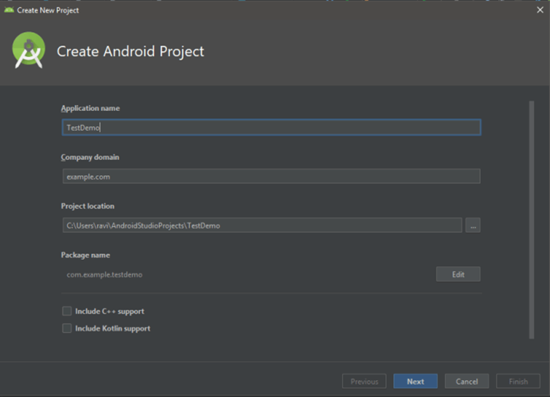
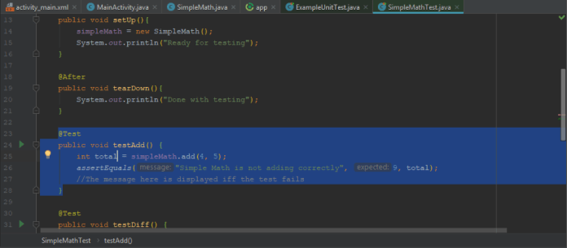
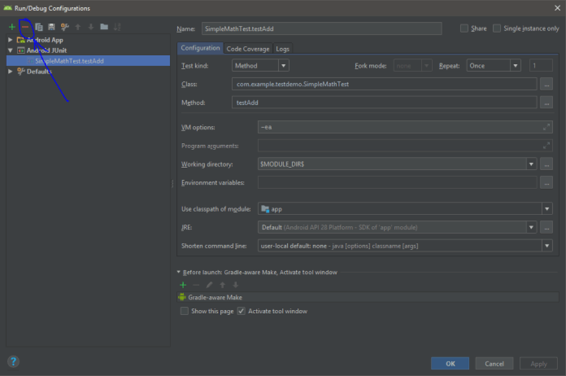
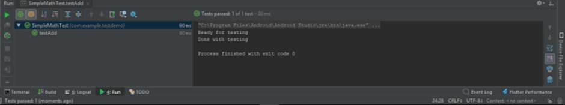

# Android App Testing

# Unit Testing in Android
To Write your first local unit test in Android, the first thing I want you to do is to create an Android Project, File -> New -> New Project.

 
Create new Project in Android Studio


Let's now write a utility class for this demo. Let's say we need an App that does simple mathematics like addition, subtraction, multiplication and division. We will now write a SimpleMath.java class. Right-click on your main package, com.example.java and select New -> New java class. Name it "SimpleMath". Add the following basic methods:

```java
package com.example.testdemo;

public class SimpleMath {

    public int add(int op1, int op2) {
        return op1 + op2;
    }

    public int diff(int op1, int op2) {
        return op1-op2;
    }

    public double div(int op1, int op2) {
        if (op2 == 0) return 0;
        return op1 / op2;
    }
}
```
Now let's proceed to write our first unit test. Recall from the lecture slides, Local Unit Test vs. Instrumented Tests, they are two different things that are also reflected in the directory structure. We have app\src\androidTest and app\src\test. We are going to have to put our Local Unit tests in the latter.

Before we begin, I want you to check your app-level build.gradle file to see if you have the correct dependencies for setting up local unit tests. By default, the android studio should have put those there but if not copy-paste the following:
test implementation 'junit:junit:4.+' or testCompile 'junit:junit:4.+' if you are running an older gradle plugin.

Right-click on your test folder (not the androdTest folder) and click New -> Java Class. Name it SimpleMathTest to reflect the unit test is for SimpleMath.java.

```java
package com.example.testdemo;
import org.junit.After;
import org.junit.Before;
import org.junit.Test;
import static org.junit.Assert.assertEquals;

public class SimpleMathTest {
    private SimpleMath simpleMath;
    
    @Before //This is executed before the @Test executes
    public void setUp(){
        simpleMath = new SimpleMath();
        System.out.println("Ready for testing");
    }    
    @After //This is executed after the 
    @Test executes
    public void tearDown(){
        System.out.println("Done with testing");
    }    
    @Test
    public void testAdd() {
        int total = simpleMath.add(4, 5);
        assertEquals("Simple Math is not adding correctly", 9, total);
        //The message here is displayed iff the test fails
    }    
    @Test
    public void testDiff() {
        int total = simpleMath.diff(9, 2);
        assertEquals("Simple Math is not subtracting correctly", 7, total);
    }    
    @Test
    public void testDiv(){
        double quotient = simpleMath.div(9,3);
        assertEquals("Simple math is not dividing correctly", 3.0, quotient, 0.0);
    }    //@Ignore //This ignores the test below
    @Test
    public void testDivWithZeroDivisor(){
        double quotient = simpleMath.div(9,0);
        assertEquals("Simple math is not handling division by zero correctly", 0.0, quotient, 0.0);
    }
}
```
# Explanation:

The code private SimpleMath simpleMath; declares an instance of the SimpleMath class in this test class. The JUnit here is the test framework, it provides us with easy to read Annotations like @Before, @After and @Test and shares similar syntax and/or approach across other programming paradigms like JSUnit for Javascript, PHPUnit for PHP, etc.

Now as the comments indicate, @Before is executed before the actual @Test executes. We have instantiated the simpleMath object in the setUpmethod (method).

We have written 4 methods with @Test annotation, which means we have 4 unit tests that can either pass or fail. The tested method tests the Addition functionality of SimpleMath. In this method, we have used the simpleMath instance to add 4 and 5 and store it in an int total . In the next line assertEquals("Simple Math is not adding correctly", 9, total); we are checking if total or is not equal to 9, which it should be if our SimpleMath class is functioning correctly. The assertEquals() is one of the many static methods provided by the JUnit framework. It takes at least two parameters as the String parameter is optional which is displayed in case of test failure. The second and third parameters of the assertEquals method are expected and actual values in strict order.

# Run the testAdd()


 
Running the testAdd() method


To run the test add either select the Green play button on the right of the line numbers or select the testAdd method right-click and select Run testAdd(). If you run into error like TestSuite Empty which I hope you don’t, just click Run -> Edit Configurations and Remove the test configurations under JUnit.

 
Dealing with Test Suite Empty error

If everything goes well you should see something like the following:

 
testAdd() test Passed.

And you have now written your first local unit test in Android Application. Also notice how fast the test runs and how we did not need to use any device or emulator as the SimpleMath class does not require any Android Instrumentation or device features. The JVM on your development machine and the JVM on your phone is exactly the same and we can thus ensure the functionality that we just tested will work fine in an Android Device too.

# Espresso Instrumentation and UI Testing:

## Espresso’s API Components

Let’s look at the four components that make up its high-level components.

## Espresso

This is the starting point for all test cases. This component provides entry points or methods to start the interaction with the app’s view. Each app’s view has two components.
First is the part of the view that belongs to the app. Testers will be able to interact with it by using the onView() and onData() methods. The second part of the view consists of the components that are provided by the OS (home screen button, back button, etc). Espresso also provides APIs to interact with non-app components. For example, the pressBack() method to initiate going back.

## ViewMatchers

Views are always in a hierarchy called the View Hierarchy. For the test cases to navigate the view hierarchy, ViewMatchers are used. Technically, they are a collection of objects and they implement the Matcher interface. Testers will be able to pass one or more of these objects to the OnView() method provided by Espresso Component.

## ViewActions

These components define the action that has to be performed on any given View. Espresso allows testers to send more than one ViewAction as a collection to the Interaction method. An example of a view action would be the click() method which helps a test script click on a given View’s UI component.

## ViewAssertions

Assertions complete a test case. They are the components that check if the test has passed or failed. In Espresso Android, the ViewAssertions can be passed to the Check() method from the ViewInteraction package. Matches assertion is the most commonly used check which verifies the final state of the view with what is expected.

# Example:

Create a new app in Android and call it EspressoTest and follow the next instructions:

## Espresso setup instructions

This guide covers installing Espresso using the SDK Manager and building it using Gradle. Android Studio is recommended.

## Set up your test environment

To avoid flakiness, we highly recommend that you turn off system animations on the virtual or physical devices used for testing. On your device, under Settings > Developer options, disable the following 3 settings:
- Window animation scale
- Transition animation scale
- Animator duration scale

## Add Espresso dependencies

To add Espresso dependencies to your project, complete the following steps:

1.	Open your app’s build.gradle file. This is usually not the top-level build.gradle file but app/build.gradle.

2.	Add the following lines inside dependencies:
```
androidTestImplementation 'androidx.test.espresso:espresso-core:3.1.0'
androidTestImplementation 'androidx.test:runner:1.1.0'
androidTestImplementation 'androidx.test:rules:1.1.0'
```

## Example Gradle build file
```
plugins {
    id 'com.android.application'
}

android {
    compileSdkVersion 30
    buildToolsVersion "30.0.2"

    defaultConfig {
        applicationId "com.example.leedstrinity.espressotest"
        minSdkVersion 23
        targetSdkVersion 30
        versionCode 1
        versionName "1.0"

        testInstrumentationRunner "androidx.test.runner.AndroidJUnitRunner"

    }

    buildTypes {
        release {
            minifyEnabled false
            proguardFiles getDefaultProguardFile('proguard-android-optimize.txt'), 'proguard-rules.pro'
        }
    }
    compileOptions {
        sourceCompatibility JavaVersion.VERSION_1_8
        targetCompatibility JavaVersion.VERSION_1_8
    }
}

dependencies {

    implementation 'androidx.appcompat:appcompat:1.2.0'
    implementation 'com.google.android.material:material:1.3.0'
    implementation 'androidx.constraintlayout:constraintlayout:2.0.4'
    testImplementation 'junit:junit:4.+'
    androidTestImplementation 'androidx.test.ext:junit:1.1.2'
    androidTestImplementation 'androidx.test.espresso:espresso-core:3.3.0'
    androidTestImplementation 'androidx.test:runner:1.1.0'

}
```

# Analytics

In order to make sure we are on the right track with each new release, the test runner collects analytics. More specifically, it uploads a hash of the package name of the application under test for each invocation. This allows us to measure both the count of unique packages using Espresso as well as the volume of usage.

If you do not wish to upload this data, you can opt-out by including the disableAnalytics argument in your instrumentation command:
```
adb shell am instrument -e disableAnalytics true
```

## Add the first test

1) Change the TextView text in the activity_main.xml to Hello World Espresso!.

2) Add a new class under androidTest folder and call it HelloWorldEspressoTest and add the following code:

_Note: Android Studio creates tests by default in src/androidTest/java/com.example.package/._
```
@RunWith(AndroidJUnit4.class)
@LargeTest
public class HelloWorldEspressoTest {
    @Rule
    public ActivityScenarioRule<MainActivity> activityRule =
            new ActivityScenarioRule<>(MainActivity.class);
    @Test
    public void textViewTest() {
        onView(withText("Hello World Espresso!")).check(matches(isDisplayed()));

    }
}
```

## Run tests
You can run your tests in Android Studio.

## In Android Studio

To create a test configuration in Android Studio, complete the following steps:
1. Open Run > Edit Configurations.
2. Add a new Android Tests configuration.
3. Choose a module.
4. Add a specific instrumentation runner: androidx.test.runner.AndroidJUnitRunner
5. Run the newly created configuration from the green arrow next to the class name.
6. Check if the test is passed.  
 

Now add a PlainText to your xml layout, change the id to editTextFirstName.

Go to the HelloWorldEspressoTest class and add the following method:

```java
@Test
public void editTextTest() {
    onView(withId(R.id.editTextFirstName)).perform(typeText("First Name"));

}
```

**Run the test and check if the test is passed.**


Add more actions to be performed automatically by Espresso. Add them one by one to check their effect.

```java
@Test
public void editTextTest() {
    onView(withId(R.id.editTextFirstName)).perform(typeText("First Name"));
    onView(withId(R.id.editTextFirstName)).perform(click());
    onView(withId(R.id.editTextFirstName)).perform(clearText());
    onView(withId(R.id.editTextFirstName)).perform(typeText("Another first name"));
}
```

To control the test time, you can add the following method:
```java
@Test
public void editTextTest() {
    onView(withId(R.id.editTextFirstName)).perform(typeText("First Name"));
    onView(withId(R.id.editTextFirstName)).perform(click());
    onView(withId(R.id.editTextFirstName)).perform(clearText());
    onView(withId(R.id.editTextFirstName)).perform(typeText("Another first name"));
    pauseTestFor(500);

}
private void pauseTestFor(long milliseconds) {
    try {
        Thread.sleep(milliseconds);
    } catch (InterruptedException e) {
        e.printStackTrace();
    }
}
```

Add a button now to your layout and add the following test case to check the interaction between two views:

```java
onView(withId(R.id.editTextFirstName)).perform(ViewActions.clearText())
                .perform(ViewActions.typeText(“My Name”),closeSoftKeyboard());
onView(withId(R.id.get_name_button)).perform(click());
onView(withId(R.id.get_name_button)).check(matches(not(isEnabled())));
```

## Add test cases to your Route app.

Happy coding


