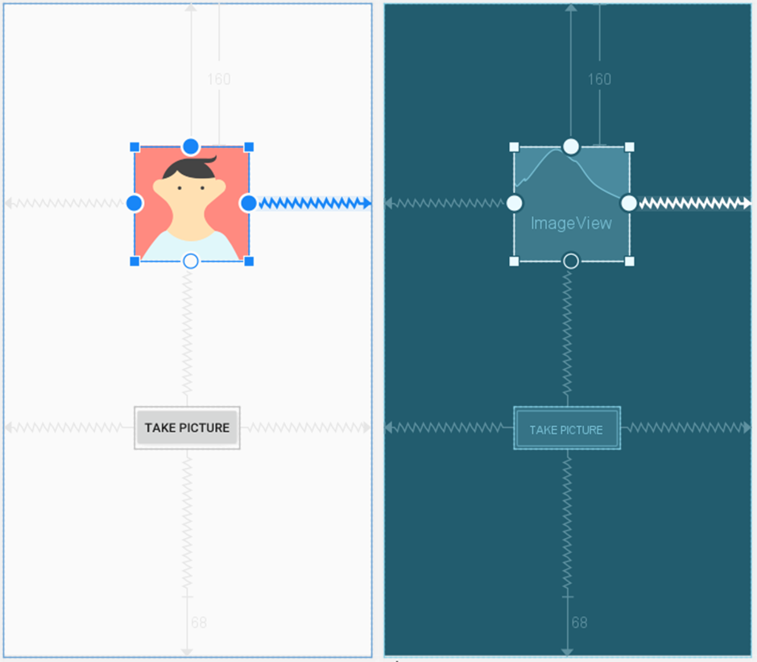

# Android Multimedia Framework and JetPack Media 3


This Tutorial shows you how to write a media-playing app that interacts with the user and the system to get good performance and a pleasant user experience. It also looks at how to use the camera hardware to capture images, and record videos using the new CameraX app.


# Exercise 1: MediaPlayer APIs to play a sound file.
Create a new project in Android Studio and call it MediaPlayer. Use the default options and select Empty Views Activity when prompted for Activity Type. We will also need a sound for this exercise and will use the same longer playing "water" sound from:http://soundbible.com/2032-Water.html

# How to do it ...
As explained previously, we will need a sound file to include in the project. Once you have your sound file ready, follow these steps:

1.	Create a new raw folder (File | New | Android resource directory). Choose raw in the Resource type dropdown and then click the Ok button.


 
2.	Copy your sound file to res/raw as sound_1, (keep the original extension).
3.	Open activity_main.xml and replace the existing TextView with the following design:

  

4.	Add the android:onClick="buttonPlay" for button PLAY and android:onClick="buttonPause" for button PAUSE and android:onClick="buttonStop" for button STOP.

5.	Now, open ActivityMain.java and add the following class variable:
```java
MediaPlayer mMediaPlayer;
```
6.	Add the buttonPlay() method:
```java
public void buttonPlay(View view){
    if (mMediaPlayer==null) {
        mMediaPlayer = MediaPlayer.create(this, R.raw.sound_1);
        mMediaPlayer.setLooping(true);
        mMediaPlayer.start();
    } else  {
        mMediaPlayer.start();
    }
}
```
7.	Add the buttonPause() method:
```java
public void buttonPause(View view){
    if (mMediaPlayer!=null && mMediaPlayer.isPlaying()) {
        mMediaPlayer.pause();
    }
}
```
8.	Add the buttonStop() method:
```java
public void buttonStop(View view){
    if (mMediaPlayer!=null) {
        mMediaPlayer.stop();
        mMediaPlayer.release();
        mMediaPlayer = null;
    }
}
```
9.	Finally, override the onStop() callback with the following code:
```java
@Override
protected void onStop() {
    super.onStop();
    if (mMediaPlayer!=null) {
        mMediaPlayer.release();
        mMediaPlayer = null;
    }
}
```
10.	You can run the application on a device or emulator.

# There's more...
Using a short audio file included with the project, we aren't likely to experience any UI delays. Generally, using a background thread when preparing MediaPlayer is a good idea. To make this common task easier, MediaPlayer already includes an asynchronous preparation method called prepareAsync(). The following code will create an OnPreparedListener() listener and use the prepareAsync() method:
```java
mMediaPlayer = new MediaPlayer();
mMediaPlayer.setOnPreparedListener(new MediaPlayer.OnPreparedListener() {
    @Override
    public void onPrepared(MediaPlayer mp) {
        mMediaPlayer.start();
    }
});
try {
    mMediaPlayer.setDataSource(/*URI, URL or path here*/));
} catch (IOException e) {
    e.printStackTrace();
}
mMediaPlayer.prepareAsync();
```
To do this step, replace the code in buttonPlay with the code above. the method buttonPlay should look like the following:
```java
public void buttonPlay(View view) {
    Uri mediaPath = Uri.parse("android.resource://" + getPackageName() + "/" + R.raw.sound_1);
    mMediaPlayer = new MediaPlayer();
    mMediaPlayer.setOnPreparedListener(new MediaPlayer.OnPreparedListener() {
        @Override
        public void onPrepared(MediaPlayer mp) {
            mMediaPlayer.start();
        }
    });
    try {
        mMediaPlayer.setDataSource(getApplicationContext(), mediaPath);
    } catch (IOException e) {
        e.printStackTrace();
    }
    mMediaPlayer.prepareAsync();
}
```
## Using hardware volume keys to control your app's audio volume

If you want the volume controls to control the volume in your app, add the setVolumeControlStream() method to your onCreate() method to specify your application's audio stream, as follows:
```java
setVolumeControlStream(AudioManager.STREAM_MUSIC);
``` 


See the AudioManager [link](https://developer.android.com/reference/android/media/AudioManager) for other streaming options.

# Exercise 2: Video Playback on Android using the VideoView and MediaController Classes

1.	Create a new empty activity in the same project above and call it VideoPlayerActivity.

2.	Open the activity_video_player.xml Layout and from the Widgets category of the Palette panel, drag and drop a VideoView instance onto the layout so that it fills the available canvas area, as follows: 


 
Using the Attributes panel, change the layout_width and layout_height attributes to match_constraint and wrap_content respectively. Also, remove the constraint connecting the bottom of the VideoView to the bottom of the parent ConstraintLayout. 

3.	Download the Video File from [Google](http://commondatastorage.googleapis.com/gtv-videos-bucket/sample/BigBuckBunny.mp4) and add it to the raw directory created in the previous example.

4.	The next step is to configure the VideoView with the path of the video to be played and then start the playback. This will be performed when the VideoPlayerActivity has been initialised, so load the VideoPlayerActivity.java file into the editor and modify it as outlined in the following listing:
```java
public class VideoPlayerActivity extends AppCompatActivity {
    private VideoView videoView;
    
    @Override
    protected void onCreate(Bundle savedInstanceState) {
        super.onCreate(savedInstanceState);
        setContentView(R.layout.activity_video_player);
        configureVideoView();
    }
    private void configureVideoView() {
        videoView = findViewById(R.id.videoView);
        videoView.setVideoURI(Uri.parse("android.resource://"
                + getPackageName() + "/" + R.raw.movie));
        videoView.start();
    }
}
```
5.	Now Add a button to the activity_main.xml. Start VideoPlayerActivity from the main activity using intent and run your app.


6.	As the VideoPlayer application currently stands, there is no way for the user to control playback. As previously outlined, this can be achieved using the MediaController class. To add a controller to the VideoView, modify the configureVideoView() method once again. The final code should look like the following:
```java
public class VideoPlayerActivity extends AppCompatActivity {
    private VideoView videoView;
    private MediaController mediaController;

    @Override
    protected void onCreate(Bundle savedInstanceState) {
        super.onCreate(savedInstanceState);
        setContentView(R.layout.activity_video_player);
        configureVideoView();
    }
    private void configureVideoView() {
        final VideoView videoView = findViewById(R.id.videoView);
        videoView.setVideoURI(Uri.parse("android.resource://"
                + getPackageName() + "/" + R.raw.movie));
        mediaController = new MediaController(this);
        mediaController.setAnchorView(videoView);
        videoView.setMediaController(mediaController);
        videoView.start();
    }
}
```
When the application is launched with these changes implemented, tapping the VideoView canvas will cause the media controls to appear over the video playback. These controls should include a seekbar together with fast forward, rewind and play/pause buttons. After the controls recede from view, they can be restored at any time by tapping on the VideoView canvas once again. With just three more lines of code, our video player application now has media controls as shown in the following figure:


 
7.	Now set up the onPreparedListener as in the previous example by changing the existing code with the following one:
```java
public class VideoPlayerActivity extends AppCompatActivity {
    private VideoView videoView;
    private MediaController mediaController;
    String TAG = "VideoPlayer";

    @Override
    protected void onCreate(Bundle savedInstanceState) {
        super.onCreate(savedInstanceState);
        setContentView(R.layout.activity_video_player);
        configureVideoView();
    }
    private void configureVideoView() {
        final VideoView videoView = findViewById(R.id.videoView);
        videoView.setVideoURI(Uri.parse("android.resource://"
                + getPackageName() + "/" + R.raw.movie));
        mediaController = new MediaController(this);
        mediaController.setAnchorView(videoView);
        videoView.setMediaController(mediaController);
        videoView.setOnPreparedListener(new MediaPlayer.OnPreparedListener() {
            @Override
            public void onPrepared(MediaPlayer mp) {
                mp.setLooping(true);
                Log.i(TAG, "Duration = " + videoView.getDuration());
            }
        });
        videoView.start();
    }
}
```
8.	Now rerun your application.

# Exercise 3: MediaPlayer app using Media3 ExpoPlayer APIs
Create a new project in Android Studio and call it ExpoPlayer. Use the default options and select Empty Views Activity when prompted for Activity Type.
1. Add Dependencies, make sure you have the necessary dependencies in your build.gradle file. Add the following lines to your app-level build.gradle:
 
```XML
implementation ("androidx.media3:media3-exoplayer:1.2.1")
implementation ("androidx.media3:media3-ui:1.2.1")
implementation ("androidx.media3:media3-common:1.2.1")
```

2. Go to your activity_main.xml and add a PlayerView to display the video and audio controls using the following code:

```XML
<androidx.media3.ui.PlayerView
android:id="@+id/exoPlayerView"
android:layout_width="match_parent"
android:layout_height="match_parent"/>
```

3. Create an ExoPlayer Instance, in your Java class, create an instance of SimpleExoPlayer:

```Java
import androidx.appcompat.app.AppCompatActivity;
import androidx.media3.common.MediaItem;
import androidx.media3.exoplayer.ExoPlayer;
import androidx.media3.ui.PlayerView;

import android.net.Uri;
import android.os.Bundle;


public class MainActivity extends AppCompatActivity {
    private ExoPlayer exoPlayer;
    private PlayerView playerView;

    @Override
    protected void onCreate(Bundle savedInstanceState) {
        super.onCreate(savedInstanceState);
        setContentView(R.layout.activity_main);
        // Initialize ExoPlayer
        exoPlayer = new ExoPlayer.Builder(this).build();

        // Find the PlayerView in your layout
        playerView = findViewById(R.id.exoPlayerView);
        playerView.setPlayer(exoPlayer);

        // Create a MediaItem (replace the URL with your audio/video source)
        Uri mediaUri = Uri.parse("http://commondatastorage.googleapis.com/gtv-videos-bucket/sample/BigBuckBunny.mp4");
        MediaItem mediaItem = MediaItem.fromUri(mediaUri);

        // Add the MediaItem to the player
        exoPlayer.setMediaItem(mediaItem);

        // Prepare the player (load media and acquire resources)
        exoPlayer.prepare();
    }

    @Override
    protected void onDestroy() {
        super.onDestroy();
        // Release the player when no longer needed
        exoPlayer.release();
    }
}
```

4. Permissions, don’t forget to add the necessary permissions for internet access in your AndroidManifest.xml:

```XML
<uses-permission android:name="android.permission.INTERNET" />
```
Also, you need to add the following line of code under the application tag in your AndroidManifest.xml:
```XML
android:usesCleartextTraffic="true"
```

5. Run Your App, build and run your app. You should see the video playing in the PlayerView.

Task: Replace the sample URL (http://commondatastorage.googleapis.com/gtv-videos-bucket/sample/BigBuckBunny.mp4) with your actual audio or video source URL.

# Exercise 4: Taking a photo with the default camera app
If your application needs an image from the camera but is not a camera replacement app, it may be better to allow the default camera app to take the picture. This also respects your user's preferred camera application.

When you take a photo unless it is specific to your application, it's considered good practice to make the photo publicly available (this allows it to be included in the user's photo gallery). So, this exercise will demonstrate using the default photo application to click a picture, save it to the public folder, and display the image.

# Getting ready ...

Create a new project in Android Studio and call it UsingTheDefaultCameraApp. Use the default options and select Empty Activity on the Add an Activity to Mobile dialog.

# How to do it ...

We're going to create a layout with an ImageView and button. The button will create an Intent to launch the default Camera app. When the camera app is done, our app will get a callback. We'll check the result and display the picture if available. Start by opening the Android Manifest and follow these steps:

1.	Add the following permission:
```java
<uses-permission android:name="android.permission.READ_EXTERNAL_STORAGE" />
```
2.	Open activity_main.xml and replace the existing TextView with ImageView and Button as the following screen:
 


Note: Add android:onClick="takePicture" as a part of setting the button’s attributes.

3.	Open MainActivity.java and add the following global variables to the MainActivity class:
```java
final int PHOTO_RESULT=1;
private Uri mLastPhotoURI=null;
```
4.	Add the following method to create the URI for the photo:
```java
private Uri createFileURI() {
    String timeStamp = new SimpleDateFormat("yyyyMMdd_HHmmss")
            .format(System.currentTimeMillis());
    String fileName = "PHOTO_" + timeStamp + ".jpg";
    return Uri.fromFile(new File(Environment
            .getExternalStoragePublicDirectory(Environment.DIRECTORY_PICTURES),fileName));
}
```
Note: add this method after onCreate()method in the MainActivity.java. 

5.	Add the following method to handle the button click:
```java
public void takePicture(View view) {
    Intent takePictureIntent = new Intent(MediaStore.ACTION_IMAGE_CAPTURE);
    if (takePictureIntent.resolveActivity(getPackageManager()) != null) {
        mLastPhotoURI = createFileURI();
        takePictureIntent.putExtra(MediaStore.EXTRA_OUTPUT, mLastPhotoURI);
        startActivityForResult(takePictureIntent, PHOTO_RESULT);
    }
}
```
6.	Add a new method to override onActivityResult() as follows:
```java
@Override
protected void onActivityResult(int requestCode, int resultCode, Intent data) {
    if (requestCode == PHOTO_RESULT && resultCode == RESULT_OK ) {
        ImageView imageView = findViewById(R.id.imageView);
        imageView.setImageBitmap(BitmapFactory.decodeFile(mLastPhotoURI.getPath()));
    }
}
```
7. Add the following code to the end of the existing onCreate() method: 
```java
StrictMode.VmPolicy.Builder builder = new StrictMode.VmPolicy.Builder();
StrictMode.setVmPolicy(builder.build());

if (ContextCompat.checkSelfPermission(this, Manifest.permission.READ_EXTERNAL_STORAGE) 
        != PackageManager.PERMISSION_GRANTED ) {
    ActivityCompat.requestPermissions(this, 
            new String[] {Manifest.permission.READ_EXTERNAL_STORAGE},0);
}
```
8. You're ready to run the application on a device or emulator.

# How it works ...
There are two parts to working with the default camera app. The first is to set up the Intent to launch the app. We create the Intent using MediaStore.ACTION_IMAGE_CAPTURE to indicate we want a photo app. We verify a default app exists by checking the results from resolveActivity(). As long as it's not null, we know an application is available to handle the Intent. (Otherwise, our app will crash.) We create a filename and add it to the Intent with putExtra(MediaStore.EXTRA_OUTPUT, mLastPhotoURI).

When we get the callback in onActivityResult(), we first make sure it's PHOTO_RESULT and RESULT_OK (the user could have cancelled), then we load the photo in ImageView.

You might be wondering what the StrictMode calls are for in onCreate(). Basically, those lines of code disable an additional security check made by the OS. If we don't disable StrictMode, the app will crash when creating the file URI with a FileUriExposedException exception.  For a production app, one solution would be to create a FileProvider as we did in the Accessing External Storage with Scoped Directories.

# There's more ...

If you don't care where the picture is stored, you can call the Intent without using the MediaStore.EXTRA_OUTPUT extra. If you don't specify the output file, onActivityResult() will include a thumbnail of the image in the data Intent. The following is how you can display the thumbnail:
```java
if (data != null) {
    imageView.setImageBitmap((Bitmap) data.getExtras().get(“data”));
}
```
Here's the code to load the full resolution image, using the URI returned in the data Intent:
```java
if (data != null) {
    try {
        imageView.setImageBitmap(
            MediaStore.Images.Media. getBitmap(getContentResolver(),
            Uri.parse(data.toUri(Intent.URI_ALLOW_UNSAFE))));
    } catch (IOException e) {
        e.printStackTrace();
    }
}
```
## Calling the default video app 
It's the same process if you want to call the default video capture application (add another button to the previous app “Record Video” to test the video capture app). Just change the Intent in step 5, as follows:
```java
Intent takeVideoIntent = new Intent(MediaStore.ACTION_VIDEO_CAPTURE);
```
You can get the URI to the video in onActivityResult(), as follows:
```java
Uri videoUri = intent.getData();
```
 
# Exercise 5: Take a photo using the CameraX library
CameraX is a powerful Jetpack library that simplifies integrating the device camera into your Android app. It provides a consistent camera experience across different devices. Let’s walk through the steps to take a photo using CameraX:

1. Add Dependencies, in your app-level build.gradle file, add the following dependency:
```XML
implementation "androidx.camera:camera-camera2:1.1.0"
```

2. Set Up CameraX, initialise CameraX in your Activity:

```Java
import androidx.camera.core.CameraX;
import androidx.camera.core.Preview;
import androidx.camera.lifecycle.ProcessCameraProvider;
import androidx.camera.view.PreviewView;
import androidx.lifecycle.LifecycleOwner;

// ...

// Inside your activity
PreviewView previewView = findViewById(R.id.previewView); // Your preview view
LifecycleOwner lifecycleOwner = this; // Use your lifecycle owner

// Initialize CameraX
ProcessCameraProvider cameraProvider = ProcessCameraProvider.getInstance(this);
cameraProvider.addListener(() -> {
    try {
        // Set up the preview use case
        Preview preview = new Preview.Builder().build();
        preview.setSurfaceProvider(previewView.getSurfaceProvider());

        // Bind the preview use case to the lifecycle
        cameraProvider.bindToLifecycle(lifecycleOwner, preview);
    } catch (Exception e) {
        // Handle exceptions
    }
});
```
3. Capture a Photo, to capture a photo, you’ll need to add an image capture use case. Here’s how you can do it:

```Java
import androidx.camera.core.ImageCapture;
import java.io.File;
import java.util.concurrent.ExecutorService;
import java.util.concurrent.Executors;

// ...

// Inside your activity
ExecutorService executor = Executors.newSingleThreadExecutor();
ImageCapture imageCapture = new ImageCapture.Builder().build();

// Capture a photo
File outputFile = new File(getExternalFilesDir(null), "my_photo.jpg");
imageCapture.takePicture(outputFile, executor,
    new ImageCapture.OnImageSavedCallback() {
        @Override
        public void onImageSaved(File file) {
            // Photo saved successfully
        }

        @Override
        public void onError(ImageCaptureException exception) {
            // Handle capture error
        }
    });
```
4. Permissions, don’t forget to add the necessary permissions for camera access in your AndroidManifest.xml:

```XML
<uses-permission android:name="android.permission.CAMERA" />
<uses-feature android:name="android.hardware.camera.any" />
```
5. Display the Preview, make sure you have a PreviewView in your layout (activity_main.xml):

```XML
<androidx.camera.view.PreviewView
    android:id="@+id/previewView"
    android:layout_width="match_parent"
    android:layout_height="match_parent" />
```

6. Run Your App, build and run your app. You’ll see the camera preview in the PreviewView. When you capture a photo, it will be saved to the specified file location.


**Happy Coding**


