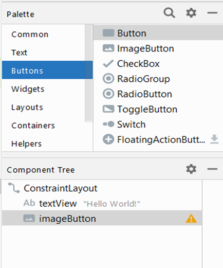

# Polish Your App and Get it Ready to Release

# Exercise 1: How to schedule an alarm
Occasionally, applications cannot depend on WorkManager for task execution, especially when the work must be performed at a precise moment. WorkManager isn't tailored for scheduling tasks at specific times, making it challenging for apps to dictate the exact execution time. In such cases, it is recommended for apps to utilise Android's AlarmManager API, enabling them to schedule "alarms" that trigger at predefined times.

## Getting ready
Create a new project in Android Studio and call it Alarms. Use the default Phone & Tablet option and select Empty Views Activity when prompted for Activity Type.

## How to do it?
Setting an alarm requires a Pending Intent, which Android sends when the alarm is triggered. Therefore, we need to set up a Broadcast Receiving to capture the alarm intent. Your UI will consist of just a simple button to set the alarm. To start, open the Android Manifest and follow these steps:

1.	Add the following ```<receiver>``` to the ```<application>``` element at the same level as the existing ```<activity>``` element:
```xml
<receiver android:name=".AlarmBroadcastReceiver"
            android:exported="true">
            <intent-filter>
                <action android:name="com.example.leedstrinity.alarms.ACTION_ALARM" />
            </intent-filter>
        </receiver>
```
2.	Open activity_main.xml and replace the existing TextView with the
following button:
```xml
<Button
    android:id="@+id/button"
    android:layout_width="wrap_content"
    android:layout_height="wrap_content"
    android:text="Set Alarm"
    android:onClick="setAlarm"
    app:layout_constraintBottom_toBottomOf="parent"
    app:layout_constraintLeft_toLeftOf="parent"
    app:layout_constraintRight_toRightOf="parent"
    app:layout_constraintTop_toTopOf="parent" />
```

3.	Create a new Java class called AlarmBroadcastReceiver using the following code:

```java
public class AlarmBroadcastReceiver extends BroadcastReceiver {    
    public static final String ACTION_ALARM= "This is my first ACTION_ALARM";

    @Override
    public void onReceive(Context context, Intent intent) {
        if (ACTION_ALARM.equals(intent.getAction())) {
            Toast.makeText(context, ACTION_ALARM, Toast.LENGTH_SHORT).show();
        }
    }
} 
```

4.	Open ActivityMain.java and add the method for the button click:
```java
public void setAlarm(View view) {
        Intent intentToFire = new Intent(getApplicationContext(), AlarmBroadcastReceiver.class);
        intentToFire.setAction(AlarmBroadcastReceiver.ACTION_ALARM);
        PendingIntent alarmIntent = PendingIntent.getBroadcast(getApplicationContext(), 0,
                intentToFire, PendingIntent.FLAG_IMMUTABLE);
        AlarmManager alarmManager = (AlarmManager)getSystemService(Context.ALARM_SERVICE);
        long thirtyMinutes= SystemClock.elapsedRealtime() + 1 * 1000;
        alarmManager.set(AlarmManager.ELAPSED_REALTIME, thirtyMinutes, alarmIntent);
    }
```

5.	You can run the application on a device or emulator.

## How it works?
Creating the alarm is done with this line of code:
```java
alarmManager.set(AlarmManager.ELAPSED_REALTIME, thirtyMinutes, alarmIntent);
```
_Note: change 30 to 1 if you want to see the result straight away._

**Here's the method signature:**
```java
set(AlarmType, Time, PendingIntent); 
```
Before Android 4.4 KitKat (API 19), this was the method to request an exact time. Android 4.4 and later will consider this as an inexact time for efficiency but will not deliver the intent before the requested time. (See ```setExact()``` as follows if you need an exact time.)

To set the alarm, we create a Pending Intent with our previously defined alarm action:
```java
public static final String ACTION_ALARM= "com.example.leedstrinity.alarms.ACTION_ALARM";
```
This is an arbitrary string and could be anything we want, but it needs to be unique, so we prepend our package name. We check for this action in the Broadcast Receiver's ```onReceive()``` callback.

## There's more
If you click the Set Alarm button and wait thirty minutes, you will see the Toast when the alarm triggers. You won't get two alarms if you are too impatient to wait and click the Set Alarm button again before the first alarm is triggered. Instead, the OS will replace the first alarm with the new alarm, since they both use the same Pending Intent. (If you need multiple alarms, you need to create different Pending Intents, such as using different Actions.)

## Cancel the alarm
If you want to cancel the alarm, call the cancel() method by passing the same Pending Intent you have used to create the alarm. If we continue with our example, this is how it would look:
```java
alarmManager.cancel(alarmIntent); 
```
Add a button to your layout and add the above code to cancel the alarm.

## Repeating alarm
If you want to create a repeating alarm, use the setRepeating() method. The Signature is similar to the set() method but with an interval. This is shown as follows:

setRepeating(AlarmType, Time (in milliseconds), Interval, PendingIntent);

For the Interval, you can specify the interval time in milliseconds or use one of the predefined AlarmManager constants:

•	INTERVAL_DAY

•	INTERVAL_FIFTEEN_MINUTES

•	INTERVAL_HALF_DAY

•	INTERVAL_HALF_HOUR

•	INTERVAL_HOUR

## Receiving notification of device boot

Android sends out many intents during its lifetime. One of the first intents sent is ACTION_BOOT_COMPLETED. If your application needs to know when the device boots, you need to capture this intent.

This example will walk you through the steps required to be notified when the device boots.

## How to do it?
To start, open the Android Manifest and follow these steps:

1.	Add the following permission:

```xml
<uses-permission android:name="android.permission.RECEIVE_BOOT_COMPLETED"/>
```

2.	Add the following <receiver> to the <application> element, at the same level as the existing <activity> element:
```xml
<receiver android:name=".BootBroadcastReceiver">
    <intent-filter>
        <action android:name="android.intent.action.BOOT_COMPLETED"/>
        <category android:name="android.intent.category.DEFAULT" />
    </intent-filter>
</receiver>
```

3.	Create a new Java class called BootBroadcastReceiver using the following code:

```java
public class BootBroadcastReceiver extends BroadcastReceiver {
    @Override
    public void onReceive(Context context, Intent intent) {
        if (intent.getAction().equals(
                "android.intent.action.BOOT_COMPLETED")) {            
            Toast.makeText(context, "BOOT_COMPLETED", Toast.LENGTH_SHORT).show();
        }
    }
}
```

4.	Reboot the device to see the Toast.

## How it works?
When the device boots, Android will send the BOOT_COMPLETED intent. As long as our application has permission to receive the intent, we will receive notifications in our Broadcast Receiver.

## There are three aspects to make this work:

•	A permission for RECEIVE_BOOT_COMPLETED

•	Adding both BOOT_COMPLETED and DEFAULT to the receiver intent filter

•	Checking for the BOOT_COMPLETED action in the Broadcast Receiver

You'll need to replace the Toast message with your code, such as for recreating any alarms you might need.

## There's more
If you followed the previous example, then you already have a Broadcast Receiver. You don't need a separate BroadcastReceiver for each action, just check for each action as needed. Here's an example if we need to handle another action:

```java
@Override
public void onReceive(Context context, Intent intent) {
    if (intent.getAction().equals("android.intent.action.BOOT_COMPLETED")) {
        Toast.makeText(context, "BOOT_COMPLETED", Toast.LENGTH_SHORT).show();
    } else if (intent.getAction().equals("<another_action>")) {
        //handle another action 
    }
}
```
 
## Exercise 2: Adding speech recognition to your app
## Getting ready
Create a new project in Android Studio and call it SpeechRecognition. Use the default Phone & Tablet option and select Empty Views Activity when prompted for Activity Type.

## How to do it?
We'll start by adding a Speak Now (or microphone) button to the layout, then we'll add the necessary code to call the speech recognizer. Open activity_main.xml and follow these steps:

1.	Replace the existing TextView with the following XML:
```xml
<TextView
    android:id="@+id/textView"
    android:layout_width="wrap_content"
    android:layout_height="wrap_content"
    android:text="Hello World!"
    app:layout_constraintLeft_toLeftOf="parent"
    app:layout_constraintRight_toRightOf="parent"
    app:layout_constraintTop_toTopOf="parent" />

<ImageButton
    android:id="@+id/imageButton"
    android:layout_width="wrap_content"
    android:layout_height="wrap_content"
    android:src="@android:drawable/ic_btn_speak_now"
    android:onClick="speakNow"
    app:layout_constraintBottom_toBottomOf="parent"
    app:layout_constraintLeft_toLeftOf="parent"
    app:layout_constraintRight_toRightOf="parent" />
```



2.	Define the REQUEST_SPEECH constant in the MainActivity.java:
```java
private final int REQUEST_SPEECH=1; 
```

3.	Add the following code to the existing onCreate() callback:
```java
PackageManager pm = getPackageManager();
List<ResolveInfo> activities = pm
        .queryIntentActivities(new Intent(RecognizerIntent.ACTION_RECOGNIZE_SPEECH), 0);
if (activities.isEmpty()) {
    findViewById(R.id.imageButton).setEnabled(false);
    Toast.makeText(this, "Speech Recognition Not Supported", Toast.LENGTH_LONG).show();
}
```

4.	Add the button click method:

```java
public void speakNow(View view) {
    Intent intent = new Intent(RecognizerIntent.ACTION_RECOGNIZE_SPEECH);
    intent.putExtra(RecognizerIntent.EXTRA_LANGUAGE_MODEL, 
            RecognizerIntent.LANGUAGE_MODEL_FREE_FORM);
    startActivityForResult(intent, REQUEST_SPEECH);
}
```
5.	Add the following code to override the onActivityResult() callback:
```java
@Override
protected void onActivityResult(int requestCode, int resultCode, Intent data) {
    super.onActivityResult(requestCode, resultCode, data);
    if (requestCode==REQUEST_SPEECH && resultCode == RESULT_OK && data!=null) {
        ArrayList<String> result = data.getStringArrayListExtra(RecognizerIntent.EXTRA_RESULTS);
        TextView textView = findViewById(R.id.textView);
        if (!result.isEmpty()){
            textView.setText("");
            for (String item : result ) {
                textView.append(item+"\n");
            }
        }
    }
}
```

6.	You can run the application on a device or emulator.

## How it works?
The work here is done by the Google Speech Recognizer included in Android. To make sure the service is available on the device, we call PackageManager in onCreate(). If at least one activity is registered to handle the RecognizerIntent.ACTION_RECOGNIZE_SPEECH intent, then we know it's available. If no activities are available, we display a Toast indicating speech recognition is not available and disable the mic button.

The button click starts the recognition process by calling an intent created with RecognizerIntent.ACTION_RECOGNIZE_SPEECH. The EXTRA_LANGUAGE_MODEL parameter is required and has the following two choices:

•	LANGUAGE_MODEL_FREE_FORM

•	LANGUAGE_MODEL_WEB_SEARCH

We get the result back in the onActivityResult() callback. If the result equals RESULT_OK, then we should have a list of words recognized, which we can retrieve using getStringArrayListExtra(). The array list will be ordered starting with the highest recognition confidence.

If you want to retrieve the confidence rating, retrieve the float array using EXTRA_CONFIDENCE_SCORES. Here's an example:
```java
float[] confidence = data.getFloatArrayExtra(RecognizerIntent.EXTRA_CONFIDENCE_SCORES);
```
The confidence rating is optional and may not be present. A score of 1.0 indicates highest confidence, while 0.0 indicates lowest confidence.

## There's more
Using the intent is a quick and easy way to get speech recognition; however, if you would prefer not to use the default Google activity, you can call the SpeechRecognizer class directly. Here's an example of how to instantiate the class:
```java
SpeechRecognizer speechRecognizer = SpeechRecognizer.createSpeechRecognizer(this);
```
You will need to add the RECORD_AUDIO permission and implement the RecognitionListener class to handle the speech events. (See the following links for more information.)

# Some important UI for your project
## Exercise 3: Adding a menu to your app 
To add a menu to your project follow these steps:
1. Create a new project and call it UIAlerts.
2. Create a menu folder under res folder in your project.
3. Create a new menu resource file by right-clicking on the menu folder and selecting New > Menu Resource File.
4. Name the new file book_menu.xml.

5. In the book_menu.xml file, add menu and menu items using the design layout as follows:


Alternatively, use the following code:
```XML
<?xml version="1.0" encoding="utf-8"?>
<menu xmlns:android="http://schemas.android.com/apk/res/android"
    xmlns:app="http://schemas.android.com/apk/res-auto">

    <item
        android:id="@+id/add_book"
        android:layout_width="wrap_content"
        android:layout_height="wrap_content"
        android:title="Add book" />
    <item
        android:id="@+id/view_book"
        android:layout_width="wrap_content"
        android:layout_height="wrap_content"
        android:title="View book" />
    <item
        android:id="@+id/vote_book"
        android:layout_width="wrap_content"
        android:layout_height="wrap_content"
        android:title="Vote book" />
</menu>
```
6. In your activity, add onCreateOptionsMenu() method, inflate the menu resource file by calling the getMenuInflater().inflate() method.
```Java
// Inflate your menu resource, defined in XML, into the Menu provided in the callback
    @Override
    public boolean onCreateOptionsMenu(Menu menu) {
        MenuInflater inflater = getMenuInflater();
        inflater.inflate(R.menu.book_menu, menu);
        return true;
    }
```
7. To handle menu item clicks, you can override the onOptionsItemSelected() method in your activity and check for the ID of the clicked item.
```Java
// Handle click events
    @Override
    public boolean onOptionsItemSelected(MenuItem item) {
        // Handle item selection.
        if (item.getItemId() == R.id.add_book) {
            Toast.makeText(this, "You pressed the 1st item, do something here", Toast.LENGTH_SHORT).show();
            return true;
        }

        else if (item.getItemId() == R.id.view_book) {
            Toast.makeText(this, "You pressed the 2nd item, do something here", Toast.LENGTH_SHORT).show();
            return true;
        }

        else if (item.getItemId() == R.id.vote_book) {
            Toast.makeText(this, "You pressed the 3rd item, do something here", Toast.LENGTH_SHORT).show();
            return true;
        }

        else return super.onOptionsItemSelected(item);

    }
```
8. You can run the application on a device or emulator. Make sure your app theme is allowing you to see the menu.
```XML   
android:theme="@style/Theme.AppCompat.Light" or
android:theme="@style/Theme.AppCompat.Dark"
``` 
## Resources

•	AlarmManager Developer Docs: https://developer.android.com/reference/android/app/AlarmManager.html

•	Intent Developer Docs: https://developer.android.com/reference/android/content/Intent.html

•	RXJava for Android is another option and gaining much traction in Android development: https://github.com/ReactiveX/RxAndroid

•	Take a look at the Android Architecture Components included with the Android JetPack: https://developer.android.com/topic/libraries/architecture/

•	RecognizerIntent Developer Docs: http://developer.android.com/reference/android/speech/RecognizerIntent.html

•	SpeechRecognizer Developer Docs: http://developer.android.com/reference/android/speech/SpeechRecognizer.html

•	RecognitionListener Developer Docs: http://developer.android.com/reference/android/speech/RecognitionListener.html

•	Google link for authenticating your client: https://developers.google.com/android/guides/client-auth

•	GoogleSignInAccount Developer Docs: https://developers.google.com/android/reference/com/google/android/gms/auth/api/signin/GoogleSignInAccount

•	SigningYourApp Developer Docs:https://developer.android.com/studio/publish/app-signing

Happy Android Coding
